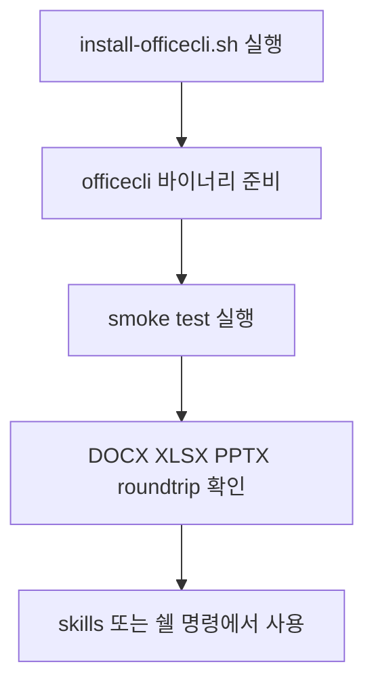

# OfficeCLI 연동 가이드

OfficeCLI는 cli-jaw에서 오피스 문서를 직접 다룰 때 쓰는 기본 런타임 도구이다. Word, Excel, PowerPoint 파일을 열고, 읽고, 수정하고, 검증하는 일을 하나의 바이너리로 처리한다. Microsoft Office를 따로 설치하지 않아도 된다.

이 통합이 중요한 이유는 에이전트가 문서 작업을 쉘 명령 한 번으로 끝낼 수 있기 때문이다. `.docx`, `.xlsx`, `.pptx`를 각각 다른 툴로 나누지 않아도 되고, `--json` 출력으로 결과를 바로 후속 자동화에 연결할 수 있다. smoke test까지 함께 두었기 때문에 “설치만 되었는가”가 아니라 “실제로 문서 편집이 되는가”를 바로 확인할 수 있다.

사용 흐름은 단순하다. 먼저 `bash scripts/install-officecli.sh`로 시스템 바이너리를 설치한다. 그다음 `bash tests/smoke/test_officecli_integration.sh`를 실행해 8개 기본 시나리오를 검증한다. 이 smoke test는 기본적으로 저장소 안의 `officecli/build-local/officecli`가 있으면 그 바이너리를 우선 사용하고, 없으면 PATH의 `officecli`를 사용한다. 다른 바이너리를 강제로 시험하고 싶으면 `OFFICECLI_BIN=/path/to/officecli bash tests/smoke/test_officecli_integration.sh`처럼 실행한다.

실무에서는 아래처럼 바로 시작하면 된다.

```bash
bash scripts/install-officecli.sh
officecli create report.docx
officecli add report.docx /body --type paragraph --prop text="분기 요약"
officecli view report.docx text
officecli validate report.docx
```

엑셀과 프레젠테이션도 같은 흐름이다. 셀 하나를 바꾸고 싶으면 `set`, 새 슬라이드를 넣고 싶으면 `add`, 구조를 JSON으로 받고 싶으면 `get --json`을 쓴다. 여러 편집을 한 번에 묶고 싶으면 `batch`에 JSON 배열을 넘기면 된다. CJK 작업이 중요하면 저장소 내 `officecli/build-local/officecli`를 우선 쓰는 편이 안전하다.

자주 쓰는 호출 문장은 다음과 같다.

- `"officecli 설치해줘"`, `"install officecli"`, `"오피스 문서 툴 깔자"`
- `"DOCX 만들어"`, `"엑셀 값 넣어"`, `"PPT 슬라이드 추가해"`
- `"officecli smoke test 돌려"`, `"Run officecli smoke test"`, `"문서 통합 테스트 확인해"`




---

## 기술 참고

### 설치 명령

| 작업 | 명령 |
| --- | --- |
| 기본 설치 | `bash scripts/install-officecli.sh` |
| 강제 재설치 | `bash scripts/install-officecli.sh --force` |
| 버전 확인 | `officecli --version` |
| smoke test | `bash tests/smoke/test_officecli_integration.sh` |
| 특정 바이너리 지정 테스트 | `OFFICECLI_BIN=/path/to/officecli bash tests/smoke/test_officecli_integration.sh` |

### 설치 스크립트 동작

| 항목 | 내용 |
| --- | --- |
| 대상 릴리스 | `iOfficeAI/OfficeCLI` latest release |
| 설치 위치 | `~/.local/bin/officecli` |
| 지원 플랫폼 | macOS arm64/x64, Linux x64/arm64, Alpine musl 변형 |
| 재실행 처리 | 기본은 idempotent, `--force`일 때만 재설치 |
| 검증 | 다운로드 후 실행 가능 여부 확인, checksum 검증은 best-effort |

### smoke test 8종

| 번호 | 항목 | 확인 내용 |
| --- | --- | --- |
| 1 | Binary availability | `officecli --version` 실행 가능 |
| 2 | DOCX roundtrip | create → add → view |
| 3 | XLSX roundtrip | create → set → view |
| 4 | PPTX roundtrip | create → add slide → outline |
| 5 | Validation | docx/xlsx/pptx validate |
| 6 | CJK roundtrip | 한글·일본어·중국어 문장 유지 |
| 7 | Batch operations | JSON batch 편집 적용 |
| 8 | JSON output | `get --json` 성공 응답 |

### 빠른 명령 레퍼런스

| 작업 | 명령 |
| --- | --- |
| 빈 문서 생성 | `officecli create report.docx` |
| 본문 텍스트 보기 | `officecli view report.docx text` |
| PPT 개요 보기 | `officecli view report.pptx outline` |
| JSON 조회 | `officecli get report.docx /body --json` |
| 문단 추가 | `officecli add report.docx /body --type paragraph --prop text="..."` |
| 셀 값 변경 | `officecli set data.xlsx /Sheet1/A1 --prop value="42"` |
| 슬라이드 추가 | `officecli add deck.pptx / --type slide --prop title="Title"` |
| 선택자 조회 | `officecli query report.docx "paragraph[style=Heading1]"` |
| 문서 검증 | `officecli validate report.docx` |
| 배치 편집 | `officecli batch data.xlsx --json <<< '[...]'` |

### upstream / fork 차이

| 항목 | upstream 바이너리 | 저장소 내 fork 바이너리 |
| --- | --- | --- |
| 기본 위치 | `~/.local/bin/officecli` | `officecli/build-local/officecli` |
| 기본 설치 경로 | install script 사용 | 저장소 빌드 산출물 사용 |
| 일반 OOXML 작업 | 지원 | 지원 |
| CJK 강화 워크플로 | 제한적일 수 있음 | 우선 권장 |
| smoke test 기본 선택 | fallback 대상 | 우선 선택 |

### 관련 스킬

| 스킬 | 역할 |
| --- | --- |
| `docx` | Word 문서 생성/편집 |
| `xlsx` | Excel 시트 편집 |
| `pptx` | PowerPoint 슬라이드 생성 |
| `officecli-cjk` | CJK 텍스트 처리 보강 |
| `officecli-accessibility` | 접근성 점검 |
| `officecli-data-pipeline` | 데이터 입출력 자동화 |

## 변경 기록

- 2026-04-02: narrative-first 구조와 frontmatter를 추가하고 smoke test의 바이너리 선택 규칙을 문서와 맞췄다
