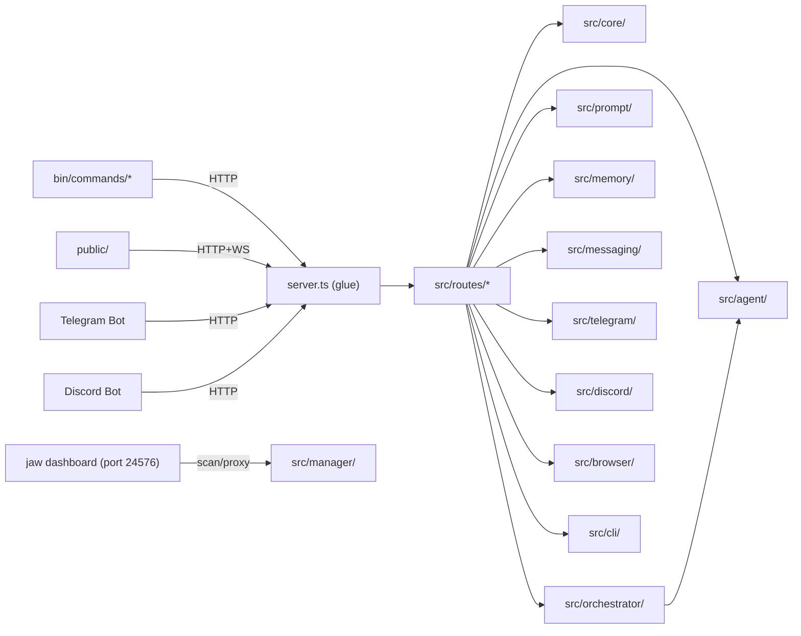

# CLI-JAW Architecture Reference

> cli-jaw 프로젝트의 내부 구조를 기술한 아키텍처 문서 허브. 시스템 전체 흐름부터 개별 모듈까지, 이 파일에서 시작하세요.

---

## 시스템 개요

4개 인터페이스(CLI, Web, Telegram, Discord)는 `server.ts`를 경유하고, `server.ts`는 인증/보안/WS/bootstrap을 맡은 뒤 `src/routes/`의 11개 route registrar와 2개 shared helper(`types.ts`, `quota.ts`)로 API를 위임합니다. Browser route registrar는 일반 CDP primitive와 `web-ai` ChatGPT/Gemini/Grok 자동화 API를 함께 제공하므로 route 수가 가장 큽니다. Process/tool logs는 `src/shared/tool-log-sanitize.ts`에서 WS와 snapshot 저장 전에 cap/truncate되어 Manager 대시보드 메모리 폭주를 막습니다.

---

## 📚 읽기 순서

| Tier | 문서 | 핵심 내용 |
|:----:|------|-----------|
| **1 — Foundation** | [str_func.md](str_func.md), [AGENTS.md](AGENTS.md) | 파일 트리 + 함수 레퍼런스, 동기화 체크리스트 |
| **2 — Core Flow** | [prompt_flow.md](prompt_flow.md), [agent_spawn.md](agent_spawn.md), [memory_architecture.md](memory_architecture.md) | 9-step 프롬프트 파이프라인, 에이전트 실행, 3-tier 메모리 |
| **3 — Interfaces** | [commands.md](commands.md), [server_api.md](server_api.md), [frontend.md](frontend.md), [telegram.md](telegram.md), [stream-events.md](stream-events.md) | 슬래시 커맨드, Express 라우트, Web UI, Telegram 봇, Discord 봇, NDJSON 이벤트 트레이스 |
| **4 — Reference** | [infra.md](infra.md), [prompt_basic_A1.md](prompt_basic_A1.md), [prompt_basic_A2.md](prompt_basic_A2.md), [prompt_basic_B.md](prompt_basic_B.md), [frontend_modernization_analysis.md](frontend_modernization_analysis.md), [gitstructure.md](gitstructure.md) | 코어 모듈, 프롬프트 템플릿, 현대화 분석, Git 토폴로지 |

> Tier 1 → 2 → 3 순서로 읽으면 전체 구조가 잡힙니다. Tier 4는 필요할 때 참조.

---

## 문서 맵

| 문서 | 범위 | 핵심 키워드 |
|------|------|-------------|
| [AGENTS.md](AGENTS.md) | Command/API/README/CLAUDE 변경 시 동기화 체크리스트 | 동기화, 체크리스트, 변경관리 |
| [str_func.md](str_func.md) | 전체 파일 트리 + 함수 시그니처 레퍼런스 | 파일트리, 함수, 마스터맵 |
| [prompt_flow.md](prompt_flow.md) | 프롬프트가 조립되는 9단계 파이프라인 | 프롬프트, 파이프라인, 주입 |
| [agent_spawn.md](agent_spawn.md) | CLI spawn + ACP 분기 + Gemini full-access flags + 오케스트레이션 | spawn, ACP, Gemini, 멀티에이전트 |
| [memory_architecture.md](memory_architecture.md) | History Block + Flush + Advanced Runtime + Task Snapshot | 메모리, flush, runtime, snapshot |
| [infra.md](infra.md) | config, db, bus, security 등 코어 모듈 | 인프라, SQLite, EventBus |
| [commands.md](commands.md) | 24개 슬래시 커맨드 + root CLI 18개 서브커맨드 + `browser web-ai` + explicit `/continue` note | 커맨드, 디스패처, 레지스트리 |
| [server_api.md](server_api.md) | `server.ts` 글루 + `src/routes/` API 126 handlers / 125 endpoints | REST, WebSocket, 라우트 |
| [stream-events.md](stream-events.md) | CLI NDJSON 이벤트 트레이스 + ProcessBlock 매핑 | NDJSON, stepRef, ProcessBlock |
| [🎨 frontend.md](frontend.md) | `public/` 소스/자산 277개 + `public/dist/` 생성물 455개, Manager notes/settings/WYSIWYG, ProcessBlock 렌더링, bounded tool-log hydration | 프론트엔드, Vite 8, PWA, ProcessBlock |
| [frontend_modernization_analysis.md](frontend_modernization_analysis.md) | 8개 현대화 제안의 비용-편익 분석 | 리팩터링, 비용분석, 마이그레이션 |
| [telegram.md](telegram.md) | Telegram 봇 + heartbeat + 음성 STT | 텔레그램, 하트비트, STT |
| [prompt_basic_A1.md](prompt_basic_A1.md) | 시스템 프롬프트 기본값 (A-1.md) | 시스템규칙, 기본값 |
| [prompt_basic_A2.md](prompt_basic_A2.md) | 사용자 설정 프롬프트 (A-2.md) | 사용자설정, 페르소나 |
| [prompt_basic_B.md](prompt_basic_B.md) | 조립 결과 + 스킬/MCP/하트비트 기본값 | 조립결과, 캐시, 기본값 |
| [gitstructure.md](gitstructure.md) | Git 토폴로지 + 서브모듈 워크플로 | Git, 브랜치, 서브모듈 |

---

## agbrowse Parity

`agbrowse` is the standalone browser/web-ai runtime. `cli-jaw` mirrors selected
surfaces through server-backed API routes, CLI commands, dashboard UI, and
`skills_ref/`. Do not claim parity unless this table says the surface is ready.

> Phase 22+ source of truth: [CAPABILITY_TRUTH_TABLE.md](CAPABILITY_TRUTH_TABLE.md). The summary below is kept for context; the truth table governs.

| Phase surface | cli-jaw mirror status | Evidence |
| --- | --- | --- |
| Phase 15 browser runtime visibility / orphan cleanup | ready | `browser doctor`, `cleanup-runtimes`, dashboard visible/agent split |
| Phase 16 semantic resolver | ready for ChatGPT web-ai path | `action-intent.ts`, `target-resolver.ts`, self-heal tests |
| Phase 17 answer artifact / source audit | ready for CLI/API output | `answer-artifact.ts`, `source-audit.ts`, `--require-source-audit` flags |
| Phase 18 broader MCP/AI SDK | partial | only existing cli-jaw browser/web-ai routes and schemas are claimable |
| Phase 19 external-CDP / hosted browser | deferred | no hosted/cloud support claim |
| Phase 20 benchmark comparison | deferred | no leaderboard or competitor score claim |
| Phase 21 release labels | docs mirrored | `skills_ref/browser`, `skills_ref/web-ai`, this parity table |

Support labels must stay aligned with agbrowse:

- `ready`: deterministic local browser primitives, resolver/source-audit
  contracts, runtime doctor/cleanup.
- `beta`: live ChatGPT/Gemini/Grok web UI flows.
- `deferred`: hosted/cloud external-CDP, benchmark score, broad production MCP
  claims.

---

## Recent Non-Strict Architecture Deltas (2026-05)

최근 100개 커밋 중 strict migration 자체가 아닌 구조 변화는 아래 문서에 반영되어야 합니다.

| Area | Current source of truth | Doc impact |
| --- | --- | --- |
| PABCD continue routing | `src/orchestrator/parser.ts`, `src/orchestrator/pipeline.ts` | natural-language “continue/계속/이어서”은 일반 프롬프트로 두고, worklog resume은 explicit `/continue`만 허용한다. |
| Gemini CLI full access + workspace dirs | `src/agent/args.ts`, `src/agent/spawn-env.ts`, `src/agent/spawn.ts` | fresh/resume Gemini runs must preserve auto-approval while passing required roots via `--include-directories`; configured/working/external task directories must be included to avoid `Path not in workspace`. |
| Bounded tool logs | `src/shared/tool-log-sanitize.ts`, `src/core/bus.ts`, `src/routes/orchestrate.ts` | WS `agent_tool`, `agent_done.toolLog`, `/api/orchestrate/snapshot.activeRun.toolLog` are sanitized before public/UI delivery. |
| Unified channel send | `src/messaging/*`, `src/routes/messaging.ts`, `src/telegram/*`, `src/discord/*` | `/api/channel/send` is canonical; `/api/telegram/send` and `/api/discord/send` remain compatibility/direct paths. |
| Browser runtime lifecycle | `src/browser/runtime-diagnostics.ts`, `src/browser/runtime-orphans.ts`, `src/browser/tab-lifecycle.ts`, `src/browser/web-ai/session*.ts` | browser docs should mention runtime doctor/orphan cleanup, persistent tab lifecycle, and web-ai session reattach. |
| Release gates | `scripts/release-gates.mjs`, `package.json` | `gate:all` now owns named docs/parity gates in addition to typecheck/tests. |

---

## 상호 참조 매트릭스

행 = 참조하는 쪽, 열 = 참조되는 쪽.

| | AGENTS | str_func | prompt_flow | agent_spawn | memory | infra | commands | server_api | telegram |
|:---|:---:|:---:|:---:|:---:|:---:|:---:|:---:|:---:|:---:|
| **AGENTS.md** | — | O | | | | | O | O | |
| **prompt_flow.md** | | | — | O | O | | | | |
| **agent_spawn.md** | | | | — | O | O | | | |
| **memory_architecture.md** | | | O | O | — | | | | |
| **prompt_basic_B.md** | | | O | | | | | | |
| **commands.md** | O | | | | | | — | O | |
| **frontend.md** | | | | | | | O | O | |
| **telegram.md** | | | | O | | O | | | — |

> 문서 수정 시 해당 열을 확인하면 영향받는 문서를 빠르게 찾을 수 있습니다.

---

## QA 도구

| 스크립트 | 용도 |
|----------|------|
| `check-doc-drift.sh` | `commands.md` / `server_api.md` / websocket events / `str_func.md` 드리프트 검사 |
| `verify-counts.sh` | `str_func.md`의 라인 카운트가 실제 소스와 일치하는지 검증 |
| `audit-fin-status.sh` | `_fin/` 디렉토리의 완료 상태 감사 |
| `normalize-status.ts` | `_fin` 상태 정규화 헬퍼 (frontmatter / legacy) |
| `status-scope.json` | `_fin` 감사/이동 스코프 매니페스트 |

---

*마지막 갱신: 2026-05-06 (`server.ts` 726L, `src/routes/` 126 route handlers / 125 API endpoints, `src/manager/` 39 TS/TSX files / 6503L, `src/browser/web-ai/` 57 TS files / 10238L, `bin/commands/` 18 top-level ts subcommands + `tui/` 7 helper, `public/js/` 52 .ts (root 17 + features 32 + diagram 3), `public/manager/` 191 files, tests 311 .test.ts 기준)*
