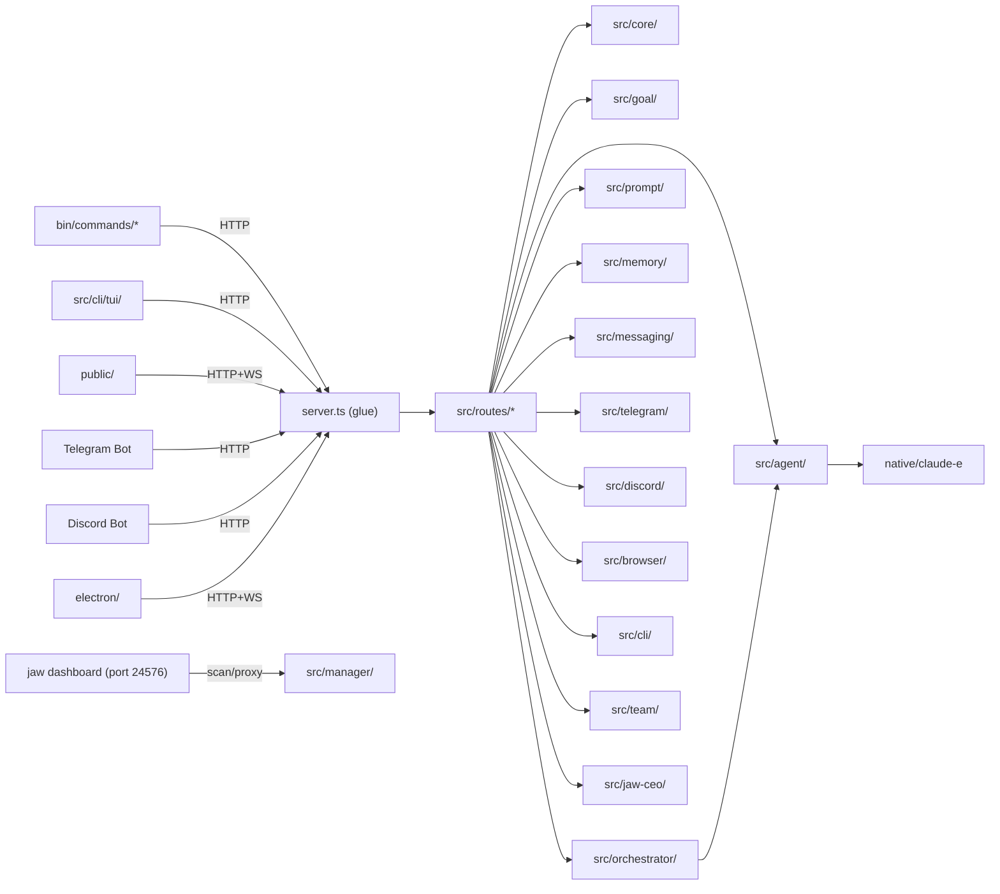

# CLI-JAW Architecture Reference

Activity backend: `shared/presentation.ts` owns display/identity decoding;
`trace/activity-journal.ts` owns bounded durable replay on existing trace storage.
`activity-control.ts` and `activity-retention.ts` keep finalization and pruning independent
of runtime projections. Snapshot/trace contracts are in `server_api.md`; ownership,
loss and delivery separation are in `runtime-integration.md` and `stream-events.md`.

> cli-jaw 프로젝트의 내부 구조를 기술한 아키텍처 문서 허브. 시스템 전체 흐름부터 개별 모듈까지, 이 파일에서 시작하세요.
>
> Planning state lives separately under `devlog/_plan/README.md`. The latest GitHub-issue triage snapshot (2026-05-16) is in that file's "Triage Snapshot" section.
>
> Multi-session architecture roadmap (Slack 다중 스레드 세션 분할, 통합 검색 계층, opt-in wiki, codex-app 기본 런타임):
> diff-level decade docs는 `devlog/_plan/260804_multi_session_architecture/` (000 roadmap + 001-008 research +
> 010·020·030·032·033·040·050·060·070·072·073·080·090·100·110 PRD). **구현 15건 전부 done** (2026-08-06).
> 후속으로 남은 것은 041(위키 entity/ontology/manager proxy), 074(세션별 CLI·모델), SSE-ring, 033b/033c다.

---

## 시스템 개요

```mermaid
graph LR
    CLI["bin/commands/*"] -->|HTTP| SRV["server.ts (glue)"]
    TUI["src/cli/tui/"] -->|HTTP| SRV
    WEB["public/"] -->|HTTP+WS| SRV
    TG["Telegram Bot"] -->|HTTP| SRV
    DC["Discord Bot"] -->|HTTP| SRV
    ELEC["electron/"] -->|HTTP+WS| SRV
    DASH["jaw dashboard (port 24576)"] -->|scan/proxy| MGR["src/manager/"]
    SRV --> ROUTES["src/routes/*"]
    ROUTES --> CORE["src/core/"]
    ROUTES --> AGT["src/agent/"]
    ROUTES --> GOAL["src/goal/"]
    ROUTES --> ORC["src/orchestrator/"]
    ROUTES --> PRM["src/prompt/"]
    ROUTES --> MEM["src/memory/"]
    ROUTES --> MSG["src/messaging/"]
    ROUTES --> TGMOD["src/telegram/"]
    ROUTES --> DCMOD["src/discord/"]
    ROUTES --> BR["src/browser/"]
    ROUTES --> CMD["src/cli/"]
    ROUTES --> TEAM["src/team/"]
    ROUTES --> CEO["src/jaw-ceo/"]
    ORC --> AGT
    AGT --> NATIVE["native/claude-e"]
```

6개 인터페이스(CLI, TUI, Web, Telegram, Discord, Slack) + Electron 데스크톱은 core `server.ts`를 경유하고, `server.ts`(635L)는 인증/보안/SSE/bootstrap을 맡은 뒤 `src/routes/`의 추출 route modules와 mounted sub-router로 API를 위임합니다(총 238 handlers including `/`; API endpoints 237). Web UI event delivery는 `GET /api/events` SSE channel을 우선 사용하고 legacy 서버에서만 WebSocket fallback을 탄다. `src/goal/`은 goal-mode autonomy(completion evidence gate)를 관리하고, `src/team/`은 multi-agent dispatch planning, `src/jaw-ceo/`는 OpenAI Realtime CEO channel을 제공합니다. 별도 `jaw dashboard serve` manager 서버는 notes/search/schedule/reminders/board/git/memory surface를 `src/manager/`에서 제공하고, manager server가 worker instance SSE를 bridge/cache한다. Process/tool logs는 `src/shared/tool-log-sanitize.ts`에서 SSE와 snapshot 저장 전에 cap/truncate되어 Manager 대시보드 메모리 폭주를 막습니다.

---

## 📚 읽기 순서

| Tier | 문서 | 핵심 내용 |
|:----:|------|-----------|
| **1 — Foundation** | [str_func.md](str_func.md), [AGENTS.md](AGENTS.md) | 파일 트리 + 함수 레퍼런스, 동기화 체크리스트 |
| **2 — Core Flow** | [prompt_flow.md](prompt_flow.md), [agent_spawn.md](agent_spawn.md), [memory_architecture.md](memory_architecture.md) | 9-step 프롬프트 파이프라인, 에이전트 실행, 3-tier 메모리 |
| **3 — Interfaces** | [commands.md](commands.md), [server_api.md](server_api.md), [frontend.md](frontend.md), [telegram.md](telegram.md), [stream-events.md](stream-events.md) | 슬래시 커맨드, Express 라우트, Web UI, Telegram 봇, Discord 봇, Slack 봇, SSE/WS 이벤트 트레이스 |
| **4 — Reference** | [infra.md](infra.md), [prompt_basic_A1.md](prompt_basic_A1.md), [prompt_basic_A2.md](prompt_basic_A2.md), [prompt_basic_B.md](prompt_basic_B.md), [CAPABILITY_TRUTH_TABLE.md](CAPABILITY_TRUTH_TABLE.md), [frontend_modernization_analysis.md](frontend_modernization_analysis.md), [gitstructure.md](gitstructure.md) | 코어 모듈, 프롬프트 템플릿, capability parity truth table, 현대화 분석, Git 토폴로지 |

> Tier 1 → 2 → 3 순서로 읽으면 전체 구조가 잡힙니다. Tier 4는 필요할 때 참조. Concurrent inbound gateway changes are documented in `telegram.md` §common messaging layer, `infra.md` §`src/messaging/`, and this index.

---

## 문서 맵

| 문서 | 범위 | 핵심 키워드 |
|------|------|-------------|
| [AGENTS.md](AGENTS.md) | Command/API/README/CLAUDE 변경 시 동기화 체크리스트 | 동기화, 체크리스트, 변경관리 |
| [str_func.md](str_func.md) | 전체 파일 트리 + 함수 시그니처 레퍼런스 | 파일트리, 함수, 마스터맵 |
| [prompt_flow.md](prompt_flow.md) | 프롬프트가 조립되는 9단계 파이프라인 | 프롬프트, 파이프라인, 주입 |
| [agent_spawn.md](agent_spawn.md) | CLI spawn + ACP 분기 + Pi RPC + AGY print-mode + Cursor stream-json + Claude E + Gemini + Grok + Kiro-code + Goal autonomy + 오케스트레이션 | spawn, ACP, Pi, AGY, Cursor, claude-e, Gemini, Grok, Kiro, Goal, 멀티에이전트 |
| [runtime-integration.md](runtime-integration.md) | canonical Codex event/outcome foundation + codex-app/pi 상주 런타임 풀 + cancel 의미론 + exec-parity + 모델 발견 + pi rpc 판정 | runtime events, finality, runtime-pool, codex-app, Pi, opencodex |
| [memory_architecture.md](memory_architecture.md) | History Block + Flush + Advanced Runtime + Task Snapshot | 메모리, flush, runtime, snapshot |
| [infra.md](infra.md) | config, db, bus, security 등 코어 모듈 + 릴리스 파이프라인(`preview → main → npm`)과 부분 실패·롤백 복구 절차 | 인프라, SQLite, EventBus, 릴리스, 롤백, dist-tag |
| [commands.md](commands.md) | 55개 슬래시 커맨드(54 non-hidden; `/file`만 hidden) + workflow category(`/plan`, `/interview`, `/deliberate`, `/planaudit`, `/review`, `/goal`, `/goalplan`, `/gd`, `/team`; 자동 실행은 `/goal run ...`) + root CLI 28개 cmdline-visible surface + 13개 CLI registry runtime | 커맨드, 디스패처, 레지스트리 |
| [server_api.md](server_api.md) | `server.ts` 글루 + `src/routes/`/mounted sub-router API 238 handlers including `/` / 237 API endpoints + SSE `/api/events` + 49 public event types + legacy WS fallback boundary | REST, SSE, WebSocket, 라우트 |
| [stream-events.md](stream-events.md) | SSE-first runtime event channel + WebSocket fallback + CLI NDJSON/Grok streaming-json + ProcessBlock 매핑 + goal pause gate(`goal_pause_gate_pending`, continuation suppression) + plain `claude` `text_delta` live streaming | SSE, WebSocket, NDJSON, stepRef, ProcessBlock, Grok, goal pause gate |
| [🎨 frontend.md](frontend.md) | `public/` 소스/자산 + Electron 데스크톱, slash workflow chips, Manager notes/search/settings/reminders/WYSIWYG, interview tracker panel, MCP settings page, Pi profile popup, kiro-code provider UI, ProcessBlock 렌더링(hydrated expand/`reconstructStepsFromBlock`, virtual-scroll detail release, `data-had-detail`) | 프론트엔드, Vite 8, PWA, Electron, ProcessBlock, virtual-scroll |
| [frontend_modernization_analysis.md](frontend_modernization_analysis.md) | 8개 현대화 제안의 비용-편익 분석 | 리팩터링, 비용분석, 마이그레이션 |
| [telegram.md](telegram.md) | Telegram 봇 + forum topic-aware send + Dashboard Telegram Hub(P0–P4) + hub-member relay + heartbeat + 음성 STT | 텔레그램, 하트비트, STT, forum hub, concurrent gateway |
| [prompt_basic_A1.md](prompt_basic_A1.md) | 시스템 프롬프트 기본값 (A-1.md) | 시스템규칙, 기본값 |
| [prompt_basic_A2.md](prompt_basic_A2.md) | 사용자 설정 프롬프트 (A-2.md) | 사용자설정, 페르소나 |
| [prompt_basic_B.md](prompt_basic_B.md) | 조립 결과 + 스킬/MCP/하트비트 기본값 | 조립결과, 캐시, 기본값 |
| [gitstructure.md](gitstructure.md) | Git 토폴로지 + 서브모듈 워크플로 | Git, 브랜치, 서브모듈 |
| [type-safety-status.md](type-safety-status.md) | tsconfig strict flags + type escape hatch inventory | TypeScript, strict, @ts-nocheck, as any |
| [CAPABILITY_TRUTH_TABLE.md](CAPABILITY_TRUTH_TABLE.md) | agbrowse/cli-jaw parity claim source of truth | parity, capability, support label |
| [tui-scrollback.md](tui-scrollback.md) | TUI native scrollback commit architecture (Ghostty 1.3+) | scrollback, DECSTBM, CommitFrontier, fillRows |
| [remote-headless.md](remote-headless.md) | 원격·무인 상주: 비대화형 SSH 셸의 PATH 부재(#479), systemd 없는 호스트의 supervisor 백엔드, pid 파일 검증 | 원격, ssh, 비대화형, PATH, supervisor, 상주 |

---

## agbrowse Parity

`agbrowse` is the standalone browser/web-ai runtime. `cli-jaw` mirrors selected
surfaces through server-backed API routes, CLI commands, dashboard UI, and
`skills_ref/`. Do not claim parity unless this table says the surface is ready.

> Phase 22+ source of truth: [CAPABILITY_TRUTH_TABLE.md](CAPABILITY_TRUTH_TABLE.md). The summary below is kept for context; the truth table governs.

| Phase surface | cli-jaw mirror status | Evidence |
| --- | --- | --- |
| Phase 15 browser runtime visibility / orphan cleanup | ready | `browser doctor`, `cleanup-runtimes`, dashboard visible/agent split |
| Phase 16 semantic resolver | ready for ChatGPT web-ai path | `action-intent.ts`, `target-resolver.ts`, self-heal tests |
| Phase 17 answer artifact / source audit | ready for CLI/API output | `answer-artifact.ts`, `source-audit.ts`, `--require-source-audit` flags |
| Phase 18 broader MCP/AI SDK | partial | only existing cli-jaw browser/web-ai routes and schemas are claimable |
| Adaptive URL fetch mirror | experimental | `jaw browser fetch <url>` mirrors agbrowse adaptive URL-reader v1 for known URLs/search-result URLs; not generic search |
| Phase 19 external-CDP / hosted browser | deferred | no hosted/cloud support claim |
| Phase 20 benchmark comparison | deferred | no leaderboard or competitor score claim |
| Phase 21 release labels | docs mirrored | `skills_ref/browser`, `skills_ref/web-ai`, this parity table |

Support labels must stay aligned with agbrowse:

- `ready`: deterministic local browser primitives, resolver/source-audit
  contracts, runtime doctor/cleanup.
- `beta`: live ChatGPT/Gemini/Grok web UI flows.
- `experimental`: adaptive URL fetch and action-memory cache; opt-in/tested,
  but not a CAPTCHA/login/paywall/stealth bypass or generic web-search claim.
- `deferred`: hosted/cloud external-CDP, benchmark score, broad production MCP
  claims.

---

## Recent Architecture Deltas (refreshed 2026-06-27; ~1200 commits since 2026-06-10)

최근 500개 커밋 중 문서에 반영해야 하는 구조 변화는 아래와 같습니다.

| Area | Current source of truth | Doc impact |
| --- | --- | --- |
| PABCD continue routing | `src/orchestrator/parser.ts`, `src/orchestrator/pipeline.ts` | natural-language “continue/계속/이어서”은 일반 프롬프트로 두고, worklog resume은 explicit `/continue`만 허용한다. |
| Gemini CLI full access + workspace dirs | `src/agent/args.ts`, `src/agent/spawn-env.ts`, `src/agent/spawn.ts` | fresh/resume Gemini runs must preserve auto-approval while passing OS home roots via `--include-directories`; WSL includes Linux home plus Windows user home when discoverable to avoid `Path not in workspace`. |
| Bounded tool logs | `src/shared/tool-log-sanitize.ts`, `src/core/bus.ts`, `src/routes/orchestrate.ts` | WS `agent_tool`, `agent_done.toolLog`, `/api/orchestrate/snapshot.activeRun.toolLog` are sanitized before public/UI delivery. |
| Unified channel send | `src/messaging/*`, `src/routes/messaging.ts`, `src/telegram/*`, `src/discord/*`, `src/slack/*` | `/api/channel/send` is canonical; explicit Slack targets may reuse only the validated current conversation/thread when the configured allowlist is empty. `/api/telegram/send` and `/api/discord/send` remain compatibility/direct paths. |
| Inbound ACK + queue notice | `src/messaging/ack-reaction.ts`, `src/messaging/queue-notice.ts`, `src/slack/api.ts`, `src/telegram/reactions.ts`, `src/discord/reactions.ts` | 인바운드 명령은 텍스트가 아니라 이모지 리액션으로 ACK한다. 상태머신과 안내 생명주기는 messaging 계층이 소유하고 채널은 transport 팩토리만 제공한다. 안내는 답변 전송 성공 **후** 삭제, 미답변(타임아웃/셧다운)은 만료 문구로 편집. 셧다운은 `QueueNoticeRegistry.drain`이 bounded로 소유하며 deadline에서 실제 abort한다. 자세히: `infra.md` §`src/messaging/`. |
| Slack 공개 채널 자동 합류 | `src/slack/auto-join.ts`, `src/slack/bot.ts`, `src/core/config.ts` | 봇 토큰은 멤버가 아닌 채널의 `conversations.history`에 `not_in_channel`을 받는다. 초대받지 않은 채널에 닿는 유일한 경로가 `conversations.join`이라 부팅 시 공개 채널을 스캔해 자동 합류한다(`slack.autoJoin`, 기본 on). 합류는 채널에 참여 메시지를 남기는 **가시적 변경**이다. 인바운드 게이트(`mentionOnly`)는 그대로라 일반 잡담에 응답하지 않는다 — 넓어지는 건 온디맨드 조회/멘션/전송이다. `channelIds` 허용목록이 비어있지 않으면 그 경계를 넘지 않는다. 자세히: `infra.md` §`src/slack/`. |
| Slack turn context | `src/prompt/conversation-context.ts`, `src/agent/spawn.ts`, `src/prompt/templates/a1-system.md` | Every Slack-triggered Boss user turn carries explicit `channel_id` and parent `thread_ts` independently of multi-session, so lookup/send APIs never depend on parsing an internal session label. |
| Browser runtime lifecycle | `src/browser/runtime-diagnostics.ts`, `src/browser/runtime-orphans.ts`, `src/browser/tab-lifecycle.ts`, `src/browser/web-ai/session*.ts` | browser docs should mention runtime doctor/orphan cleanup, persistent tab lifecycle, and web-ai session reattach. |
| Render helper split | `public/js/render.ts`, `public/js/render/*` | Frontend docs should describe `render.ts` as a 17L stable façade and keep markdown/sanitize/Mermaid/SVG/file-link/post-render ownership under `public/js/render/`. |
| Diagram overlay styling | `public/css/diagram.css`, `public/js/render/sanitize.ts`, `public/js/render/svg-actions.ts` | Inline SVG overlay clones preserve semantic diagram classes via `.diagram-svg-overlay`; docs should not treat `diagram.css` as Mermaid-only. |
| Release gates | `scripts/release-gates.mjs`, `package.json` | `gate:all` runs all 23 named gates (`typecheck`, `tests`, `truth-table-fresh`, `mcp-scope-frozen`, `no-experimental-in-readme-ready-section`, `no-cloud-claims`, `observe-actions-fixtures`, `observation-bundle-fixtures`, `browser-primitives-catalog`, `action-memory-safe-replay`, `model-adapter-frozen`, `workflow-common-layer-no-sdk`, `doc-drift`, `strict-baseline`, `path-length`, `redaction-sinks`, `electron-version`, `gate-docs`, `sidecar-prune-safety`, `native-load`, `sidecar-smoke`, `install-integrity`, `messaging-conformance`); each is npm-addressable as `gate:<name>`. This row is itself enforced by `gate:gate-docs`. |
| Manager notes search | `src/notes/search.ts`, `src/manager/notes/routes.ts`, `public/manager/src/notes/NotesSearchSidebar.tsx` | Manager notes docs should describe ripgrep-backed markdown search, `/api/dashboard/notes/search`, sidebar-mode abortable frontend search, and typed search errors. |
| Manager reminders parity | `src/manager/reminders/*`, `public/manager/src/dashboard-reminders/*` | Manager docs should describe dashboard reminders API, matrix buckets, top-priority strip, detail popover, drag/drop bucket moves, and reminder notification scheduler. |
| WYSIWYG wikilink fallback | `public/manager/src/notes/wysiwyg/milkdown-wikilink-plugin.ts`, `public/manager/src/notes/wiki-link-rendering.ts` | WYSIWYG docs should mention `outgoingLinks` lookup plus `vaultIndex.notes` client-side fallback before backend index refresh; preview resolver parity remains tracked as a follow-up. |
| Trace read API | `src/routes/traces.ts`, `src/trace/store.ts` | Server API docs should list public trace summary/event routes and the `alert_escalation` WS event. |
| PABCD Project root guard + devlog skill guidance | `src/orchestrator/pipeline.ts`, `src/orchestrator/state-machine.ts`, `skills_ref/dev*/SKILL.md`, `structure/prompt_basic_B.md` | PABCD docs should require `Project root: <absolute path>` in injected/dispatch examples and skill docs should prefer strict TypeScript plus existing `structure/`/`devlog`/SOT discovery. |
| Dashboard Memory Federation (L1/L2) | `src/manager/memory/`, `src/manager/routes/dashboard-memory.ts`, `bin/commands/dashboard-memory.ts` | Dual-memory: L1 = instance-local `jaw memory` (read/write), L2 = dashboard `jaw dashboard memory` (read-only cross-instance FTS5 federation with RRF reranking). Schema-aware probing degrades gracefully for older instances. Dashboard-less users are unaffected. |
| Grok CLI runtime | `src/cli/registry.ts`, `src/agent/args.ts`, `src/agent/events.ts`, `src/routes/quota.ts`, `public/assets/providers/grok*.svg` | `grok-build` is a standard CLI runtime using `grok -p ... --output-format streaming-json`; effort/system-prompt flags are disabled for `grok-build`; `/api/quota.grok` reads current `~/.grok/auth.json` OIDC credentials and prefers the Grok Build weekly credits gRPC-web endpoint (`GrokBuildBilling/GetGrokCreditsConfig`) before falling back to legacy `cli-chat-proxy.grok.com/v1/billing`. Browser `vendor=grok` remains a separate web-AI surface. |
| Cursor runtime | `src/types/cli-engine.ts`, `src/cli/registry.ts`, `src/cli/readiness.ts`, `src/agent/cursor-runtime.ts`, `src/agent/events/cursor.ts`, `src/agent/args.ts`, `src/agent/spawn.ts`, `src/agent/spawn/resume.ts`, `src/routes/settings.ts`, `public/assets/providers/cursor*.svg`, `public/js/provider-icons.ts`, `public/js/constants.ts`, `public/manager/src/settings/pages/components/agent/agent-meta.ts`, `bin/commands/tui/types.ts` | `cursor` is a top-level experimental registry runtime, not an `ai-e` provider. It uses `cursor-agent -p --trust --output-format stream-json`, exact resume through `--resume <chatId>`, and model ids resolved from model+effort before spawn. `/api/cli-registry`, `/api/cli-status`, and `/api/quota` include Cursor; quota is status-only because Cursor CLI does not expose quota windows. Provider icon source is official Cursor brand SVG, cropped locally. |
| AGY runtime | `src/types/cli-engine.ts`, `src/cli/registry.ts`, `src/cli/readiness.ts`, `src/agent/agy-capabilities.ts`, `src/agent/args.ts`, `src/agent/agy-runtime.ts`, `src/agent/spawn.ts`, `src/agent/spawn-env.ts`, `src/routes/settings.ts`, `public/index.html`, `public/js/constants.ts`, `public/js/features/settings-cli-status.ts`, `public/manager/src/settings/pages/components/agent/agent-meta.ts`, `bin/commands/init.ts`, `bin/commands/tui/types.ts` | `agy` is a top-level registry runtime, not an `ai-e` provider. It uses `agy -p` print mode with capability-probed optional flags (`--model` observed in AGY 1.0.12; probe failure logs and falls back to legacy emit-all compatibility), `--print-timeout 10m`, per-run `--log-file` session capture, exact native resume through `--conversation <sessionId>`, optional `--dangerously-skip-permissions`, repeated `--add-dir`, plain-text stdout, default `NO_COLOR=1`, run-time auth checking. No per-run `--effort` flag. Native AGY context-file ingestion is separate from cli-jaw wrapper contracts such as injected operational context, exact resume policy, transcript anchoring, quota UI, and post-compaction invariants. `/api/cli-registry`, `/api/cli-status`, and `/api/quota` include AGY; `antigravity-usage --json` can expose reverse-engineered Gem/Cla windows. If AGY only returns binary `0`/`1` quota, cli-jaw marks `precision: "binary"` and the UI displays `Available` / `Exhausted` instead of fake exact percent bars. Antigravity MCP sync remains a separate config target. AGY parity gaps tracked in `devlog/_fin/260627_agy_parity_gap/`. |
| Claude E runtime wrapper | `native/claude-e/`, `src/agent/claude-e-runtime.ts`, `src/agent/args.ts`, `src/agent/events.ts`, `src/core/cli-detection.ts`, `src/core/config.ts`, `src/cli/readiness.ts`, `bin/commands/doctor.ts` | `claude-e` is an experimental registry runtime backed by the Claude E helper surface; helper discovery honors `CLAUDE_E_BIN`/`CLAUDE_EXEC_BIN`/`JAW_CLAUDE_I_BIN`, local npm `claude-e` release/debug candidates, PATH `claude-e`, compatibility `claude-exec`, then legacy `jaw-claude-i` / `claude-i` fallbacks. The embedded native source now lives under `native/claude-e/` but still builds the compatibility binary `jaw-claude-i`; the old `native/jaw-claude-i/` path remains a deprecated fallback candidate only. Candidates must expose `--idle-timeout-ms` in `run --help`, so stale PATH helpers are rejected before spawn args are built. Runtime telemetry emits internal `agent:claude-e:*`; some persisted helper/session internals still use the historical `claude-i` bucket. `npm run build:claude-e` / `npm run test:claude-e` are primary native build/test scripts; `build:claude-exec` / `test:claude-exec` remain compatibility aliases. |
| AI-E runtime wrapper | `src/core/config.ts`, `src/cli/registry.ts`, `src/agent/args.ts`, `tests/unit/cli-registry.test.ts` | `ai-e` detection checks `AI_E_BIN`, local npm `@bitkyc08/ai-e` release/debug candidates, then PATH. Candidates must expose `--idle-timeout-ms` through `ai-e claude run --help`; older PATH binaries are reported as rejected with `missing --idle-timeout-ms support`. |
| Interview structured tracker + multi-question + elicitation | `src/orchestrator/state-machine.ts`, `src/orchestrator/pipeline.ts`, `public/js/ws.ts`, `public/index.html`, `public/css/orc-state.css`, `src/prompt/templates/a1-system.md`, `src/prompt/templates/orchestration.md`, `public/js/render/markdown.ts`, `public/js/features/elicitation.ts`, `src/shared/structured-fence.ts`, `src/agent/lifecycle-handler.ts` | Interview(I)는 라운드당 1~3개 질문 + 응답마다 `<interview_tracker>` known/unknown 추출 → `OrcContext.interview`(known/unknown/round) → `orc_state` WS payload → `#interviewPanel`(`renderInterviewPanel`) 실시간 렌더. 21.n부터 명확한 선택지 질문은 short prose + standalone `elicitation` fence를 사용할 수 있으나 hidden tracker는 유지한다. 21.5부터 `visibleWhen` prior-answer branching을 지원한다. `structured-fence`와 lifecycle 진단은 incomplete fence / durable truncation을 fail-closed로 방어한다. |
| I→P context pinning | `src/routes/orchestrate.ts`, `src/orchestrator/pipeline.ts`, `src/orchestrator/state-machine.ts` | `I → P` 전환은 첫 Plan 생성 전에도 기존 `OrcContext`를 보존하고, `originalPrompt`가 비어 있으면 `interview.request`를 pinned planning task로 사용한다. 사용자가 "진행/계속" 같은 짧은 후속 명령을 보내도 인터뷰의 원 요청과 evidence가 Plan 입력을 대체당하지 않는다. `setState('P', undefined)`의 stale-plan clearing 계약은 유지한다. |
| Frontend gap 22/23 runtime cards | `src/routes/link-preview.ts`, `server.ts`, `public/js/render/markdown.ts`, `public/js/render/search-results.ts`, `public/js/render/link-preview.ts`, `public/js/render/post-render.ts`, `public/js/features/message-history.ts`, `public/js/features/chat-messages.ts`, `public/css/chat.css`, `src/orchestrator/pipeline.ts`, `src/shared/structured-fence.ts` | 22 Rich Link Preview는 `/api/link-preview` metadata route와 `/api/link-preview/image` guarded proxy를 통해 외부 URL을 compact card로 unfurl한다. 카드 UI는 favicon/site/URL metadata를 첫 줄에 합치고 제목/설명을 clamp해 긴 설명이 채팅 세로 공간을 과점하지 않게 한다. 23 Search Results는 `search-results` fenced JSON을 final-render 시 native cards로 hydrate한다. Telegram/Discord는 Web UI fence를 raw로 받지 않도록 prompt guard + output fallback을 적용한다. |
| Frontend gap 30.2 renderer runtime cards | `public/js/render/compose-block.ts`, `public/js/render/diff-viewer.ts`, `public/js/render/dataframe.ts`, `public/js/render/chart-json.ts`, `public/js/render/markdown.ts`, `public/js/render/post-render.ts`, `public/js/render/delegations.ts`, `public/js/render/sanitize.ts`, `public/js/features/message-history.ts`, `public/js/features/chat-messages.ts`, `public/css/chat.css`, `src/shared/structured-fence.ts` | 24+33 Compose Block, 34 Diff Viewer, 36 Dataframe, 31 Chart JSON이 21/22/23과 같은 final-render structured-fence architecture로 구현된다. `compose-block`/`dataframe`/`chart-json`은 sanitizer-safe placeholder 후 post-render hydration, malformed fail-closed, streaming inert policy를 따른다. `diff`는 explicit fence와 no-language unified diff auto-detect를 native escaped diff viewer로 렌더한다. |
| steerPrompt Web/CLI fire + `steer_started` | `src/cli/handlers-workflows.ts`, `src/agent/spawn.ts`, `src/routes/orchestrate.ts`, `public/js/ws.ts` | goal set/resume/done/cancel/pause 및 interview/deliberate/planaudit start가 Web/CLI에서 `steerPrompt`만 반환하고 멈추던 버그를 `fireSteerForWebCli()`로 수정 — Web/CLI는 `submitMessage()`를 직접 실행하고 Telegram/Discord는 기존 `steerPrompt` 반환을 유지한다. 관찰 가능한 `steer_started`({prompt,origin}) WS 이벤트 추가. goal resume가 Web/CLI에서도 실제 작업을 이어간다. |
| Dashboard git diff API | `src/manager/routes/dashboard-git.ts`, `src/manager/git/diff-service.ts`, `public/manager/src/diff-panel/diff-client.ts`, `public/manager/src/diff-panel/DiffPanel.tsx` | Desktop Diff 패널 데이터 경로가 Electron main git IPC에서 server-backed `/api/dashboard/git/{repo-candidates,diff-summary,file-diff}`로 이동(`diff-client.ts` → `dashboard-git.ts` → `diff-service.ts`). `core.quotepath=false` + ref/home/path-traversal guard는 diff-service에서 유지. |
| Goal objective length limit removed | `src/cli/handlers-workflows.ts`, `src/goal/store.ts` | goal objective의 2000자 길이 제한 제거. `/goal run start`는 preflight/start/stop/status를 갖춘 budget tracking-only Preview로 동작하며, budget enforcement는 아직 tracking-only다. |
| Inline media rendering + channel relay | `src/routes/static.ts`, `public/js/render/markdown.ts`, `public/js/render/delegations.ts`, `public/js/features/media-lightbox.ts`, `public/css/chat.css`, `src/messaging/extract-images.ts`, `src/telegram/forwarder.ts`, `src/discord/forwarder.ts` | `/uploads/`는 `/media`, 그 외 로컬 절대경로는 인증된 `/api/image?path=`로 렌더링한다. `/api/image`는 allowed-root realpath + media allowlist(SVG 제외)로 서빙하고, 실패 이미지는 document capture listener가 non-clickable placeholder로 바꾼다. `agent_done`와 채널-origin reply는 text 뒤 허용된 로컬 이미지를 기존 Telegram photo/Discord attachment transport로 relay한다. |
| Goal continuation hardening | `src/goal/heartbeat.ts`, `src/orchestrator/state-machine.ts`, `src/prompt/templates/a1-system.md`, `src/prompt/builder.ts` | Goal mode가 PABCD보다 우선. Codex-style completion audit (requirement-by-requirement scrutiny) + blocked audit (3턴 연속 규칙). Interview per-turn에 negativity bias / pressure-test 규칙. (260610 2차 슬림: goal-mode 규칙은 continuation 프롬프트 단일 소유 — STATE_PROMPTS의 'Goal mode EXCEPTION'과 a1 'Goal Mode Rules'는 제거되고 a1엔 CLI 목록+포인터 스텁만 남음. devlog/_fin/260610_prompt_injection_redesign/10.) (260624 work-phase loop: heartbeat 연속 프롬프트 + builder 인라인 PABCD 가이드 + STATE_PROMPTS D/I/P가 work-phase=풀 PABCD 한 바퀴, loop/루프 멀티-패스 사전문서화+설계전용 Phase-0, anti-skip(충실 이행), D→IDLE→P 재진입을 명시. devlog/_fin/260624_goal_work_phase_pabcd_loop/.) |
| Slash command P2 surface | `src/cli/commands.ts`, `src/cli/handlers/session-handlers.ts`, `src/core/chat-sessions.ts` | Slash parsing now uses `tokenizeArgs()` for quoted arguments, unknown-command suggestions include Levenshtein recovery, and `/fork` clones the current chat into a new session. `commands.md` command counts and category lists must include `/goalplan`, `/review`, `/task`, and `/fork`. |
| Agent retry + trace redaction quick wins | `src/agent/lifecycle-handler.ts`, `src/agent/spawn.ts`, `src/trace/redact.ts` | 429/transient retry uses `_retryAttempt` with exponential backoff (`MAIN_MAX_RETRIES = 3`, `EMP_MAX_RETRIES = 2`). Trace redaction covers AWS access keys, Anthropic `sk-ant-*` keys, JWT-like tokens, and expanded secret key names. `agent_retry` events include attempt/max retry metadata. |
| Native search skill + private skill boundary | `src/prompt/templates/a1-system.md`, `src/prompt/templates/skills.md`, `skills_ref/jaw-search/SKILL.md`, `skills_ref/jaw-browser/SKILL.md`, `skills_ref/registry.json` | Korean/source-sensitive search defaults to native cli-jaw search: rewrite into focused queries, treat results as URL candidates, verify original pages via fetch/open, and escalate browser/web-ai only when the original page is incomplete. `agbrowse research plan` is optional query-planning help, not provider execution. `k-writing` (Korean promotional/content writing; retired label: `k-thread-gen`) and `lecture-stt` remain private active runtime skills, not public `skills_ref` entries. Korean promotional/content writing routes through active `k-writing`, not free-form prose or the retired label. |
| Goalplan refine guard | `src/goal/store.ts`, `src/goal/heartbeat.ts`, `src/routes/goal.ts`, `src/cli/handlers-workflows.ts`, `bin/commands/goal.ts` | `/goal plan`/`/goalplan`/`cli-jaw goal plan`은 raw hint를 objective로 저장하지 않고 pending objective + `planHint`로 저장한다. `goalMode: "plan"` 상태에서는 checkpoint/update가 거부되며, `cli-jaw goal refine "<specific objective>"` 또는 `/api/goal` `refine-objective`가 objective를 확정하고 direct mode로 전환한다. |
| `/review` project-dir workflow | `src/workflows/review.ts`, `src/cli/handlers-workflows.ts`, `src/cli/commands.ts` | `/review`는 `projectDirs` 또는 최근 맥락에서 검증한 git repo만 대상으로 하며 JAW_HOME/`process.cwd()` fallback을 금지한다. `/review [focus]`의 사용자 focus text를 최우선 scope signal로 반영하고, 현재 대화의 작업 초점과 최근 goal/chat context, commit history, diff, worktree, untracked 파일은 그 범위의 근거로 사용하며, 무관한 최근 커밋을 git range만으로 포함하지 않는다. Markdown report에 `Scope Resolution` 근거를 저장한다. `--fix`는 검증된 프로젝트 루트 안의 Critical/High만 현재 `HEAD` 위 새 working-tree patch로 자동 수정하며 기존 커밋을 rewrite하지 않는다. |
| Runtime SSE event channel | `src/core/event-bus.ts`, `src/routes/events.ts`, `public/js/event-channel.ts`, `public/js/ws.ts` | `GET /api/events`는 data-only SSE payload(`topic`, `event`)와 `Last-Event-ID` replay를 제공한다. Web client는 SSE를 primary event channel로 쓰고, `/api/events`를 열 수 없는 legacy server에서만 WebSocket fallback으로 돌아간다. |
| Route extraction after SSE cycle | `server.ts`, `src/routes/static.ts`, `src/routes/messages.ts`, `src/routes/system.ts`, `src/routes/agent-control.ts`, `src/routes/command.ts`, `src/routes/instance.ts`, `src/routes/chat-sessions.ts`, `src/routes/task.ts`, `src/routes/events.ts` | `server.ts`는 635L glue; base/session/message/task/event surfaces가 route modules로 분리. `server_api.md`와 `str_func.md` counts track **238** handlers including `/` and **237** API endpoints. |
| Electron self-contained sidecar release | `scripts/bundle-sidecar.sh`, `scripts/check-electron-sidecar-no-jwc.cjs`, `scripts/check-app-icon-assets.cjs`, `electron/electron-builder.yml`, `.github/workflows/desktop-release.yml`, `electron/src/main/lib/jaw-spawn.ts`, `electron/src/main/lib/install-cli.ts` | Packaged desktop builds include a Node.js 24.17 sidecar under `extraResources/server`, bundle only the `jaw` CLI shim, exclude JWC payloads (`jawcode`, `@jawcode-dev`, `@oven`, `bun`) from npm and Electron installs, leave JWC as an external runtime selected only when the user installs/builds jawcode and sets `JWC_SDK_PATH` or runs `jaw jwc install` then `jaw jwc doctor`, remove optional external JWC dependencies with `jaw jwc clean`, prefer bundled `bin/jaw` before global `jaw`, fail CLI install on incomplete sidecars, verify staging/final macOS `.app` sidecars plus packaged app icons, and build macOS arm64 DMG/ZIP, Windows x64 NSIS/ZIP, and Linux AppImage from GitHub Actions release/manual dispatch. |
| Manager InstanceRegistry + worker SSE bridge | `src/manager/instance-registry.ts`, `src/manager/server.ts`, `src/manager/worker-events.ts`, `src/manager/worker-sse-client.ts` | Manager scans are served from a cached `InstanceRegistry`; the manager server subscribes to worker instance `GET /api/events` streams server-side and caches latest-message progress while the React manager continues polling manager HTTP endpoints. |
| Telegram Hub (P0–P4) | `src/messaging/thread-target.ts`, `src/telegram/hub-callback.ts`, `src/manager/telegram-hub/*`, `src/manager/routes/telegram-hub.ts`, `public/manager/src/settings/pages/TelegramHub.tsx` | P0: thread-aware send. P1–P3: routing CRUD, hub bot, `/setthread` `/threads` `/hubhelp`, Manager GUI. **P4:** per-topic `model`/`systemPrompt` on `ThreadRoute`; hub forwards overrides to instance `/api/message`; Manager routes table shows overrides; outbound may use `rich-message` scaffold when available. One bot token → one long-poller. |
| Process-block expand + detail release | `public/js/features/process-block.ts`, `tests/unit/process-block-expand.test.ts` | Hydrated/virtual-scroll blocks: `[data-expand-steps]` falls back to `reconstructStepsFromBlock()` (`dataset.processStepIds` + meta store) when WeakMap misses. Virtual-scroll recycle: `data-had-detail` placeholder instead of blank expand after `releaseProcessBlockDetails()`. |
| Goal pause gate continuation fix (P0) | `src/goal/pause-gate.ts`, `src/goal/heartbeat.ts`, `src/agent/lifecycle-handler.ts` | Armed pause gate (`active` + `agentPauseCount≥1`) suppresses further automatic goal continuation; `goal_pause_gate_pending` SSE when audit turn ends without scheduling next kick. See `stream-events.md` / `server_api.md`. |
| Plain `claude` live streaming | `src/agent/events/claude.ts`, `src/agent/events/helpers.ts`, `src/agent/events/index.ts` | Top-level `claude` runtime streams assistant `text_delta` live via `appendAssistantRawText()`; `claudeStreamedText` guard prevents F-T4 doubling on complete `assistant`. |
| PABCD evidence gate (`--attest`) | `src/orchestrator/attestation.ts`, `src/orchestrator/state-machine.ts`, `bin/commands/orchestrate.ts` | Forward P→A/A→B/B→C/C→D requires `cli-jaw orchestrate <phase> --attest '{"from","to","did",...}'`; goal-mode still uses attestation as proof-of-work. |
| Skill-slash commands | `src/cli/handlers-skill-invoke.ts`, `src/core/skill-cache.ts`, `src/cli/commands.ts` | Active skills register as dynamic `/skill:<id>` (cli/web only); injects full `SKILL.md` via steerPrompt. |
| Adaptive-fetch P0 hardening | `src/browser/adaptive-fetch/scheduler.ts`, `stage-types.ts`, `browser-escalation.ts` | Typed stage scheduler, SSRF on all transports, overall-deadline + in-flight `AbortSignal` cancellation, warm browser pool, BM25 filter, Camoufox/yt-dlp/Jina reader stack (34 files). |
| Test runner (`tests/run.mts`) | `tests/run.mts`, `tests/setup/isolated-home.ts`, `package.json` | `npm test` / `test:all` use programmatic driver with `isolation:'process'` for subprocess DB isolation; replaces flat `tsx --test tests/**/*.test.ts` glob. |
| Pre-prompt context hooks | `src/prompt/context-hooks.ts`, `bin/commands/hooks.ts`, `docs/dev/pre-prompt-context-hooks.md` | Bounded sources under `JAW_HOME`, scopes `main`/`heartbeat`, `freshSession` wired into spawn turn metadata. |
| Runtime policy hooks | `src/core/policy-hooks.ts`, `src/core/policy-flags.ts`, `structure/prompt_flow.md` | Optional `policy-hooks.json`: afterOutput warn/block/redact seams (lifecycle/jwc/send/heartbeat), `record_pending`/quiet-marker event flags, beforeSpawn warn checks; inert without config. |
| Web-AI session artifacts + agbrowse parity wave | `src/browser/web-ai/session-artifacts.ts`, `candidate-reconcile.ts`, `session-doctor.ts`, `tier-timeout.ts`, `watcher-lock.ts` | Artifact persistence, navigation-ready guard, capability-probe ladders, DR timeout activity requirement, tab-lease caps; web-ai module count 68→96. |

---

## 상호 참조 매트릭스

행 = 참조하는 쪽, 열 = 참조되는 쪽.

| | AGENTS | str_func | prompt_flow | agent_spawn | memory | infra | commands | server_api | telegram |
|:---|:---:|:---:|:---:|:---:|:---:|:---:|:---:|:---:|:---:|
| **AGENTS.md** | — | O | | | | | O | O | |
| **prompt_flow.md** | | | — | O | O | | | | |
| **agent_spawn.md** | | | | — | O | O | | | |
| **memory_architecture.md** | | | O | O | — | | | | |
| **prompt_basic_B.md** | | | O | | | | | | |
| **commands.md** | O | | | | | | — | O | |
| **frontend.md** | | | | | | | O | O | |
| **telegram.md** | | | | O | | O | | | — |

> 문서 수정 시 해당 열을 확인하면 영향받는 문서를 빠르게 찾을 수 있습니다.

---

## QA 도구

| 스크립트 | 용도 |
|----------|------|
| `check-doc-drift.sh` | `commands.md` / `server_api.md` / websocket events / `str_func.md` 드리프트 검사 (legacy bash; commands/routes 검사는 `scripts/docs/check-docs.mts`가 AST 기반으로 이중화) |
| `scripts/docs/*.mts` | AST 기반 inventory 추출기 (`extract-commands`, `extract-routes`) + `npm run docs:check` live 비교 게이트 |
| `verify-counts.sh` | `str_func.md`의 라인 카운트가 실제 소스와 일치하는지 검증 |
| `audit-fin-status.sh` | `_fin/` 완료 상태 감사. 기본 stdout-only (read-only); 리포트 파일은 `--write-report`, 매니페스트 없는 전체 스캔은 `--full-scan` |
| `normalize-status.ts` | `_fin` 상태 정규화 헬퍼 (frontmatter / legacy) |
| `status-scope.json` | `_fin` 감사/이동 스코프 매니페스트 (canonical 위치: `structure/status-scope.json`) |

---

*마지막 갱신: 2026-07-06 (`server.ts` 637L, `src/routes/` 36 TS files / 238 route handlers including `/` / 237 API endpoints, `src/agent/` 48 TS files including spawn/events submodules, `src/goal/` 5 TS files (+`pause-gate.ts`), `src/cli/commands.ts` 52 slash commands (51 non-hidden; only `/file` hidden) + dynamic `/skill:<id>`, `src/core/event-bus.ts` + `src/routes/events.ts` SSE channel, `src/manager/` 102 TS/TSX files (+`telegram-hub/` 3 files), `src/browser/web-ai/` 96 TS files + `adaptive-fetch/` 32 files, `src/telegram/` 7 top-level TS files (+`hub-callback.ts`), `bin/commands/` 36 top-level TS files (+`hooks.ts`), `electron/` sidecar packaging 기준)*
