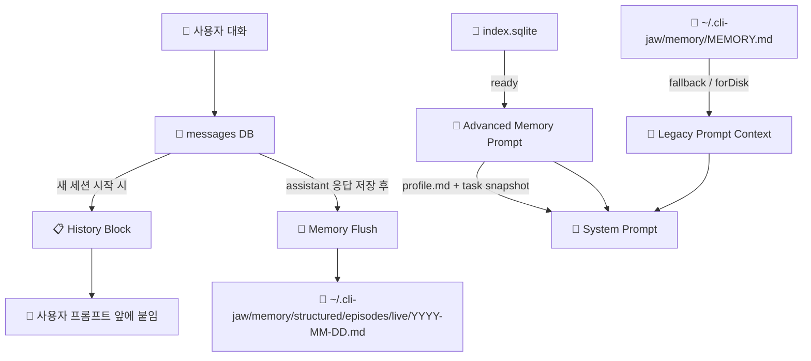

> 📚 [INDEX](INDEX.md) · [프롬프트 흐름 ↗](prompt_flow.md) · [에이전트 실행 ↗](agent_spawn.md) · **메모리 아키텍처**

# Memory Architecture — 통합 메모리 시스템

> 최종 갱신: 2026-05-16
> 소스: `src/memory/runtime.ts` 374L (사실상 facade), `src/memory/shared.ts` 256L, `src/memory/bootstrap.ts` 517L, `src/memory/indexing.ts` 417L, `src/memory/keyword-expand.ts` 268L, `src/memory/synonyms.ts` 60L, `src/memory/reflect.ts` 256L, `src/memory/identity.ts` 86L, `src/memory/injection.ts` 69L, `src/memory/memory.ts` 154L, `src/memory/worklog.ts` 200L, `src/memory/heartbeat.ts` 206L, `src/memory/heartbeat-schedule.ts` 410L, `src/memory/advanced.ts` 1L (re-export shim), `src/agent/memory-flush-controller.ts` 159L, `src/agent/spawn.ts` 1968L, `src/prompt/builder.ts` 715L, `src/orchestrator/pipeline.ts` 455L, `src/routes/memory.ts`, `src/routes/jaw-memory.ts`, `src/cli/command-context.ts`, `src/cli/handlers-runtime.ts`
> 임베딩: `src/manager/memory/embedding/` — `provider.ts`, `vec-store.ts`, `sync.ts`, `state-machine.ts`, `hybrid-search.ts`, `index.ts` + `src/manager/routes/dashboard-memory.ts`

---

## 전체 구조 요약



---

## 1계층: History Block (대화 원문 주입)

| 항목 | 값 |
|------|-----|
| **소스** | `src/agent/spawn.ts` `buildHistoryBlock(prompt, workingDir)` |
| **저장소** | `messages` DB 테이블 (`working_dir` 컬럼 + legacy `NULL` row fallback) |
| **트리거** | `!isResume` (새 세션 시작 시에만) |
| **주입 위치** | 사용자 프롬프트 **앞**에 `[Recent Context]`로 붙임 |
| **maxSessions** | `10` (DB에서는 `maxSessions * 2`개 row 조회) |
| **maxTotalChars** | `8000` (초과 시 잘림) |
| **assistant 메시지** | `trace` 필드 우선 사용, 없으면 content |
| **compact row** | compact 마커 row를 만나면 `trace` 요약만 넣고 중단 |
| **working_dir 스코핑** | `getRecentMessages(workingDir || null, ...)` — 현재 프로젝트 row 우선, `working_dir IS NULL` legacy row도 포함 |

### 주입 위치별 분기

| CLI | 주입 방식 | 코드 |
|-----|----------|------|
| **claude** | `stdin.write(historyBlock + prompt)` | `spawn.ts` 표준 CLI 분기 |
| **claude-i** | fresh run은 `stdin.write(historyBlock + prompt)`, resume은 helper `--resume` + 현재 prompt만 전달 | `claude-exec` helper surface 우선, legacy `jaw-claude-i` fallback. 세션 bucket은 `claude-i`라 standard Claude 세션과 분리 |
| **codex** | `stdin.write(historyBlock + "\n\n[User Message]\n" + prompt)` | `spawn.ts` 표준 CLI 분기 |
| **gemini / grok / opencode** | `args`에 포함, 히스토리는 `withHistoryPrompt()`로 합쳐 전달 | `spawn.ts` `buildArgs()` 경로. Grok는 `-p` + `--output-format streaming-json`, no effort/system prompt flags |
| **copilot (ACP)** | `acp.prompt(acpPrompt)` | `spawn.ts` ACP 분기 |

### 프로젝트 스코핑

- `workingDir`가 `messages` 조회 범위를 결정하지만, SQL은 `WHERE working_dir = ? OR working_dir IS NULL` 이라서 구형 전역 row도 history fallback에 섞일 수 있다.
- 새 세션일 때만 히스토리를 주입한다.
- 재개(resume) 흐름에서는 `loadSession()`가 우선이고, 실패한 경우에만 history fallback을 다시 붙인다.
- `steer`, `telegram`, `queue` 경로처럼 메시지를 미리 저장한 뒤 spawn 하는 경우에는 방금 넣은 user prompt를 중복 주입하지 않도록 건너뛴다.

---

## 2계층: Memory Flush (대화 → 구조화 저장)

| 항목 | 값 |
|------|-----|
| **소스** | `src/agent/memory-flush-controller.ts` `triggerMemoryFlush()` |
| **저장소** | `~/.cli-jaw/memory/structured/episodes/live/YYYY-MM-DD.md` |
| **트리거** | 메인 에이전트가 assistant 응답을 저장한 뒤 `memoryFlushCounter` 증가 |
| **threshold** | `settings.memory.flushEvery` (config 기본값 `10`; legacy session memory 주입 간격은 `ceil(flushEvery / 2)`) |
| **플러시 CLI** | `settings.memory.cli` 또는 현재 `settings.cli` |
| **플러시 모델** | `settings.memory.model` 또는 `settings.perCli[flushCli].model`, 없으면 `default` |
| **최소 대화 수** | 최근 메시지 4개 미만이면 스킵 |

### 플러시 프로세스

```
assistant 응답 저장 → memoryFlushCounter++
   → threshold 도달 시 memoryFlushCounter = 0, flushCycleCount++
   → DB에서 최근 threshold개 메시지 읽기
   → 별도 spawn으로 "memory extractor" 프롬프트 실행
   → 결과를 structured/episodes/live/YYYY-MM-DD.md에 ## HH:MM 형식으로 append
```

### 저장 형식

```markdown
## 15:30

User discussed refactoring the auth module. Decided to use JWT tokens.
Prefers ES Module only, no CommonJS.
```

### 실제 동작 포인트

- flush는 user turn이 아니라 메인 agent의 assistant 출력 저장 시점에만 계산된다.
- `mainManaged === true`이고 `!opts.internal`일 때만 카운터가 증가한다.
- ACP/표준 CLI 둘 다 같은 counter를 공유한다.
- flush 전용 경로는 일반 대화와 분리되어 있고, `_flushLock`과 `_lastFlushedMessageId`로 중복 실행과 재플러시를 막는다.
- `settings.memory.autoReflectAfterFlush`와 `flushMessageWindow` 기본값은 설정에 존재하지만, 현재 flush 설명문 생성의 핵심 경로는 `triggerMemoryFlush()` + extractor prompt다.

---

## 3계층: Prompt Injection (메모리 → 시스템 프롬프트)

### 3-A: Advanced Memory Runtime

| 항목 | 값 |
|------|-----|
| **상태 소스** | `src/memory/runtime.ts` `getAdvancedMemoryStatus()` (alias `getMemoryStatus`) |
| **저장소 루트** | `~/.cli-jaw/memory/structured` |
| **routing.searchRead** | `index.sqlite` 존재 시 `advanced`, 없으면 `basic` |
| **routing.save** | 항상 `integrated` |
| **provider / enabled** | `integrated` / `true` |
| **state** | `configured` 또는 `not_initialized` |
| **indexState** | `ready`, `not_indexed`, `not_initialized` |
| **표시 항목** | `indexedFiles`, `indexedChunks`, `importStatus`, `lastExpansion`, `lastError`, `backupRoot` |

### 3-B: Advanced Prompt Injection

| 항목 | 값 |
|------|-----|
| **소스** | `src/memory/injection.ts` `buildMemoryInjection()` → `src/prompt/builder.ts` `getSystemPrompt()` |
| **발동 조건** | `!forDisk` 이고 `getAdvancedMemoryStatus().routing.searchRead === 'advanced'` |
| **주입 내용** | `## Memory Runtime` + `injection role` + `## Profile Context` + `## Soul & Identity` + `## Task Snapshot` |
| **Profile 읽기** | `loadAdvancedProfileSummary(800)` |
| **Soul 읽기** | `loadSoulSummary(1000)` (`shared/soul.md`) |
| **Task Snapshot** | `buildTaskSnapshot(currentPrompt, 2800)` 또는 `spawnAgent(..., memorySnapshot)` |
| **Task Snapshot 출처** | `src/orchestrator/pipeline.ts` 에서 user prompt 기준으로 미리 생성 가능 |
| **검색 범위** | profile/shared/episodes/semantic/procedures 만 인덱싱, sessions/corrupted/legacy-unmapped 는 미인덱스 |

#### Task Snapshot 규칙

- 최대 4개 hit만 넣는다.
- hit 하나당 snippet은 최대 700자 수준으로 자른다.
- 결과는 `## Task Snapshot` 아래 `### relpath:start-end` 형태로 붙는다.
- `buildTaskSnapshotAsync()` 는 현재 동기 wrapper다.
- `buildMemoryInjection()`는 역할별로 범위를 줄인다: `boss`는 profile+soul+snapshot, `employee/subagent/read_only_tool`는 snapshot 없이 축소, `flush`는 memory injection을 비운다.

### 3-C: Legacy Fallback Prompt

| 항목 | 값 |
|------|-----|
| **소스** | `src/prompt/builder.ts` `appendLegacyMemoryContext()` |
| **저장소** | `~/.claude/projects/{hash}/memory/*.md` + `~/.cli-jaw/memory/MEMORY.md` |
| **주입 빈도** | 첫 3 assistant counter turn 또는 `memoryFlushCounter % ceil(flushEvery / 2) === 0` 일 때 session memory 주입 |
| **CHAR_BUDGET** | `10000자` |
| **주입 형태** | `## Recent Session Memories` + `## Core Memory` |
| **Core Memory 길이 제한** | `1500자` 초과 시 자르고 안내 문구 추가 |
| **실행 위치** | `forDisk` 이거나 advanced index가 아직 준비되지 않았을 때 |

### 3-D: Session Memory 해석 방식

- `loadRecentMemories()` 는 각 `.md` 파일을 읽어서 `## ` 단위 섹션만 뽑는다.
- 각 섹션은 첫 줄만 bullet로 넣는다.
- 파일 순서는 최신 파일 우선, 섹션도 역순이다.
- 즉, raw conversation dump가 아니라 섹션 머리말 중심의 요약 주입이다.
- `forDisk: true` 경로는 legacy fallback을 먼저 조립한 뒤, 준비된 경우 advanced `profile.md` 요약(600자)과 `buildTaskSnapshot('current session context', 1500)` 결과를 `## Core Memory` 아래에 추가한다. 즉 `B.md`/workspace `AGENTS.md`는 런타임 boss prompt와 동일하지는 않지만, 더 이상 legacy-only 스냅샷은 아니다.

### 3-E: Core Memory

| 항목 | 값 |
|------|-----|
| **소스** | `~/.cli-jaw/memory/MEMORY.md` |
| **주입 조건** | 내용이 50자 초과일 때만 |
| **주입 형태** | `## Core Memory` 섹션 |
| **용도** | 사용자 선호도, 핵심 결정사항, 장기 팩트 |

---

## 4계층: Index / Bootstrap / Shadow Import

| 항목 | 값 |
|------|-----|
| **인덱스 빌드** | `src/memory/indexing.ts` `reindexAll(root)` |
| **인덱스 DB** | `~/.cli-jaw/memory/structured/index.sqlite` |
| **검색 방식** | FTS5 BM25 + synonym query expansion + trigram side index + LIKE fallback |
| **검색 테이블** | `chunks`, `chunks_fts`, `chunks_trigram`, `memory_synonyms` |
| **인덱싱 파일** | `profile.md`, `shared/**`, `episodes/**`, `semantic/**`, `procedures/**` |
| **미인덱싱 파일** | `sessions/**`, `corrupted/**`, `legacy-unmapped/**` |
| **bootstrap** | `src/memory/bootstrap.ts` `bootstrapAdvancedMemory()` |
| **shadow import** | legacy 파일 저장 시 advanced structured root로 동기화 |

### bootstrap 대상

- `MEMORY.md` → `profile.md`
- legacy markdown (`~/.cli-jaw/memory/**`) → `episodes/imported` 또는 `semantic/imported`
- KV table (`memory` DB) → `semantic/kv-imported.md`
- legacy Claude session memory (`~/.claude/projects/{hash}/memory`) → `episodes/legacy/*.md`
- legacy root 전체와 KV rows는 `backup-memory-v1` 아래에 백업된다.

### 구조 생성

- `ensureAdvancedMemoryStructure()` 는 `shared`, `episodes`, `semantic`, `procedures`, `sessions`, `corrupted`, `legacy-unmapped` 를 만든다.
- `profile.md` 는 없을 때만 기본 frontmatter + 섹션 골격으로 생성한다.
- `memory-advanced` 레거시 루트가 있으면 새 structured 루트로 복사 마이그레이션한다.
- `reflectMemory()` 는 최근 `episodes/live/*.md`를 스캔해 `shared/preferences.md`, `shared/decisions.md`, `shared/projects.md`, `procedures/runbooks.md`, `shared/soul.md`로 fact를 승격하고, 변경 파일은 즉시 재인덱싱한다.
- `identity.ts`는 `shared/soul.md`를 별도 관리한다. advanced prompt의 `Soul & Identity` 섹션과 `/api/jaw-memory/soul` 읽기/갱신이 이 파일을 사용한다.

### state / meta

- `meta.json` 이 있으면 initialized 로 본다.
- `writeMeta()` 가 `importedCounts`, `bootstrapStatus`, `lastError`, `sourceLayout` 등을 누적 관리한다.
- `getMemoryStatus()` 는 `backupRoot`, `corruptedCount`, `lastExpansion`, `lastIndexedAt`, `lastError`, `importedCounts`까지 반환한다.
- `expandSearchKeywords()` 는 heuristic/domain 키워드를 최대 16개까지 돌려주고 `lastExpansionTerms` 를 갱신한다. provider/Gemini/OpenAI/Vertex 헬퍼는 남아 있지만, 현재 runtime 검색 경로는 그 결과에 의존하지 않는다.
- `searchIndex()` 는 `memory_synonyms`를 이용해 query-side synonym expansion을 적용하고, BM25/LIKE 결과와 `chunks_trigram` 부분 문자열 결과를 RRF로 병합한 뒤 kind priority, exact/phrase boost, kind별 recency half-life를 적용한다.

---

## 5계층: 외부 API / UI 표면

### HTTP API

| 엔드포인트 | 역할 |
|---|---|
| `/api/memory/status` | advanced memory 상태 조회 |
| `/api/memory/reindex` | structured index 재생성 |
| `/api/memory/bootstrap` | bootstrap + import 실행 |
| `/api/memory/files` | structured root 파일 목록 |
| `/api/jaw-memory/reflect` | 최근 episode 반영(reflection) 실행 |
| `/api/jaw-memory/flush` | memory flush 즉시 트리거 |
| `/api/jaw-memory/soul` | `shared/soul.md` 조회/업데이트 |
| `/api/jaw-memory/search` | legacy/basic 또는 advanced search-read 라우팅 |
| `/api/jaw-memory/read` | legacy/basic 또는 advanced read 라우팅 |
| `/api/jaw-memory/save` | legacy save, 저장 후 shadow import 트리거 |
| `/api/jaw-memory/list` | legacy file list |
| `/api/jaw-memory/init` | legacy `memory/` 초기화 |

### CLI / CommandContext

- `src/cli/command-context.ts` 가 web/cli/telegram/discord 공통 memory ctx 를 제공한다.
- `listMemory`, `searchMemory`, `getMemoryStatus`, `bootstrapMemory`, `reindexMemory`, `initMemoryRuntime` 가 연결된다.
- `/memory status|bootstrap|reindex|adv ...` 는 `src/cli/handlers-runtime.ts` 에서 status / bootstrap / reindex / init / on / off 를 분기하고, `handlers.ts`는 이를 re-export한다.
- `searchMemory()` 는 `src/memory/injection.ts` `searchMemoryWithPolicy()`를 탄다. 현재 이 함수는 전달받은 `role`과 무관하게 advanced index 준비 여부만 보고 indexed search vs legacy grep search를 고른다.
- remote interface의 settings patch allowlist에는 `showReasoning`도 포함된다. 메모리 명령 자체와 직접 관련되지는 않지만 `/thought`와 같은 command-context 통합 경로를 공유한다.

### 저장/동기화 후속처리

- `memory.save()` 는 일반 파일이면 `syncLegacyMarkdownShadowImport()` 를, `structured/` 아래면 `reindexIntegratedMemoryFile()` 를 호출한다.
- `appendDaily()` 도 structured episodes daily 파일에 append 후 reindex 한다.
- `src/routes/memory.ts` 의 `memory-files` 설정 API 는 memory CLI/model 을 저장하고, claude 모델 값은 legacy alias 를 정규화한다.
- `/api/memory/status` 는 `profileFresh`, `coreSourceHash`, `profileSourceHash`, `lastReflectedAt`, `flushRunning`, `migrationLocked`, `staleWarnings`, `hasSoul`, `soulSynthesized`, `soulPreview`, `legacyFileCount`, `advancedFileCount`, `flushStatus`까지 함께 내려준다.

---

## 비교표

| | History Block | Memory Flush | Advanced Prompt | Legacy Fallback | Core Memory |
|---|---|---|---|---|
| **역할** | 최근 대화 원문 전달 | assistant 응답을 structured episode 로 요약 저장 | indexed memory + profile + task snapshot 주입 | legacy session memory + core fallback | 핵심 기억 상시 주입 |
| **타이밍** | 새 세션만 | assistant 응답 저장 직후 | advanced index ready일 때 매번 | advanced 미준비 또는 forDisk base | 매번 |
| **크기 제한** | 8000자 | 최근 메시지 4개 미만이면 스킵 | 800 / 2800 | 10000 / 1500 | 1500자 |
| **저장소** | `messages` DB | `memory/structured/episodes/live` | `memory/structured` | `~/.claude/projects/{hash}/memory` + `~/.cli-jaw/memory/MEMORY.md` | `MEMORY.md` |
| **코드** | `spawn.ts` | `memory-flush-controller.ts` + `spawn.ts` | `builder.ts` + `injection.ts` + `runtime.ts` | `builder.ts` | `builder.ts` |
| **resume 시** | ❌ 스킵 | ✅ 정상 동작 | ✅ 정상 동작 | ✅ 정상 동작 | ✅ 정상 동작 |

---

## settings.json 설정

```json
{
  "memory": {
    "enabled": true,
    "flushEvery": 20,
    "cli": "claude",
    "model": "haiku"
  }
}
```

| 키 | 기본값 | 설명 |
|---|---|---|
| `enabled` | `true` | `false`면 flush 카운팅만 건너뛴다 |
| `flushEvery` | `10` | assistant 응답 기준 flush 기준치 |
| `cli` | 현재 CLI | flush용 별도 CLI 지정 가능. `grok` 지정 시 `grok-build`에는 effort flag를 전달하지 않음 |
| `model` | CLI 기본 모델 | flush용 경량 모델 지정 (예: haiku) |

### heartbeat와의 관계

- heartbeat job 자체는 memory storage 를 직접 읽거나 쓰지 않는다.
- 대신 `getSystemPrompt()` 가 heartbeat 템플릿을 합쳐 넣기 때문에, 메모리와 같은 시스템 프롬프트 경로를 공유한다.
- 최근 heartbeat prompt 조립 경로는 실행 전 memory search를 먼저 수행하라는 지시를 함께 붙인다. 즉 storage mutation은 없지만, prompt 정책상 메모리 조회를 전제로 동작한다.
- heartbeat 실행은 `orchestrateAndCollect()` 를 타고, 결과는 active channel 로 전송된다.

---

## Embedding Search Layer (Dashboard-level)

> 소스: `src/manager/memory/embedding/` — `provider.ts`, `vec-store.ts`, `sync.ts`, `state-machine.ts`, `index.ts`
> 라우트: `src/manager/routes/dashboard-memory.ts` (embed-config/state/estimate/reindex-stream)
> Dashboard UI: `public/manager/src/dashboard-settings/DashboardEmbeddingSection.tsx`

기존 FTS5 검색 위에 벡터 임베딩을 추가하는 **애드온** 레이어. 기본 OFF, dashboard 설정에서 provider/API key 설정 후 인덱싱하면 활성화.

### 아키텍처

```
인스턴스 A (index.sqlite) ──┐
인스턴스 B (index.sqlite) ──┼── chunks ──→ sync.ts ──→ provider.ts ──→ vec_memory.sqlite
인스턴스 C (index.sqlite) ──┘                           (batch embed)     (vec_chunks table)
                                                                             ↓
                                                                    hybrid-search.ts
                                                                    (FTS5 + vec RRF merge)
```

### 모듈

| File | 역할 |
|------|------|
| `provider.ts` | OpenAI/Gemini/Voyage/Vertex/Local(Ollama) 통합 임베딩 클라이언트. batch 20 |
| `vec-store.ts` | SQLite 벡터 저장소. `vec_chunks` 테이블. `searchScoped`, `getStats`, content hash 중복 방지 |
| `sync.ts` | 전체 인스턴스 순회 동기화. content hash skip, retry 3회 + 1s delay, batch 간 300ms |
| `state-machine.ts` | `getEmbeddingState()` — 설정/DB/인덱스 상태 → `EmbeddingState` (OFF/CONFIGURED/INDEXING/ACTIVE_*/NEEDS_REINDEX/ERROR) |
| `hybrid-search.ts` | FTS5 + 벡터 RRF(Reciprocal Rank Fusion) 결합 검색 |

### State Machine

```
OFF → CONFIGURED → INDEXING → ACTIVE_HYBRID / ACTIVE_EMBEDDING
                                    ↓ provider 변경
                               NEEDS_REINDEX → INDEXING → ...
                                    ↓ 에러
                                  ERROR (fallback to FTS5)
```

### Auto-sync

- `memory_status` broadcast (save) → 2s debounce → incremental sync
- 30분 주기 background catchall sync
- Content hash로 변경 없는 chunk는 skip

### 설정 파일

`~/.cli-jaw-dashboard/embedding.json`:

| 키 | 예시 | 설명 |
|---|---|---|
| `enabled` | `true` | 임베딩 활성화 여부 |
| `provider` | `"openai"` | `openai\|gemini\|voyage\|vertex\|local` |
| `model` | `"text-embedding-3-small"` | provider별 기본 모델 자동 선택 |
| `apiKey` | `"sk-..."` 또는 `"$ENV_VAR"` | 환경변수 참조 지원 |
| `searchMode` | `"hybrid"` | `hybrid\|embedding\|fts5` |
| `dimensions` | `1536` | provider별 자동 설정 |
