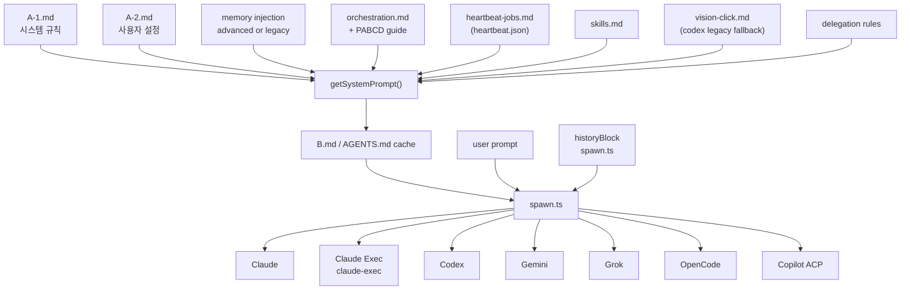

> 📚 [INDEX](INDEX.md) · **프롬프트 파이프라인** · [A1](prompt_basic_A1.md) · [A2](prompt_basic_A2.md) · [B](prompt_basic_B.md) · [메모리](memory_architecture.md)

# 프롬프트 삽입 흐름 — Prompt Injection Flow

> cli-jaw의 프롬프트 조립 + 주입 전체 흐름. 현재 기준 소스는 `src/prompt/builder.ts` 715L, `src/memory/injection.ts`, `src/agent/spawn.ts` 1968L, `src/prompt/templates/*` (a1-system 305L, a2-default 25L, orchestration 95L, employee 86L, control-system 56L, worker-context 11L, skills 18L, heartbeat-jobs 4L, heartbeat-default 4L, vision-click 3L).

---

## 전체 구조



---

## Layer 1 — 정적 프롬프트

### A-1.md

- 경로: `~/.cli-jaw/prompts/A-1.md`
- 템플릿 폴백: `src/prompt/templates/a1-system.md`
- 역할: 시스템 규칙, browser control, memory/heartbeat, jaw employee vs CLI sub-agent 구분, 채널 전송 규칙

핵심은 "파일 우선, 템플릿 폴백"이다. `A-1.md`가 있으면 그대로 쓰고, 없을 때만 템플릿을 렌더한다.

### A-2.md

- 경로: `~/.cli-jaw/prompts/A-2.md`
- 템플릿: `src/prompt/templates/a2-default.md`
- 역할: Identity / User / Vibe / Working Directory 같은 사용자 설정 힌트

`initPromptFiles()`는 없을 때만 A2를 만든다. 이미 있으면 덮어쓰지 않는다.

### initPromptFiles()

초기화 시점에 세 파일을 관리한다.

- `A-1.md`: stock/custom 구분을 `.hash`로 관리하며 템플릿 변경 시 안전하게 마이그레이션
- `A-2.md`: 없을 때만 생성
- `HEARTBEAT.md`: 없을 때만 생성

중요한 점은 `HEARTBEAT.md`가 현재 프롬프트 조립의 핵심 입력은 아니라는 것이다. heartbeat runtime의 실제 소스 오브 트루스는 `heartbeat.json`이다.

---

## Layer 2 — 동적 프롬프트 조립

### 조립 순서

현재 `getSystemPrompt()`의 순서는 다음과 같다.

1. `A-1.md`
2. `A-2.md`
3. memory injection (advanced or legacy fallback)
4. orchestration section
5. heartbeat jobs section
6. skills section
7. vision-click hint
8. delegation rules

이전 버전에 있던 timestamp stamp(`YYMMDD-HH:MMAM/PM.`) 주입은 현재 `getSystemPrompt()`에서 제거됐다.

### Memory Injection

메모리는 두 갈래다.

- `forDisk: false`: `buildMemoryInjection()` 우선
- `forDisk: true`: legacy fallback + 준비된 advanced profile/task snapshot의 축약 disk block

#### Advanced path

`src/memory/injection.ts`가 현재 단일 정책 소스다.

- 발동 조건: `getAdvancedMemoryStatus().routing.searchRead === 'advanced'`
- 기본 역할: Boss prompt는 `profile + soul + task snapshot`
- 축소 역할: `employee`, `subagent`, `read_only_tool`은 snapshot 없이 profile 위주
- flush 역할: memory injection 생략

advanced 가 아니면 `appendLegacyMemoryContext()`로 legacy fallback을 먼저 붙인 뒤, `## Memory Status` 블록으로 "indexed memory is still initializing / temporary fallback memory context is active"를 명시한다.

출력 블록은 다음 순서를 가진다.

```text
---
## Memory Runtime
- indexed memory context is active
- injection role: boss
- use task snapshot and profile context before assuming missing memory

## Profile Context
...

## Soul & Identity
...

## Task Snapshot
### relpath:start-end
...
```

#### Legacy path

advanced index가 아직 준비되지 않았거나 `forDisk: true`인 경우 `appendLegacyMemoryContext()`를 먼저 쓴다.

- 세션 메모리: 첫 3 assistant counter turn 또는 `memoryFlushCounter % ceil(flushEvery / 2) === 0`일 때 주입
- 코어 메모리: `MEMORY.md`가 50자 이상일 때 항상 주입
- 코어 메모리 길이 제한: 1500자
- 세션 메모리 길이 예산: 10000자

`forDisk: true`는 그 뒤에 `loadProfileSummary(600)`과 `buildTaskSnapshot('current session context', 1500)` 결과를 `## Core Memory` 아래에 덧붙인다. 따라서 `B.md`와 workspace `AGENTS.md`는 "disk 캐시용 축약 memory snapshot"이며, 런타임 boss prompt의 advanced `profile + soul + task snapshot`과 완전히 동일하지 않다.

### Orchestration

직원이 1명 이상 등록되어 있으면 `orchestration.md`가 붙는다.

현재 orchestration 안내는 JSON subtasks가 아니라 shell dispatch 기준이다.

```bash
cli-jaw dispatch --agent "Frontend" --task "Specific task instruction"
```

추가로 `skills/dev-pabcd/SKILL.md`가 있으면 `## PABCD Orchestration Guide`가 이어 붙는다.

### Heartbeat

heartbeat 섹션은 `loadHeartbeatFile()` 결과를 본다.

- 입력 파일: `~/.cli-jaw/heartbeat.json`
- 템플릿: `heartbeat-jobs.md`
- 각 job은 enabled 상태, 사람이 읽는 schedule, prompt preview를 렌더한다

`HEARTBEAT.md` 편집 파일은 별도로 존재하지만, 현재 `getSystemPrompt()`는 heartbeat section을 `heartbeat.json`에서만 만든다.

### Skills

skills 섹션은 active skills와 reference registry를 합쳐 렌더한다.

- active skills: `{{JAW_HOME}}/skills/*/SKILL.md`
- reference skills: `{{JAW_HOME}}/skills_ref/registry.json`

렌더 규칙:

- 둘 다 있으면 active + available + discovery 전체 렌더
- active만 있으면 available 목록을 생략
- ref만 있으면 available + discovery만 렌더

### Vision Click

- 조건: `activeCli === 'codex'`
- 추가 조건: `skills/vision-click/SKILL.md`가 실제로 존재해야 함

즉 "Codex라고 무조건 표시"가 아니라 "Codex + active vision-click skill"일 때만 붙는다. 이 블록은 일반 browser 자동화 정책이 아니라 `snapshot` ref와 직접 좌표 클릭이 모두 부적합할 때 쓰는 Codex-only legacy fallback 힌트다.

### Delegation Rules

delegation rules 블록은 prompt 끝에 항상 붙는다.

- CLI sub-agents는 내부 병렬 작업용
- jaw employees는 `cli-jaw dispatch`
- 둘을 혼동하지 말 것

이 블록은 orchestration 템플릿 유무와 무관하게 항상 추가된다.

---

## Layer 3 — regenerateB()와 디스크 캐시

`regenerateB()`는 template/prompt cache를 비우고 `getSystemPrompt({ forDisk: true })`를 다시 만든 뒤, content hash가 바뀐 경우에만 두 군데에 쓴다.

| 출력 | 역할 |
| --- | --- |
| `~/.cli-jaw/prompts/B.md` | 디버그/캐시 |
| `{workDir}/AGENTS.md` | Codex, Copilot, OpenCode가 자동으로 읽는 지침 파일 |

중요한 점:

- session invalidation은 더 이상 하지 않는다
- AGENTS.md는 content hash가 바뀔 때만 fresh write 되며 resume continuity는 유지한다
- employee spawn은 별도 tmp cwd를 만들어 boss AGENTS.md와 격리한다

---

## Layer 4 — spawn.ts에서 실제 주입

### History Block

`spawn.ts`는 새 세션에서만 `buildHistoryBlock()`를 만든다.

- 소스: `messages` DB
- 범위: `working_dir = ? OR working_dir IS NULL`
- 상한: `maxTotalChars = 8000`
- compact marker row를 만나면 `trace`만 넣고 중단

최종 조합 함수는 `withHistoryPrompt()`다.

```text
[Recent Context]
...

---
[Current Message]
{prompt}
```

### CLI별 입력 방식

| CLI | 시스템 프롬프트 | 현재 턴 입력 |
| --- | --- | --- |
| Claude | `buildArgs(..., sysPrompt)` | stdin에 `withHistoryPrompt(prompt, historyBlock)` |
| Claude Exec (`claude-i`) | helper 뒤의 Claude CLI에 args로 `--model`/`--effort`/permission 전달 | fresh run은 stdin에 `withHistoryPrompt(prompt, historyBlock)`, resume run은 `claude-exec --resume <sessionId>` + 현재 prompt |
| Codex | `{workDir}/AGENTS.md` 자동 로드 | 새 세션일 때만 stdin에 `[User Message]` 블록 |
| Gemini | `GEMINI_SYSTEM_MD` tmpfile | args 레벨 prompt (`withHistoryPrompt`) |
| Grok | cwd instruction files auto-discovery (`grok inspect` 기준) | args 레벨 prompt (`withHistoryPrompt`) via `-p`, no effort/system-prompt flags for `grok-build` |
| OpenCode | args 빌드 시 sysPrompt 포함 | args 레벨 prompt (`withHistoryPrompt`) |
| Copilot | ACP + cwd 지침 파일 | `session/prompt(acpPrompt)` |

### Gemini thought visibility

- `settings.showReasoning` 기본값은 `false`이고 `/thought [status|on|off]`가 이 값을 조정한다.
- `spawn.ts`는 event parser context에 `showReasoning: settings.showReasoning === true`를 전달한다.
- `src/agent/events.ts`의 Gemini branch는 thought/thinking content를 assistant `fullText`에 합치지 않는다. toggle이 켜져 있으면 process-step thinking event로 표시하고, 꺼져 있으면 trace에 hidden marker만 남긴다.

### Resume 처리

- standard CLI는 `buildResumeArgs()`로 세션 ID를 전달한다
- Copilot ACP는 `loadSession()`을 먼저 시도한다
- ACP `loadSession()` 실패 시에만 `createSession()` 후 history fallback을 다시 붙인다

---

## Layer 5 — Employee Prompt

직원 프롬프트는 `getEmployeePromptV2()`가 만든다. 예전처럼 "메인 프롬프트에서 JSON subtasks를 감지해 직원이 또 JSON을 뱉는 구조"가 아니다.

현재 employee prompt 레이어:

1. `employee.md` 기본 템플릿
2. static employee system patch와 declared skill inline injection(예: Control)
3. 공통 `dev/SKILL.md`
4. `dev-scaffolding`
5. 역할별 skill (`dev-frontend`, `dev-backend`, `dev-data`, docs용 documentation 등)
6. phase별 skill (phase 2 → `dev-code-reviewer`, phase 4 → `dev-testing`)
7. `worker-context.md`에서 추출한 phase별 worker context (`Phase 1~4` 중 phase 번호 매핑) + 실행 규칙
8. employee delegation rules

핵심 규칙:

- 직원은 jaw employee를 재디스패치하지 않는다 (`cli-jaw dispatch` 호출 금지, subtask JSON 출력 금지).
- 반대로 CLI 자체 sub-agent(Task/Agent tool)는 명시적으로 **허용**된다. employee는 내부 병렬화를 위해 Task/Agent tool을 자유롭게 쓸 수 있고, sub-agent에게는 "Do NOT use Agent, subagent, or delegation tools"를 전달해 1-level 깊이를 강제한다.
- employee 프롬프트는 process cwd가 격리 임시 디렉터리일 수 있다고 명시하고, task의 `## Workspace Context` 블록을 project root로 사용하라고 지시한다.

---

## 한 줄 요약

현재 prompt 파이프라인은 "A1/A2 파일 기반 캐시 + role-aware memory injection + `cli-jaw dispatch` 중심 orchestration + per-CLI spawn input adapter" 구조다. 가장 큰 최근 변화는 JSON subtask 설명이 사라지고, memory injection이 `src/memory/injection.ts`로 중앙화되었으며, heartbeat 입력이 `heartbeat.json`으로 고정되고, Grok CLI는 `-p` 기반 표준 런타임으로 추가됐지만 `grok-build` effort/system prompt flag는 비활성화된 점이다.
