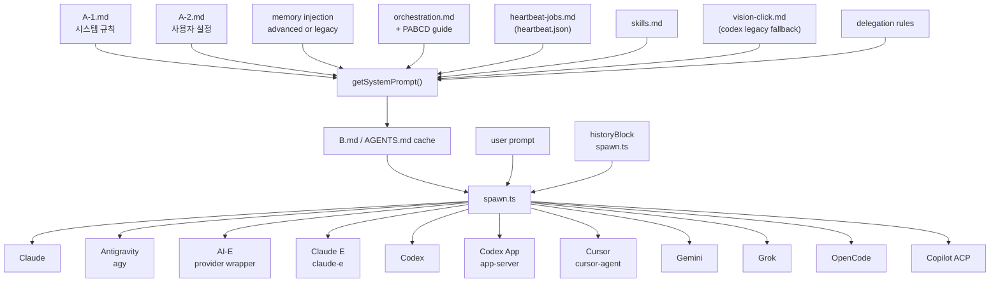

> 📚 [INDEX](INDEX.md) · **프롬프트 파이프라인** · [A1](prompt_basic_A1.md) · [A2](prompt_basic_A2.md) · [B](prompt_basic_B.md) · [메모리](memory_architecture.md)

# 프롬프트 삽입 흐름 — Prompt Injection Flow

Activity is an observation sink, not a prompt or delivery source. Print parsers retain
accepted intermediate text before legacy resets, while final text still comes from the
existing lifecycle decision. Journal/link failures do not roll back an already-written
MESSAGE, re-enter the handler, or introduce a new inference/send. Semantic SSE bypasses
collectors and messaging listeners; request replay remains non-actionable.

> cli-jaw의 프롬프트 조립 + 주입 전체 흐름. 현재 기준 소스는 `src/prompt/builder.ts` 1040L, `src/memory/injection.ts`, `src/agent/spawn.ts` 2011L, `src/prompt/templates/*` (a1-system 388L, a2-default 25L, orchestration 120L, employee 73L, control-system 56L, worker-context 11L, skills 24L, heartbeat-jobs 4L, heartbeat-default 4L, vision-click 3L).

---

## 전체 구조


```mermaid
graph TD
    A1["A-1.md<br/>시스템 규칙"] --> SYS["getSystemPrompt()"]
    A2["A-2.md<br/>사용자 설정"] --> SYS
    MEM["memory injection<br/>advanced or legacy"] --> SYS
    ORC["orchestration.md<br/>+ PABCD guide"] --> SYS
    HB["heartbeat-jobs.md<br/>(heartbeat.json)"] --> SYS
    SK["skills.md"] --> SYS
    VC["vision-click.md<br/>(codex legacy fallback)"] --> SYS
    DEL["delegation rules"] --> SYS
    SYS --> B["B.md / AGENTS.md cache"]
    B --> SPAWN["spawn.ts"]
    USER["user prompt"] --> SPAWN
    HIST["historyBlock<br/>spawn.ts"] --> SPAWN
    SPAWN --> CLAUDE["Claude"]
    SPAWN --> AGY["Antigravity<br/>agy"]
    SPAWN --> AIE["AI-E<br/>provider wrapper"]
    SPAWN --> CLAUDEI["Claude E<br/>claude-e"]
    SPAWN --> CODEX["Codex"]
    SPAWN --> CODEXAPP["Codex App<br/>app-server"]
    SPAWN --> CURSOR["Cursor<br/>cursor-agent"]
    SPAWN --> GEMINI["Gemini"]
    SPAWN --> GROK["Grok"]
    SPAWN --> OPENCODE["OpenCode"]
    SPAWN --> COPILOT["Copilot ACP"]
```

---

## Layer 1 — 정적 프롬프트

### A-1.md

- 경로: `~/.cli-jaw/prompts/A-1.md`
- 템플릿 폴백: `src/prompt/templates/a1-system.md`
- 역할: 시스템 규칙, browser control, memory/heartbeat, jaw employee vs CLI sub-agent 구분, 채널 전송 규칙

핵심은 "파일 우선, 템플릿 폴백"이다. 디스크 원본은 그대로 보존한다. `forDisk: false` 런타임 조립만 현재 prompt/active skill routing이 desktop/browser 의도를 가질 때 `desktop-control` anchor를 포함하고, 그 외에는 단일 정상 anchor block을 제외한다.

### A-2.md

- 경로: `~/.cli-jaw/prompts/A-2.md`
- 템플릿: `src/prompt/templates/a2-default.md`
- 역할: Identity / User / Vibe / Working Directory 같은 사용자 설정 힌트

`initPromptFiles()`는 없을 때만 A2를 만든다. 이미 있으면 덮어쓰지 않는다.

### initPromptFiles()

초기화 시점에 세 파일을 관리한다.

- `A-1.md`: stock/custom 구분을 `.hash`로 관리하며 템플릿 변경 시 안전하게 마이그레이션
- `A-2.md`: 없을 때만 생성
- `HEARTBEAT.md`: 없을 때만 생성

중요한 점은 `HEARTBEAT.md`가 현재 프롬프트 조립의 핵심 입력은 아니라는 것이다. heartbeat runtime의 실제 소스 오브 트루스는 `heartbeat.json`이다.

---

## Layer 2 — 동적 프롬프트 조립

### 조립 순서

현재 `getSystemPrompt()`의 순서는 다음과 같다.

1. `A-1.md`
2. `A-2.md`
3. memory injection (advanced or legacy fallback)
4. orchestration section
5. Dev Work Classification contract
6. heartbeat jobs section
7. skills section
8. vision-click hint
9. runtime context + pre-prompt context hooks (`forDisk: false` only)
10. Bounded Local Search Contract
11. delegation rules

이전 버전에 있던 timestamp stamp(`YYMMDD-HH:MMAM/PM.`) 주입은 현재 `getSystemPrompt()`에서 제거됐다.

### 메시지별 원격 대화 컨텍스트

`src/agent/spawn.ts`는 시스템 프롬프트 캐시와 별개로 Boss user prompt를 감쌀 때 원격 대화 식별자를 주입한다. Slack-origin turn은 `src/prompt/conversation-context.ts`를 통해 `Current Slack conversation: channel_id=<id>; thread_ts=<parent ts|none>` 줄을 받는다. 이 줄은 `multiSession.enabled`와 무관하며, agent는 내부 session label을 파싱하지 않고 `/api/slack/history`, `/api/slack/members`, `/api/channel/send`의 target을 구성할 수 있다. 식별자는 제어문자와 줄바꿈을 제거하고 길이를 제한한 뒤 주입한다.

### Memory Injection

메모리는 두 갈래다.

- `forDisk: false`: `buildMemoryInjection()` 우선
- `forDisk: true`: legacy fallback + bounded soul(최대 6000자) + 준비된 advanced profile/task snapshot의 축약 disk block + resolved instance paths

#### Advanced path

`src/memory/injection.ts`가 현재 단일 정책 소스다.

- 발동 조건: `getAdvancedMemoryStatus().routing.searchRead === 'advanced'`
- 기본 역할: Boss prompt는 `profile + soul + task snapshot`
- 축소 역할: `employee`, `subagent`, `read_only_tool`은 snapshot 없이 profile 위주
- flush 역할: memory injection 생략

advanced 가 아니면 `appendLegacyMemoryContext()`로 legacy fallback을 먼저 붙인 뒤, `## Memory Status` 블록으로 "indexed memory is still initializing / temporary fallback memory context is active"를 명시한다.

출력 블록은 다음 순서를 가진다.

```text
---
## Memory Runtime
- indexed memory context is active
- injection role: boss
- use task snapshot and profile context before assuming missing memory

## Profile Context
...

## Soul & Identity
...

## Task Snapshot
### relpath:start-end
...
```

#### Legacy path

advanced index가 아직 준비되지 않았거나 `forDisk: true`인 경우 `appendLegacyMemoryContext()`를 먼저 쓴다.

- 세션 메모리: 첫 3 assistant counter turn 또는 `memoryFlushCounter % ceil(flushEvery / 2) === 0`일 때 주입
  - `memoryFlushCounter` 는 **단조 증가**하며 플러시 트리거와 분리돼 있다. 플러시는 별도 전역 카운터(`countTurnForFlush`)가 세고 임계에서 0으로 리셋되는데, 이 값이 리셋되면 주입 주기와 compact 임계(25/35턴)가 함께 왜곡되므로 둘을 합치지 말 것.
- 코어 메모리: `MEMORY.md`가 50자 이상일 때 항상 주입
- 코어 메모리 길이 제한: 1500자
- 세션 메모리 길이 예산: 10000자

`forDisk: true`는 그 뒤에 인덱스 준비 여부와 무관하게 `loadSoulSummary(6000)`을 읽고, `loadProfileSummary(600)`과 `buildTaskSnapshot('current session context', 1500)`을 `## Disk Memory Context` 아래에 덧붙인다. soul이 6000자를 넘으면 명시적 truncation marker와 warning 로그를 남기며, 파일이 있는데 읽거나 주입할 수 없는 경우도 warning으로 드러낸다. 따라서 `B.md`와 workspace `AGENTS.md`는 "disk 캐시용 축약 memory snapshot"이며, 런타임 boss prompt의 advanced `profile + soul + task snapshot`과 완전히 동일하지 않다.

같은 disk 경로는 `## Resolved Instance Context`에 실제 `JAW_HOME`과 `settings.workingDir`을 기록한다. stock A2의 `## Working Directory\n- ~/.cli-jaw` placeholder는 실제 working directory로 바꾸되, 다른 custom A2 내용은 보존한다.

### Orchestration

직원이 1명 이상 등록되어 있으면 `orchestration.md`가 붙는다.

현재 orchestration 안내는 JSON subtasks가 아니라 shell dispatch 기준이다.

```bash
cli-jaw dispatch --agent "Frontend" --task "Specific task instruction"
```

직원 진행 조회는 dispatch stdout만 보지 않는다. orchestration prompt는
`cli-jaw worker status [agent] --port <port>`와
`cli-jaw worker watch [agent] --port <port>`를 안내하며, `snapshot.workers`는
running-only이고 완료된 safe-summary progress는 worker-progress previous
snapshot에 남는다고 명시한다.

지연된 employee 결과 replay도 boss context에 full stdout을 재주입하지 않는다. 원래 dispatch 연결이 끊긴 뒤 결과가 도착하면 다음 boss turn에는 bounded notice만 들어가며, notice는 agent/run identity, 짧은 preview, `cli-jaw worker status <runId>`, `cli-jaw worker read <runId> --tail 120` 복구 명령을 제공한다. 전체 raw output은 runId 기반 explicit read surface에서만 읽는다.

추가로 `skills/jaw-dev-pabcd/SKILL.md`가 있으면 `## PABCD Orchestration Guide`가 이어 붙는다. 이 인라인 가이드는 loop/multi-pass 작업을 명시한다 — 큰/"loop" 작업은 work-phase(결과 슬라이스)마다 풀 PABCD 한 바퀴를 돌고, goal 모드에서 D 이후 D→IDLE→P로 다음 work-phase의 P에 재진입하며, 각 phase의 실제 작업을 충실히 수행한다(anti-skip). devlog/_fin/260624_goal_work_phase_pabcd_loop/ 참고.

### Mid-run 메시지 정책 (midRunPolicy)

실행 중인 agent에 새 메시지가 도착하면 (`isAgentBusy` && multiSession enabled)
gateway가 정책을 적용한다 (src/orchestrator/gateway.ts). 결정 순서:
요청 `meta.midRunPolicy` > 세션 `active_run_policy` > `settings.multiSession.midRunPolicy`
> 기본값 `'steer'` (config.ts 기본값/마이그레이션/검증 모두 steer로 정규화).

런타임별 `steer` 정책의 실제 동작:

| 런타임 | busy + steer 정책 | 맥락 보존 |
|--------|-------------------|-----------|
| jwc | in-band (pi `session.prompt` streamingBehavior 'steer') | 완전 (같은 턴) |
| codex-app | in-band (app-server `turn/steer` — `MainRunState.steerTurnInBand` 훅이 active-turn 동안만 설치됨) | 완전 (같은 턴) |
| cursor native | `cancel-reprompt`: 원래 prompt 취소 응답·callback·업데이트 drain 뒤 같은 native session에 재요청. jaw 논리 run과 최종 정산은 하나 | 원래 요청·수락된 추가 지시·제한된 부분 출력과 현재 운영 지침을 복원 |
| 그 외 (codex legacy exec, claude, cursor print, grok, opencode, pi, agy, copilot, kiro) | **kill-steer**: 진행 턴을 중단하고 새 run. `withSteerContext`가 제한된 부분 출력을 재주입 | 제한된 부분 출력 보존 |

기존 in-band 경로의 큐 처리는 유지한다. Native Cursor는 replacement가 진행 중이면
다음 입력을 큐로 보낼 수 있지만, 취소·전송·입력 기록 실패를 큐 재시도로 바꾸지 않는다.
Stop으로 무효화된 미전송 지시는 별도 `cancelled` 결과로 끝내고 다시 제출하지 않는다.
로컬 write 완료는 모델의 수락 ACK가 아니다. 입력 기록 직전에도 main 객체·세대·
정규 소유권을 확인하며, 빠른 최종 응답도 그 기록보다 먼저 정산되지 않는다.
기다리려면 `followup`/`collect`를 선택한다.

명시적 `/steer`는 같은 런타임 훅을 사용한다. `/queue steer <n>`은 별도 우선 실행
명령으로, 기존 interrupt + 새 run을 유지한다. Kill 경로에서는 pre-kill MAX(id)와
정확한 exit-settle 배리어 뒤 부분 출력을 복원한다. 복원 범위는 제한되며 전체 맥락을
보장하지 않는다. B 시작 이후 무상관 ACP 프레임은 provider의 전송 순서 준수를
전제로 한다. 로컬 epoch만으로 늦은 A 프레임을 식별할 수는 없다.

### PABCD evidence gate (`--attest`)

Forward phase transitions **P→A, A→B, B→C, C→D** require a narrative attestation — not a boolean checkbox. Implementation: `src/orchestrator/attestation.ts`, enforced in `state-machine.ts` via `checkAttestationGate()`.

```bash
cli-jaw orchestrate B --attest '{"from":"A","to":"B","did":"<what you actually did this phase>"}'
cli-jaw orchestrate D --attest '{"from":"C","to":"D","did":"ran checks","checkOutput":"<tsc/test tail>","exitCode":0}'
```

| Rule | Detail |
| --- | --- |
| `did` | Required non-empty narrative; placeholders (`tbd`, `done`, `ok`, …) rejected |
| C→D | Also requires pasted `checkOutput` + non-zero `exitCode` rejects advance |
| Parse sources | CLI `--attest` JSON **or** `<phase_attestation>{…}</phase_attestation>` block in agent text |
| Goal mode | Gates are self-advancing (no user wait) but attestation is still proof-of-work |
| Exempt | I/IDLE/reject paths; human actor bypasses gate |

`--force` is scrubbed from orchestration prompts. See `devlog/_fin/260624_pabcd_evidence_gate/`.

### Pre-prompt context hooks

`src/prompt/context-hooks.ts` + `~/.cli-jaw/context-hooks.json` (optional).

- Injected in `getSystemPrompt()` **after** runtime-context block, **before** bounded-local-search contract (runtime turns only; skipped for `forDisk`)
- Config: bounded sources under `JAW_HOME`, scopes `main` | `heartbeat`, per-source `maxAgeSeconds`, char budgets (hard caps: 8 sources / 4000 total chars)
- `freshSession` from `spawn.ts` (`!isResume`) is passed into hook metadata
- Fail-open: missing/invalid config does not block spawn
- CLI: `cli-jaw hooks` (`bin/commands/hooks.ts`) — inspect config + dry-run report
- Docs: `docs/dev/pre-prompt-context-hooks.md`

### Runtime policy hooks (output boundary + event flags)

`src/core/policy-hooks.ts` + `src/core/policy-flags.ts` + `~/.cli-jaw/policy-hooks.json` (optional; layer inert without config, kill switch `CLI_JAW_POLICY_HOOKS=0`).

- afterOutput warn/block/redact rules (bounded: 16 rules / 200-char patterns / 256KiB eval) applied before the durable assistant insert (`src/agent/lifecycle-handler.ts`), at the jwc settle path (`src/agent/spawn.ts`), on outbound channel sends (`src/messaging/send.ts`), and on heartbeat results before quiet-check/anchor insert (`src/memory/heartbeat.ts`)
- Built-in event flags: `record_pending` (tool-log pattern -> `~/.cli-jaw/policy-flags.json` -> next-turn `[POLICY FLAG]` reminder prepended in `src/orchestrator/pipeline.ts`), `heartbeatQuietOk` extra quiet markers alongside `[SILENT]`
- beforeSpawn deterministic checks (prompt-size warn, forbidden patterns) at the spawn choke point — warn/trace only, never blocking
- Known v1 limitation: live streaming deltas reach the web UI before final-output policy; only final text is checked
- CLI: `cli-jaw hooks policy [--json]`

### Bounded local search contract

`getBoundedLocalSearchContract()` is always appended near the end of `getSystemPrompt()` (boss + employee paths that call it).

- Native Grep/Glob must start from one known file or narrow directory — no repo-wide/home/`node_modules` sweeps
- Shell search: `timeout 20s rg … <narrow-path>` with output cap; timeout → do not widen
- Korean/source-sensitive **external** search routes through active `jaw-search` skill (focused query rewrite + fetch original pages); `agbrowse research plan` is optional planning help only
- Enforced in A1 via `builder.ts`; aligns with AGENTS.md bounded-search rules (#255)

### Heartbeat

heartbeat 섹션은 `loadHeartbeatFile()` 결과를 본다.

- 입력 파일: `~/.cli-jaw/heartbeat.json`
- 템플릿: `heartbeat-jobs.md`
- 각 job은 enabled 상태, 사람이 읽는 schedule, prompt preview를 렌더한다

`HEARTBEAT.md` 편집 파일은 별도로 존재하지만, 현재 `getSystemPrompt()`는 heartbeat section을 `heartbeat.json`에서만 만든다.

### Skills

skills 섹션은 active skills와 reference registry를 합쳐 렌더한다.

- active skills: `{{JAW_HOME}}/skills/*/SKILL.md`
- reference skills: `{{JAW_HOME}}/skills_ref/registry.json`

렌더 규칙:

- 둘 다 있으면 active + available + discovery 전체 렌더
- active만 있으면 available 목록을 생략
- ref만 있으면 available + discovery만 렌더

### Vision Click

- 조건: `activeCli === 'codex'`
- 추가 조건: `skills/vision-click/SKILL.md`가 실제로 존재해야 함

즉 "Codex라고 무조건 표시"가 아니라 "Codex + active vision-click skill"일 때만 붙는다. 이 블록은 일반 browser 자동화 정책이 아니라 `snapshot` ref와 직접 좌표 클릭이 모두 부적합할 때 쓰는 Codex-only legacy fallback 힌트다.

### Delegation Rules

delegation rules 블록은 prompt 끝에 항상 붙는다.

- CLI sub-agents는 내부 병렬 작업용
- jaw employees는 `cli-jaw dispatch`
- 둘을 혼동하지 말 것

이 블록은 orchestration 템플릿 유무와 무관하게 항상 추가된다.

---

## Layer 3 — regenerateB()와 디스크 캐시

`regenerateB()`는 template/prompt cache를 비우고 `getSystemPrompt({ forDisk: true })`를 다시 만든 뒤, content hash가 바뀐 경우에만 두 군데에 쓴다.

| 출력 | 역할 |
| --- | --- |
| `~/.cli-jaw/prompts/B.md` | 디버그/캐시 |
| `{workDir}/AGENTS.md` | Codex, Copilot, OpenCode가 자동으로 읽는 지침 파일 |

중요한 점:

- session invalidation은 더 이상 하지 않는다
- AGENTS.md는 content hash가 바뀔 때만 fresh write 되며 resume continuity는 유지한다
- AGENTS.md에는 bounded `Soul & Identity`와 resolved `JAW_HOME`/working directory가 포함된다. soul truncation/읽기 실패는 로그에 남아 silent omission이 되지 않는다
- employee spawn은 별도 tmp cwd를 만들어 boss AGENTS.md와 격리한다

---

## Layer 4 — spawn.ts에서 실제 주입

### History Block

`spawn.ts`는 새 세션에서만 `buildHistoryBlock()`를 만든다.

- 소스: `messages` DB
- 범위: `working_dir = ? OR working_dir IS NULL`
- 상한: `maxTotalChars = 8000`
- compact marker row를 만나면 `trace`만 넣고 중단

최종 조합 함수는 `withHistoryPrompt()`다.

```text
[Recent Context]
...

---
[Current Message]
{prompt}
```

### CLI별 입력 방식

| CLI | 시스템 프롬프트 | 현재 턴 입력 |
| --- | --- | --- |
| Claude | `buildArgs(..., sysPrompt)` + `stream-json`/`text_delta` | stdin에 `withHistoryPrompt(prompt, historyBlock)`; live `agent_output` via `appendAssistantRawText()` |
| AGY (`agy`) | 별도 system prompt flag 없음 | fresh run: `agy -p <prompt>` with capability-probed optional `--model` when supported; `--print-timeout 10m`, `--log-file`; resume `agy --conversation <sessionId> -p <prompt>` |
| AI-E (`ai-e`) | 선택 provider의 adapter를 따른다 | provider별 args로 위임하되 AGY는 provider 목록에 포함하지 않는다 |
| Claude E (`claude-e`) | helper 뒤의 Claude CLI에 args로 `--model`/`--effort`/permission 전달 | fresh run은 stdin에 `withHistoryPrompt(prompt, historyBlock)`, resume run은 `claude-e --resume <sessionId>` + 현재 prompt. legacy bucket/event namespace는 `claude-i` |
| Codex | `{workDir}/AGENTS.md` 자동 로드 | 새 세션일 때만 stdin에 `[User Message]` 블록 |
| Codex App | app-server thread config | JSON-RPC `turn/start`로 prompt 전달 |
| Cursor | project-root `AGENTS.md` / `CLAUDE.md` 자동 로드 | fresh run은 args 레벨 prompt (`withHistoryPrompt`)를 `cursor-agent -p --trust --output-format stream-json`으로 전달하고, resume은 `--resume <chatId>` + 현재 prompt |
| Kiro (`kiro-code`) | fresh run에서만 cli-jaw operational context를 args prompt에 포함 | fresh run은 operational context + `withHistoryPrompt(prompt, historyBlock)`를 `kiro-cli chat --no-interactive`에 전달하고, resume은 `--resume-id <sessionId>` + 현재 prompt만 전달한다 |
| Gemini | `GEMINI_SYSTEM_MD` tmpfile | args 레벨 prompt (`withHistoryPrompt`) |
| Grok | cwd instruction files auto-discovery (`grok inspect` 기준) | args 레벨 prompt (`withHistoryPrompt`) via `-p`, no effort/system-prompt flags for `grok-build` |
| OpenCode | args 빌드 시 sysPrompt 포함 | args 레벨 prompt (`withHistoryPrompt`) |
| Copilot | ACP + cwd 지침 파일 | `session/prompt(acpPrompt)` |

### Gemini thought visibility

- `settings.showReasoning` 기본값은 `false`이고 `/thought [status|on|off]`가 이 값을 조정한다.
- `spawn.ts`는 event parser context에 `showReasoning: settings.showReasoning === true`를 전달한다.
- `src/agent/events.ts`의 Gemini branch는 thought/thinking content를 assistant `fullText`에 합치지 않는다. toggle이 켜져 있으면 process-step thinking event로 표시하고, 꺼져 있으면 trace에 hidden marker만 남긴다.

### Resume 처리

- standard CLI는 `buildResumeArgs()`로 세션 ID를 전달한다. AGY는 `--conversation <sessionId>`를 사용하고, `-c`/`--continue`는 최신 대화 재개라 bucket persistence에는 쓰지 않는다
- AGY can ingest native active-directory context files such as `AGENTS.md` and `GEMINI.md`, and cli-jaw may pass workspace directories with `--add-dir`. That native ingestion does not by itself prove cli-jaw's wrapper-injected operational context, exact resume policy, transcript anchoring, quota UI, or post-compaction invariants; those remain supervised cli-jaw runtime contracts.
- Copilot ACP는 `loadSession()`을 먼저 시도한다
- ACP `loadSession()` 실패 시에만 `createSession()` 후 history fallback을 다시 붙인다

---

## Layer 5 — Employee Prompt

직원 프롬프트는 `getEmployeePromptV2()`가 만든다. 예전처럼 "메인 프롬프트에서 JSON subtasks를 감지해 직원이 또 JSON을 뱉는 구조"가 아니다.

현재 employee prompt 레이어:

1. `employee.md` 기본 템플릿
2. static employee system patch와 declared skill inline injection(예: Control)
3. 공통 `dev/SKILL.md`
4. `jaw-dev-scaffolding`
5. 역할별 skill (`jaw-dev-frontend`, `jaw-dev-backend`, `jaw-dev-data`, docs용 documentation 등)
6. phase별 skill (phase 2 → `jaw-dev-code-reviewer`, phase 4 → `jaw-dev-testing`)
7. `worker-context.md`에서 추출한 phase별 worker context (`Phase 1~4` 중 phase 번호 매핑) + 실행 규칙
8. employee delegation rules

핵심 규칙:

- 직원은 jaw employee를 재디스패치하지 않는다 (`cli-jaw dispatch` 호출 금지, subtask JSON 출력 금지).
- 반대로 CLI 자체 sub-agent(Task/Agent tool)는 명시적으로 **허용**된다. employee는 내부 병렬화를 위해 Task/Agent tool을 자유롭게 쓸 수 있고, sub-agent에게는 "Do NOT use Agent, subagent, or delegation tools"를 전달해 1-level 깊이를 강제한다.
- employee 프롬프트는 process cwd가 격리 임시 디렉터리일 수 있다고 명시하고, task의 `## Workspace Context` 블록을 project root로 사용하라고 지시한다.

---

## 한 줄 요약

현재 prompt 파이프라인은 "A1/A2 파일 기반 캐시 + role-aware memory injection + pre-prompt context hooks + bounded local search contract + `cli-jaw dispatch` 중심 orchestration + PABCD `--attest` evidence gate + per-CLI spawn input adapter" 구조다.
