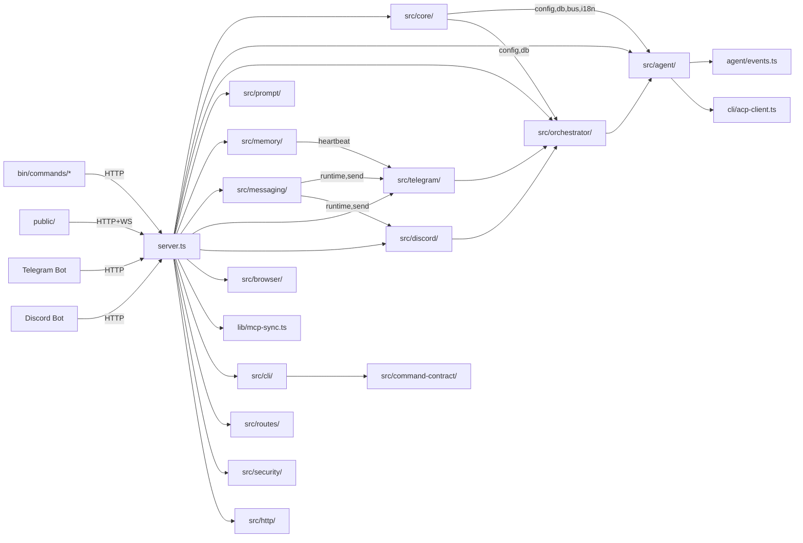

> 📚 [INDEX](INDEX.md) · [체크리스트 ↗](AGENTS.md) · **파일 트리 & 함수 레퍼런스**

# CLI-JAW — Source Structure & Function Reference

> 마지막 검증: 2026-05-12 (실제 코드베이스 재측정)
> `server.ts` 789L / `src/routes/` 15 files (12 registrar + `quota.ts` helper + `types.ts` + trace routes, 131 route handlers) / `src/cli/handlers*.ts` 383L + 461L + 95L / `src/cli/api-auth.ts` 45L / `src/agent/spawn.ts` 1610L + `src/agent/watchdog.ts` 104L / `src/manager/` 57 TS/TSX files (9103L, dashboard manager + board/notes/search/schedule/reminders/connector/routes + notes assets/watcher 서브모듈) / `src/browser/web-ai/` 67 TS files (12263L, ChatGPT/Gemini/Grok 멀티벤더 자동화 + resolver/source-audit/observation helpers + context-pack/tab-pool) / `src/types/` 1 file (75L) / `bin/commands/` 18 top-level ts files + `tui/` 7 helper files
> issue #91: OfficeCLI 10-phase integration (dual-audited, 94/94 tests) — closed
> issue #92: Phase 20 overlay consolidation + GitHub Release v1.0.28-lidge.1 (3 audits passed: A-/A/A) — closed
> issue #95: Avatar image upload — emoji+image dual support, 4 API endpoints, secure path serving — closed
> issue #26/#79/#80/#81: Frontend Modernization epic + virtual scroll + IndexedDB + PWA — closed (Phase 0~8 완료, GPT-5.4+Opus Fast dual-verified)
> issue #100: crypto.randomUUID HTTP/IP 접속 시 채팅 초기화 버그 수정 — closed
> issue #102: 서비스 모드 리부트 후 직원 파견 실패 — 10건 전수 수정, 11 SRH 테스트, Opus+GPT-5.4 이중 감사 — closed
> issue #101: VS 스크롤 80+ 메시지 최상단 튕김 — fix 1~14 적용 완료 (measured bootstrap, prefix-sum binary search, spacing model, regression harness, doc resync 포함), dual-model 검증 + regression tests 반영 — closed
> Phase 9 보안 하드닝 + Phase 17 AI triage + Phase 20.6 모듈 분리 + parallel dispatch + session fix + cli-jaw rename + orchestration v3 + **multi-instance refactor (Phase 1-4.1)** + **interface_unify (submitMessage gateway + collect.ts + command-context.ts)** + **safe_install (postinstall guard + init.ts refactor)** + **repo_hygiene (phase 3 완료)** + **frontend TS migration (Phase A-0 infra + A-1 leaf 6파일)** + **flush model selection 강화(FC-007/008)** + **multi-instance zombie shutdown fix** + **telegram-file retry** + **copilot auth comprehensive** + **markdown CJK bold fix** + **KaTeX copy/rendering audit** + **CI audit-fin-status gate** + **employee custom model __custom__ fix** + **PABCD state machine + visual feedback** + **429 smart retry** + **Telegram voice STT** + **Web voice recording** + **Token keep-alive** + **STT settings UI** + **PDF skill** + **skill reset soft/hard (#64)** + **session hardening rollout (main-session authority + Telegram settings parity + ACP fallback persistence guard + resume classifier)** + **issue66 pasted-text collapse (composer segments + bracketed paste parser)** + **issue29 browser launch policy (launch-policy.ts + `browser start --agent` + prompt/skill contract 갱신)** + **TUI renovation Phases 1-5 (transcript model + config wiring + help overlay + command palette)** + **CLI model selector refresh (locale bootstrap + no-arg `/model`·`/cli` selector + remote reply contract)** + **OfficeCLI integration (#91): CjkHelper.cs + 3 skill rewrite + 3 new overlays + ooxml_core + smoke tests** + **Phase 20 (#92): overlay consolidation → 3 routable skills + shared refs + fork release v1.0.28-lidge.1** + **ProcessBlock UX (copy btn + spacing + placeholder) + Claude thinking_delta/input_json_delta parsing + typography overhaul (font 13→15px, CJK Pretendard fallback, line-height 1.6)** + **Hotfix3 terminology standardization (worker→employee, collision guard)** + **orchestrate reset history preservation + stale PABCD reconnect fix** + **compact command + Claude canonical models + stepRef correlation** + **route extraction (`server.ts` 569L + `src/routes/` 12 files)** + **handlers 3-split + `api-auth.ts`** + **security mutation auth + path-guards `assertSendFilePath`** + **processQueue race fix** + **Codex double-fold regression fix** 반영
>
> 상세 모듈 문서는 [서브 문서](#서브-문서)를 참조하세요.

---

## File Tree

```text
cli-jaw/
├── server.ts                 ← Express 라우트 base + auth/CORS/rate-limit + WS bootstrap + `register*Routes()` glue + startup stale orc_state guard + graceful shutdown(closeDb) + employee migration + seed defaults + registerAvatarRoutes + async listen bootstrap (await initActiveMessagingRuntime) + orphaned jaw-emp-* cleanup + clearAllEmployeeSessions startup (807L)
├── lib/                      ← 외부 통합/공용 헬퍼 (5 files)
│   ├── mcp-sync.ts           ← MCP 통합 + 스킬 복사 + softResetSkills + runSkillReset + trusted repair gate + clone cooldown (73L)
│   ├── upload.ts             ← 파일 업로드 + Telegram 다운로드 guards(status/timeout/maxBytes) + 유니코드 파일명 (200L)
│   ├── token-keepalive.ts    ← Claude/Copilot 토큰 자동 갱신 (1시간 간격 claude --version 호출) (32L) [`bin/star-prompt.ts`도 자체 모듈로 존재 (128L)]
│   ├── stt.ts                ← 음성인식 엔진 (Gemini REST → Whisper fallback, settings.json 연동, mimeType 파라미터) (231L)
│   └── quota-copilot.ts      ← Copilot 할당량 조회 (env → file cache → gh auth token → keychain, execFileSync 보안, source 계정 바인딩) + refreshCopilotFromKeychain (307L)
├── src/
│   ├── core/                 ← 의존 0 인프라 계층 (21 files)
│   │   ├── config.ts         ← JAW_HOME, settings, CLI 탐지, APP_VERSION + migrateSettings legacy Claude model normalization + avatar settings deep merge + corrupt settings backup (433L)
│   │   ├── compact.ts        ← compact 헬퍼 (COMPACT_MARKER_CONTENT, managed summary builder, cutoff logic) (403L)
│   │   ├── instance.ts       ← 인스턴스 ID, node/jaw 경로, 유닛명 sanitize (58L)
│   │   ├── db.ts             ← SQLite 스키마 + prepared statements + trace + tool_log + working_dir migration + closeDb() WAL checkpoint + checkOrphanedWal + busy_timeout + clearMessagesScoped + queued_messages table + model-aware clearEmployeeSession (320L)
│   │   ├── bus.ts            ← WS + 내부 리스너 broadcast (36L)
│   │   ├── logger.ts         ← 로거 유틸 (11L)
│   │   ├── i18n.ts           ← 서버사이드 번역 (90L)
│   │   ├── employees.ts      ← Employee 시드/CRUD 공용 로직 + 정적(코드 정의) 직원(Control 등) 등록 + DEFAULT_EMPLOYEES (232L)
│   │   ├── main-session.ts   ← 메인 세션 authoritative CLI/clear-state helper + clearBossSessionOnly (185L)
│   │   ├── message-summary.ts ← message preview/summary helper (44L)
│   │   ├── path-expand.ts    ← shell-style path expansion helper (12L)
│   │   ├── runtime-settings.ts ← settings side effects 통합 helper (104L)
│   │   ├── runtime-settings-gate.ts ← settings mutation in-flight gate (41L)
│   │   ├── codex-config.ts   ← Codex config.toml context window sync (78L)
│   │   ├── runtime-path.ts   ← buildServicePath() PATH 보강 (nvm/fnm/homebrew/volta/asdf/cargo/bun/yarn/pnpm 14+ dirs) (78L)
│   │   ├── boss-auth.ts      ← boss/employee scope 분리용 auth helper (42L)
│   │   ├── claude-install.ts ← Claude CLI 설치 상태 점검 helper (33L)
│   │   ├── launchd-cleanup.ts ← launchd stale plist / runtime cleanup (16L)
│   │   ├── launchd-plist.ts  ← launchd plist 생성 helper (61L)
│   │   ├── tcc.ts            ← macOS TCC / screen-recording 권한 점검 (55L)
│   │   └── settings-merge.ts ← perCli/activeOverrides deep merge (52L)
│   ├── agent/                ← CLI 에이전트 런타임 (15 files)
│   │   ├── alert-escalation.ts ← alert escalation event helper (80L)
│   │   ├── spawn.ts          ← CLI spawn + ACP 분기 + 큐 + 메모리 flush + 429 retry timer + isAgentBusy + buildHistoryBlock compact cutoff + working_dir scoping + enqueue→processQueue race fix + QueueItem persistent DB queue + makeCleanEnv PATH augment (1625L)
│   │   ├── spawn-env.ts      ← spawn용 child env 빌더 (OpenCode/Gemini permissions config 주입 등, 141L)
│   │   ├── args.ts           ← CLI별 인자 빌더 (183L)
│   │   ├── error-classifier.ts ← stderr/result 기반 에러 분류 헬퍼 (38L)
│   │   ├── lifecycle-handler.ts ← child lifecycle + fallback/retry + queue resume orchestration + clearEmployeeSession on resume failure (531L)
│   │   ├── live-run-state.ts ← active run snapshot / hydrate helper (64L)
│   │   ├── memory-flush-controller.ts ← assistant 완료 후 메모리 flush lock + trigger 제어 (159L)
│   │   ├── opencode-diagnostics.ts ← OpenCode permissions/env audit + raw event 진단 헬퍼 (156L)
│   │   ├── session-persistence.ts ← main-session persistence policy + ownership generation (72L)
│   │   ├── resume-classifier.ts ← stale resume signature classifier (51L)
│   │   ├── smoke-detector.ts ← smoke response 감지 + auto-continue 판단 (141L)
│   │   ├── tool-timeout.ts   ← tool inactivity timeout helper (33L)
│   │   ├── watchdog.ts       ← idle/progress watchdog + 4h absolute hard cap with progress deadline extension (104L)
│   │   └── events.ts         ← NDJSON 파서 + ACP update + logEventSummary + summarizeToolInput(type-safe) + toolType/detail 필드 + Claude thinking_delta/input_json_delta 버퍼 + flushClaudeBuffers + stepRef correlation + compact event parsing + Codex toolLog running→done dedup (1526L)
│   ├── messaging/            ← 통합 메시징 런타임 (신규)
│   │   ├── runtime.ts        ← 채널 lifecycle (init/shutdown/restart) + transport registry (146L)
│   │   ├── send.ts           ← 통합 아웃바운드 메시지 라우팅 (ChannelSendRequest) (147L)
│   │   ├── session-key.ts    ← 세션 키 헬퍼 (27L)
│   │   └── types.ts          ← MessengerChannel, OutboundType, RemoteTarget 타입 (27L)
│   ├── orchestrator/         ← 직원 오케스트레이션 + 인터페이스 통합 (10 files)
│   │   ├── state-machine.ts ← PABCD 상태 머신 + broadcast(state,title) + worklog 타이틀 파싱 + employee terminology + OrcContext.workingDir + Project root dispatch contract (363L)
│   │   ├── pipeline.ts       ← PABCD orchestration (explicit entry only) + plan context persistence + memorySnapshot injection + reset clears boss session + OrcContext workingDir init + Approved Plan Project root guard (455L)
│   │   ├── distribute.ts     ← runSingleAgent + buildPlanPrompt + parallel helpers + tiered findEmployee + employee resume diagnostics (554L)
│   │   ├── parser.ts         ← triage + subtask JSON + verdict 파싱 + isResetIntent (176L) [needsOrchestration/CODE_KEYWORDS/FILE_PATH_PATTERN/MULTI_TASK_PATTERN 제거됨]
│   │   ├── gateway.ts        ← submitMessage 통합 진입점 (WebUI+CLI+TG+Discord 공통) + working_dir scoped insertMessage (155L)
│   │   ├── collect.ts        ← orchestrateAndCollect (bot.ts에서 분리) (65L)
│   │   ├── scope.ts          ← 현재 단일 'default' scope를 반환하는 stub (resolveOrcScope/findActiveScope, 17L) — 멀티 scope 미사용
│   │   ├── worker-monitor.ts ← Worker stall detection — activity timestamps + stall/disconnect/timeout callbacks (58L)
│   │   ├── worker-registry.ts ← Worker 프로세스 레지스트리 (171L)
│   │   └── workspace-context.ts ← Project root/path hint resolver for employee dispatch context (65L)
│   ├── prompt/               ← 프롬프트 조립 (3 files)
│   │   ├── builder.ts        ← A-1/A-2 + 스킬 + 직원 프롬프트 v2 + promptCache (4-segment key: emp:role:phase:workingDir) + dev skill rules + **advanced memory mode branch + task snapshot injection** + dashboard-connector anchor preserve (714L)
│   │   ├── soul-bootstrap-prompt.ts ← LLM 기반 soul.md 개인화 부트스트랩 프롬프트 빌더 (52L)
│   │   └── template-loader.ts ← 프롬프트 템플릿 로더 (50L)
│   ├── manager/              ← Multi-instance 대시보드 매니저 (57 TS/TSX files, 9103L; `jaw dashboard serve` + board/notes/search/schedule/reminders/connector/routes/notes assets/watcher 서브모듈)
│   │   ├── server.ts         ← Express 대시보드 서버 + helmet + 헬스/스캔/액션 라우트 + board/notes/schedule/reminders/connector/routes 라우터 마운트 (572L)
│   │   ├── scan.ts           ← 포트 범위 스캔 + 인스턴스 감지 (148L)
│   │   ├── proxy.ts          ← 인스턴스 reverse proxy 미들웨어 (231L)
│   │   ├── lifecycle.ts      ← 인스턴스 lifecycle (start/stop/spawn) 매니저 (531L)
│   │   ├── lifecycle-helpers.ts ← lifecycle 공용 헬퍼 (grace timer, port wait, capability builder, error result) (188L)
│   │   ├── lifecycle-store.ts ← PersistedRegistry/HomeMarker 영속화 + LifecycleStore 클래스 (194L)
│   │   ├── registry.ts       ← `manager-instances.json` 영속화 + UI status 패치 (407L)
│   │   ├── metadata.ts       ← 인스턴스 메타데이터 헬퍼 (52L)
│   │   ├── constants.ts      ← DASHBOARD_DEFAULT_PORT / MANAGED_INSTANCE_PORT_FROM/COUNT (13L)
│   │   ├── types.ts          ← Dashboard 타입 (DashboardInstance/Registry/ScanResult/NoteSearchResult 등, 364L)
│   │   ├── dashboard-home.ts ← DASHBOARD_HOME_ENV + resolveDashboardHome + dashboardPath 헬퍼 (19L)
│   │   ├── dashboard-service.ts ← permDashboard/unpermDashboard/dashboardServiceStatus 서비스 관리 (214L)
│   │   ├── health-history.ts ← HealthEvent/HealthHistory 건강 이력 추적 + createHealthHistory (139L)
│   │   ├── launchd-service.ts ← macOS launchd 서비스 백엔드 (detect/perm/unperm/stop/start/restart) (235L)
│   │   ├── systemd-service.ts ← Linux systemd 서비스 백엔드 (detect/perm/unperm/stop/start/restart) (236L)
│   │   ├── platform-service.ts ← 크로스플랫폼 서비스 추상화 (detectBackend launchd/systemd/none 자동감지) (113L)
│   │   ├── logs.ts           ← 인스턴스 로그 조회 (fetchInstanceLogs, InstanceLogSnapshot) (125L)
│   │   ├── observability.ts  ← ManagerEvent 옵저버빌리티 + createObservability (59L)
│   │   ├── preview-origin-proxy.ts ← 프리뷰 origin 프록시 (포트 매핑, PreviewOriginProxyController) (298L)
│   │   ├── process-verify.ts ← 프로세스 검증 (isPidAlive, resolveListeningPid, isPortOccupied, waitForPortFree) (121L)
│   │   ├── profiles.ts       ← 프로파일 관리 (deriveProfile, mergeProfiles, sortProfiles, filterByProfile) (103L)
│   │   ├── security.ts       ← 포트/호스트/Origin 보안 검증 (parsePositivePort, isLoopbackHost, isExpectedHostHeader, isAllowedOriginHeader 등 18종) (129L)
│   │   ├── shutdown.ts       ← 대시보드 graceful shutdown (createDashboardShutdown) (71L)
│   │   ├── board/            ← 칸반 보드 서브모듈 (2 files, 307L)
│   │   │   ├── store.ts      ← BoardStore 클래스 + DashboardTask/TaskLane CRUD (SQLite) (209L)
│   │   │   └── routes.ts     ← 칸반 보드 Express 라우터 (createDashboardBoardRouter) (98L)
│   │   ├── notes/            ← 대시보드 노트 서브모듈 (15 files, 2266L)
│   │   │   ├── assets.ts     ← note asset path/metadata helpers (278L)
│   │   │   ├── capabilities.ts ← notes feature capability summary (58L)
│   │   │   ├── constants.ts  ← notes reserved path constants (11L)
│   │   │   ├── frontmatter.ts ← frontmatter parse/stringify helpers (159L)
│   │   │   ├── link-resolver.ts ← note link/wiki-link resolver (107L)
│   │   │   ├── remote-assets.ts ← remote image fetch/cache helpers (139L)
│   │   │   ├── search.ts     ← ripgrep-backed markdown search + typed errors + reserved-folder filter (290L)
│   │   │   ├── store.ts      ← NotesStore 클래스 — 마크다운 노트 CRUD (파일시스템 기반) (297L)
│   │   │   ├── routes.ts     ← 노트 Express 라우터 (createDashboardNotesRouter) + `/search` + JSON 에러 핸들러 (257L)
│   │   │   ├── trash.ts      ← NotesTrash 클래스 — os-trash/dashboard-trash 이중 경로 (129L)
│   │   │   ├── vault-index.ts ← notes vault index builder (276L)
│   │   │   ├── path-guards.ts ← 노트 경로 보안 (assertNoteRelPath, isPathInside, resolveNotePath, encodeTrashPath 등) (91L)
│   │   │   ├── system-trash.ts ← macOS system trash 이동 헬퍼 (moveToSystemTrash) (20L)
│   │   │   ├── watcher.ts    ← notes external file watcher (33L)
│   │   │   └── wiki-links.ts ← wiki-link extraction/update helpers (121L)
│   │   ├── reminders/        ← 대시보드 reminders 서브모듈 (7 files, 775L)
│   │   │   ├── api.ts        ← dashboard reminder list/create/update API helpers (26L)
│   │   │   ├── dispatcher.ts ← reminder notification dispatch helper (55L)
│   │   │   ├── due-time.ts   ← reminder due/remind time classification (20L)
│   │   │   ├── instance-link.ts ← reminder source instance/message link parser (35L)
│   │   │   ├── routes.ts     ← `/api/dashboard/reminders` Express router (list/create/from-message/update) (161L)
│   │   │   ├── scheduler.ts  ← reminder notification scheduler loop (71L)
│   │   │   └── store.ts      ← SQLite-backed dashboard reminders store + notification status (407L)
│   │   ├── connector/        ← on-demand dashboard connector 서브모듈 (3 files, 409L) — agent writes go through here only when userRequested:true
│   │   │   ├── routes.ts     ← `/api/dashboard/connector` Express router (board/reminders/notes adapters + audit + parent-folder auto-create) (259L)
│   │   │   ├── audit-log.ts  ← SQLite-backed connector audit event log (124L)
│   │   │   └── types.ts      ← ConnectorActor/Surface/InstanceLink/AuditEvent/ErrorCode 타입 (26L)
│   │   ├── schedule/         ← 스케줄 관리 서브모듈 (4 files, 459L)
│   │   │   ├── store.ts      ← ScheduleStore 클래스 + DashboardScheduledWork CRUD (SQLite) (230L)
│   │   │   ├── routes.ts     ← 스케줄 Express 라우터 (createDashboardScheduleRouter) (112L)
│   │   │   ├── runner.ts     ← 스케줄 실행기 (startScheduleRunner, cron/interval 기반) (74L)
│   │   │   └── dispatcher.ts ← 스케줄 작업 디스패치 (dispatchScheduledWork, DispatchResult) (43L)
│   │   └── routes/           ← 대시보드 전용 라우트 (2 files, 183L)
│   │       ├── electron-metrics.ts ← Electron 메트릭스 수집/조회 (ElectronMetricsStore, createElectronMetricsRouter) (155L)
│   │       └── desktop-status.ts ← 데스크톱 앱 상태 조회 (readDesktopStatus, createDesktopStatusRouter) (28L)
│   ├── cli/                  ← 커맨드 시스템
│   │   ├── commands.ts       ← 슬래시 커맨드 레지스트리 + 디스패처 + 파일경로 필터 + tgDescKey + /commands alias /cmd + /orchestrate alias /pabcd + /compact (332L)
│   │   ├── handlers.ts       ← core command handlers + runtime/completion re-export hub + compact re-export (363L)
│   │   ├── handlers-runtime.ts ← memory/browser/prompt/quit/file/steer/forward/fallback/flush/ide/orchestrate 핸들러 + `LEGACY_MODEL_CLI_HINTS` (449L)
│   │   ├── handlers-completions.ts ← `/model` `/cli` `/skill` `/employee` `/browser` `/fallback` `/flush` 인자 자동완성 헬퍼 (92L)
│   │   ├── api-auth.ts       ← CLI→server Bearer token bootstrap (`getCliAuthToken`, `authHeaders`, `cliFetch`) (45L)
│   │   ├── claude-models.ts  ← Claude 정규 모델셋 (CLAUDE_CANONICAL_MODELS, CLAUDE_LEGACY_VALUE_MAP) + migration/validation helpers (78L)
│   │   ├── compact.ts        ← /compact 슬래시 커맨드 핸들러 (Claude native + managed 경로 분기) + working_dir scoped (119L)
│   │   ├── registry.ts       ← 5개 CLI/모델 단일 소스 + canonical defaults (91L)
│   │   ├── readiness.ts      ← CLI별 인증/설치 상태 점검 (CliReadiness[]) (82L)
│   │   ├── acp-client.ts     ← Copilot ACP JSON-RPC 클라이언트 (382L)
│   │   ├── command-context.ts ← 공유 커맨드 컨텍스트 팩토리 + runSkillReset 위임 + regenerateB 유지 (140L)
│   │   └── tui/
│   │       ├── store.ts      ← TuiStore (transcript + overlay 상태 통합), OverlayState + SelectorState (68L) ✨
│   │       ├── transcript.ts ← TranscriptItem union (user/assistant/status) + TranscriptState + 6 mutation 함수 (57L) ✨
│   │       ├── composer.ts   ← Issue #66 pasted-text composer state + bracketed paste parser + slash gate + PasteCollapseConfig (227L) ✨
│   │       ├── overlay.ts    ← help overlay + command palette + choice selector 렌더링 (HelpEntry, PaletteRenderOptions, ChoiceSelectorItem) (481L) ✨
│   │       ├── keymap.ts     ← 키 입력 분류 (ctrl-c/ctrl-d/ctrl-k/enter/backspace/printable/escape) (36L) ✨
│   │       ├── panes.ts      ← PaneState (openPanel, side, preferredWidth), PanelKind 6종 (53L) ✨
│   │       ├── shell.ts      ← ShellLayout 계산 + scroll region setup/cleanup + ensureSpaceBelow (83L) ✨
│   │       └── renderers.ts  ← visualWidth (CJK 2-cell) + clipTextToCols ANSI-safe 자르기 (37L) ✨
│   ├── memory/               ← 데이터 영속화 + advanced memory runtime (13 files)
│   │   ├── advanced.ts       ← Advanced Memory re-export stub (1L)
│   │   ├── bootstrap.ts      ← legacy memory/bootstrap import + structured root 초기화 (517L)
│   │   ├── heartbeat.ts      ← Heartbeat 잡 스케줄 + cron/every timer orchestration + minute-slot dedupe + fs.watch (206L)
│   │   ├── heartbeat-schedule.ts ← Heartbeat schedule normalize + cron validate/match + timezone validate + immediate cron loop helper (410L)
│   │   ├── identity.ts       ← `shared/soul.md` 관리 + soul runtime helper (86L)
│   │   ├── indexing.ts       ← FTS5/BM25 reindex + indexed file/chunk 상태 집계 (417L)
│   │   ├── injection.ts      ← memory injection policy + advanced/basic search routing (69L)
│   │   ├── keyword-expand.ts ← search keyword expansion + provider config normalize (268L)
│   │   ├── memory.ts         ← Persistent Memory grep 기반 (154L)
│   │   ├── reflect.ts        ← episode → shared/procedures reflection + promoted fact 정리 (256L)
│   │   ├── runtime.ts        ← Advanced Memory 런타임: bootstrap/import/FTS5 인덱스/BM25 검색/task snapshot/delta reindex (374L)
│   │   ├── shared.ts         ← file/meta/frontmatter 공용 헬퍼 (256L)
│   │   └── worklog.ts        ← Worklog CRUD + phase matrix (200L)
│   ├── telegram/             ← Telegram 인터페이스
│   │   ├── bot.ts            ← Telegram 봇 + forwarder lifecycle + origin 필터링 + inbound download size hints + voice 핸들러 등록 (640L)
│   │   ├── voice.ts          ← 음성 메시지 → guarded download → STT → tgOrchestrate 파이프라인 (40L)
│   │   ├── forwarder.ts      ← 포워딩 헬퍼 (escape, chunk, createForwarder) (123L)
│   │   └── telegram-file.ts  ← Telegram 파일 전송 + 재시도 + 사이즈 검증 (133L)
│   ├── discord/              ← Discord 인터페이스 (신규)
│   │   ├── bot.ts            ← Discord 봇 + transport 등록 + message/attachment 핸들러 (386L)
│   │   ├── commands.ts       ← Discord slash command 등록 + 핸들러 (118L)
│   │   ├── forwarder.ts      ← Discord 포워딩 헬퍼 (escape, chunk) (45L)
│   │   └── discord-file.ts   ← Discord 파일 전송 (56L)
│   ├── browser/              ← Chrome CDP 제어 + web-ai 자동화
│   │   ├── connection.ts     ← Chrome 탐지/launch/CDP 연결 + readiness polling + retry + headless + runtime diagnostics/orphan cleanup + **activePort/active-tab 상태 관리** (817L)
│   │   ├── launch-policy.ts  ← browser start mode 정규화 + agent/debug/manual launch policy (51L)
│   │   ├── actions.ts        ← snapshot/click/type/navigate/screenshot + browser primitive actions (527L)
│   │   ├── vision.ts         ← vision-click 파이프라인 + Codex provider + guardrail options (204L)
│   │   ├── index.ts          ← re-export hub (33L)
│   │   └── web-ai/           ← Web AI 브라우저 자동화 (67 TS files, 12263L; ChatGPT/Gemini/Grok 멀티벤더 + resolver/source-audit/observation helpers + context-pack + tab lifecycle/pool)
│   │       ├── index.ts      ← web-ai barrel hub (37L)
│   │       ├── types.ts      ← WebAiVendor, WebAiStatus, QuestionEnvelope, WebAiSessionRecord, WebAiOutput 등 핵심 타입 (159L)
│   │       ├── constants.ts  ← CACHE_SCHEMA_VERSION, VALIDATION_THRESHOLD, MAX_TRACE_STEPS, RESOLUTION_SOURCES (30L)
│   │       ├── errors.ts     ← WebAiError 클래스 + wrapError/providerError/contextError/toErrorJson (150L)
│   │       ├── question.ts   ← normalizeEnvelope + renderQuestionEnvelope + renderQuestionEnvelopeWithContext (98L)
│   │       ├── session.ts    ← 세션 CRUD (createSession/getSession/listSessions/updateSessionResult/pruneSessions) + baseline 관리 (449L)
│   │       ├── session-store.ts ← SessionStore JSON 영속화 + withStoreLock + insertSession/patchSession/listStoredSessions/pruneSessions (278L)
│   │       ├── cli-sessions.ts ← CLI sessions 커맨드 실행 (runSessionsCommand, printSessionsHuman) (208L)
│   │       ├── chatgpt.ts    ← ChatGPT 벤더: render/status/send/poll/query/watch/sessions/stop/diagnose (891L)
│   │       ├── chatgpt-composer.ts ← ChatGPT 컴포저 조작 (findComposerCandidate, insertPromptIntoComposer, submitPromptFromComposer) (363L)
│   │       ├── chatgpt-response.ts ← ChatGPT 응답 캡처 (readAssistantSnapshot, captureAssistantResponse) (320L)
│   │       ├── chatgpt-model.ts ← ChatGPT 모델 선택 (selectChatGptModel, instant/thinking/pro) (580L)
│   │       ├── chatgpt-attachments.ts ← ChatGPT 파일 첨부 (preflightAttachment, attachLocalFileLive, clearComposerAttachmentsLive) (378L)
│   │       ├── gemini-live.ts ← Gemini 벤더: geminiStatus/geminiSend/geminiPoll/geminiStop (573L)
│   │       ├── gemini-model.ts ← Gemini 모델 선택 (selectGeminiModel, fast/thinking/pro) (115L)
│   │       ├── gemini-contract.ts ← Gemini Deep Think 계약/제약/상태 리포트 (116L)
│   │       ├── grok-live.ts  ← Grok 벤더: grokStatus/grokSend/grokPoll/grokStop (427L)
│   │       ├── grok-model.ts ← Grok 모델 선택 (selectGrokModel, auto/fast/expert/heavy) (120L)
│   │       ├── ax-snapshot.ts ← 접근성 트리 스냅샷 (buildWebAiSnapshot, extractInteractiveRefs, hashAccessibilitySnapshot) (375L)
│   │       ├── annotated-screenshot.ts ← 주석 스크린샷 빌더 (buildAnnotatedScreenshot) (153L)
│   │       ├── browser-primitives.ts ← 브라우저 기본 동작 (findVisibleCandidate, captureTextBaseline, waitForStableTextAfterBaseline, clickResolvedTarget, fillResolvedTarget) (259L)
│   │       ├── self-heal.ts  ← 셀프힐 타겟 해석 (resolveActionTarget, validateResolvedTarget, locatorForResolvedTarget, rankTargetCandidates) (439L)
│   │       ├── action-breadth.ts ← broad action expansion helper (74L)
│   │       ├── action-cache.ts ← 액션 캐시 (loadActionCache/saveActionCache/getCachedTarget/updateCacheEntry) (250L)
│   │       ├── action-intent.ts ← action intent normalization/resolution (92L)
│   │       ├── action-memory.ts ← action memory scoring/cache helper (108L)
│   │       ├── action-trace.ts ← 액션 추적 (createTraceContext, recordTraceStep, getSessionTrace, summarizeTrace) (85L)
│   │       ├── trace-persistence.ts ← 추적 영속화 (appendTraceToSession, redactSensitive) (58L)
│   │       ├── ref-registry.ts ← Ref 레지스트리 (createRefRegistry, resolveRef, invalidateRefsOnDomChange, isRegistryStale) (150L)
│   │       ├── dom-hash.ts   ← DOM 해시 (domHashAround, normalizeDomForHash, selectorMatchSummary) (74L)
│   │       ├── post-action-assert.ts ← 액션 후 검증 (assertPostAction, clickWithPostAssert, fillWithPostAssert) (186L)
│   │       ├── observe-actions.ts ← observed action extraction/helper layer (231L)
│   │       ├── observe-targets.ts ← 시맨틱 타겟 관찰 (observeProviderTargets, rankTargetCandidates) (129L)
│   │       ├── observation-bundle.ts ← observation bundle builder (138L)
│   │       ├── target-resolver.ts ← target resolver helper (48L)
│   │       ├── capability-registry.ts ← 기능 레지스트리 (listCapabilities, lookupCapability, isCapabilityEnabled, requireCapabilityOrFailClosed) (499L)
│   │       ├── capability-types.ts ← 기능 타입 (WebAiVendorScope, CapabilityStatus, CapabilityFamily, CapabilityEntry) (67L)
│   │       ├── capability-freshness.ts ← 기능 freshness 게이트 (validateFreshnessGate) (38L)
│   │       ├── capability-observation-presets.ts ← ChatGPT/Gemini 기능 관찰 프리셋 (모델선택기, 첨부, 웹검색, 이미지생성, deep think 등) (113L)
│   │       ├── capability-observed-tool-entries.ts ← 관찰된 도구 기능 엔트리 (OBSERVED_TOOL_CAPABILITY_ENTRIES) (92L)
│   │       ├── provider-adapter.ts ← 벤더 어댑터 인터페이스 (WebAiProviderAdapter, ProviderRuntimeDisabledError, createDisabledProviderAdapter) (70L)
│   │       ├── vendor-editor-contract.ts ← 벤더 에디터 계약 (createChatGptEditorAdapter, 셀렉터 상수 모음) (155L)
│   │       ├── copy-markdown.ts ← 응답 복사 마크다운 캡처 (captureCopiedResponseText, preferCopiedText) (230L)
│   │       ├── answer-artifact.ts ← assistant answer artifact capture/formatting helper (128L)
│   │       ├── source-audit.ts ← answer/source audit helper (152L)
│   │       ├── product-surfaces.ts ← 프로덕트 서피스 감지 (detectChatGptProductSurfaces, detectGeminiProductSurfaces) (85L)
│   │       ├── diagnostics.ts ← Web AI 진단 (captureWebAiDiagnostics, toWebAiErrorEnvelope, redactDiagnosticText) (289L)
│   │       ├── doctor.ts     ← 기능 진단 (runDoctor, diagnoseFeature, featureDefinitionsForVendor) (291L)
│   │       ├── contract-audit.ts ← 계약 감사 (auditContractAgainstSnapshot) (127L)
│   │       ├── cache-metrics.ts ← 캐시 메트릭스 (recordCacheEvent, reportCacheMetricsFromEvents) (105L)
│   │       ├── churn-log.ts  ← 기능 이탈 로그 (readChurnLog, appendChurnRecord, compactChurnLog, maybeRecordChurn) (94L)
│   │       ├── notifications.ts ← Web AI 알림 (drainPendingWebAiNotifications, formatWebAiNotification) (76L)
│   │       ├── interstitial.ts ← provider interstitial handling (87L)
│   │       ├── planner-contract.ts ← web-ai planner contract helper (73L)
│   │       ├── watcher.ts    ← 응답 워처 (startWebAiWatcher, listActiveWebAiWatchers, stopWebAiWatchers, resumeStoredWebAiWatchers) (246L)
│   │       ├── tab-finalizer.ts ← tab lifecycle finalizer (29L)
│   │       ├── tab-lease-store.ts ← web-ai tab lease store (440L)
│   │       ├── tab-pool.ts   ← provider tab pooling/cleanup (69L)
│   │       └── context-pack/ ← 컨텍스트 패키지 서브모듈 (9 files, 567L)
│   │           ├── index.ts  ← context-pack barrel hub (8L)
│   │           ├── types.ts  ← ContextPackInput, SelectedContextFile, ContextPackResult, ContextPackSummary (64L)
│   │           ├── constants.ts ← DEFAULT_MAX_FILE_SIZE_BYTES, DEFAULT_INLINE_CHAR_LIMIT, DEFAULT_MODEL_INPUT_BUDGETS (39L)
│   │           ├── builder.ts ← buildContextPackageResult, buildInlineContextOrFail, prepareContextForBrowser, summarizeContextPack (71L)
│   │           ├── file-selector.ts ← buildContextPack, collectPatterns, expandContextPaths, readContextFile (180L)
│   │           ├── renderer.ts ← renderContextComposerText, renderContextAttachmentText, resolveContextTransport (78L)
│   │           ├── report.ts ← renderContextDryRunReport, toJsonResult (69L)
│   │           ├── runtime.ts ← contextDryRun, contextRender (18L)
│   │           └── token-estimator.ts ← estimateTokens, resolveMaxInputTokens, buildBudgetReport (40L)
│   ├── ide/                   ← IDE 연동 (jaw chat TUI 전용)
│   │   └── diff.ts            ← git diff 감지 + IDE diff 뷰 + 서브모듈 재귀 + fingerprint 비교 (203L)
│   ├── routes/               ← Express 라우트 추출 (15 files: 12 registrar + quota helper + types + traces, 131 route handlers)
│   │   ├── types.ts          ← `AuthMiddleware` shared type (3L)
│   │   ├── employees.ts      ← employee CRUD 라우트 (96L)
│   │   ├── heartbeat.ts      ← heartbeat read/write 라우트 (43L)
│   │   ├── skills.ts         ← skill list/enable/disable/reset 라우트 (74L)
│   │   ├── jaw-memory.ts     ← jaw memory search/read/list/save/init/reflect/flush/soul/soul-activate/bootstrap 라우트 (239L)
│   │   ├── i18n.ts           ← locale bundle 라우트 (26L)
│   │   ├── orchestrate.ts    ← PABCD reset/state/workers/snapshot/queue cancel/queue steer/dispatch/worker result/state PUT 라우트 (394L)
│   │   ├── memory.ts         ← memory status/KV/files/settings 라우트 (185L)
│   │   ├── settings.ts       ← settings/prompt/heartbeat-md/MCP/registry/status/quota/copilot 라우트 (191L)
│   │   ├── messaging.ts      ← upload/file-open/voice/telegram/channel/discord send 라우트 (222L)
│   │   ├── avatar.ts         ← Agent/User 아바타 이미지 업로드/서빙/삭제 + settings.json 메타 저장 + safeResolveUnder 경로 보호 (146L)
│   │   ├── quota.ts          ← Copilot/Claude/Codex/Gemini/OpenCode quota helper readers + Claude 429 cache (`settings.ts`/`server.ts`에서 사용) (344L)
│   │   ├── traces.ts         ← public trace summary/events read routes (80L)
│   │   └── browser.ts        ← 브라우저 API 라우트 + `cdpPort(req)` 포트 우선순위 + primitive/tab/debug/doctor/cleanup/web-ai routes (442L)
│   ├── security/             ← 보안 입력 검증 (3 files)
│   │   ├── path-guards.ts    ← assertSkillId, assertFilename, assertMemoryRelPath, assertSendFilePath, safeResolveUnder (112L)
│   │   ├── decode.ts         ← decodeFilenameSafe (21L)
│   │   └── network-acl.ts    ← isPrivateIP, isAllowedHost, isAllowedOrigin, originMatchesHost, extractHost (RFC1918 + 169.254 + fe80/fc00 + ::ffff:v4, DNS rebinding guard, 131L)
│   ├── http/                 ← 응답 계약
│   │   ├── response.ts       ← ok(), fail() 표준 응답 (25L)
│   │   ├── async-handler.ts  ← asyncHandler 래퍼 (14L)
│   │   └── error-middleware.ts ← notFoundHandler, errorHandler (26L)
│   ├── types/                ← 공유 타입 정의 (1 file, 75L)
│   │   └── agent.ts          ← ToolEntry, SpawnContext, SpawnResult 인터페이스 (75L)
│   └── command-contract/     ← 커맨드 인터페이스 통합
│       ├── catalog.ts        ← COMMANDS → capability map 확장 (43L)
│       ├── policy.ts         ← getVisibleCommands, getTelegramMenuCommands (39L)
│       └── help-renderer.ts  ← renderHelp list/detail mode (44L)
├── public/                   ← Web UI (Vite 8 + ES Modules, 480 files [source + assets + public/public/dist mirror, public/dist 제외], public/dist build output 458 files, mirrored copies under `public/public/dist/` and `public/dist/dist/`, ~66128L)
│   ├── index.html            ← 뼈대 (876L, CLI-JAW 대문자 로고, pill theme switch, data-i18n, 로컬 avatar 입력)
│   ├── manifest.json         ← PWA 매니페스트 (20L) ✨
│   ├── sw.js                 ← Service Worker 오프라인 캐시 (104L) ✨
│   ├── icons/                ← PWA 아이콘 세트 ✨
│   ├── theme-test.html       ← 테마 테스트 페이지
│   ├── css/                  ← 10 files (4749L)
│   │   ├── variables.css     ← Arctic Cyan 테마 + will-change + scrollbar tint + opacity 애니메이션(@keyframes revealUp/Left/Right) + avatar input 스타일 (491L)
│   │   ├── layout.css        ← opacity 전환 + contain 격리 + 로고 글로우 + status-badge + avatar 업로드 컨트롤 (527L)
│   │   ├── markdown.css      ← rendering (table·code·KaTeX·Mermaid) + mermaid overlay popup + copy btn (505L)
│   │   ├── chat.css          ← 채팅 UI (agent-icon+agent-body / user-icon+user-body 레이아웃·입력·첨부·스피너·stream cursor) + contain: content/layout style + empty-state fade hide + .avatar-image 스타일 (1286L)
│   │   ├── diagram.css       ← Mermaid/HTML 다이어그램 위젯 스타일 + iframe wrapper + overlay clone + semantic SVG 라벨/커넥터 컬러 토큰 (400L) ✨
│   │   ├── orc-state.css    ← PABCD 상태 글로우 + 펄스 + 배지 + 로드맵 바 + 상어 스프라이트 + light mode (239L)
│   │   ├── sidebar.css       ← 설정탭·스킬카드·토글·cli-dot(ok/warn/missing) + pulse-warn + cwd-display (340L)
│   │   ├── modals.css        ← 모달·탭·설정 패널 + heartbeat validation hint/error row + contextual help dialog/button styles (363L)
│   │   ├── tool-ui.css       ← process-block 접기/펼치기 + grid collapse + 상태 dot + running 애니메이션 + orchestrate-placeholder 숨김 (550L)
│   │   └── trace-drawer.css  ← trace drawer panel/event list styling (48L)
│   ├── locales/              ← i18n 로케일
│   │   ├── ko.json           ← 한국어 (377키)
│   │   ├── en.json           ← 영어 (377키)
│   │   ├── ja.json           ← 일본어
│   │   └── zh.json           ← 중국어
│   └── js/                   ← 72 .ts files (root 17 + features/ 41 + diagram/ 3 + render/ 11, 전 파일 TypeScript)
│       ├── main.ts           ← 앱 진입점 + 모듈 wire + heartbeat schedule validation/save guard + initAvatar() + initHelpDialog() 포함 (512L)
│       ├── render.ts         ← render public API façade. 기존 caller import surface를 유지하고 실제 구현은 `render/` 하위 모듈로 분리 (17L)
│       ├── constants.ts      ← CLI_REGISTRY 동적 로딩 + ROLE_PRESETS (CliEntry, CliRegistry 타입) (149L)
│       ├── api.ts            ← fetch 래퍼 + REST 엔드포인트 (generic api<T>(), ApiResponse) (61L)
│       ├── icons.ts          ← inline SVG 아이콘 레지스트리 (278L)
│       ├── provider-icons.ts ← CLI/Provider 아이콘 매핑 (88L) ✨
│       ├── locale.ts         ← 로케일 셀렉터 (23L)
│       ├── state.ts          ← 전역 상태 (AppState + OrcStateName + heartbeatErrors + ProcessBlockState) (89L)
│       ├── cjk-fix.ts        ← CJK bold/italic 인접 텍스트 파싱 보정 (38L)
│       ├── streaming-render.ts ← rAF 스트리밍 렌더러 (threshold 기반 throttle + trailing rAF 보장) (92L)
│       ├── virtual-scroll.ts ← TanStack Virtualizer 기반 DOM 풀링 + measured height cache + mounted row remeasure + reconnect/restore anchor 보존 + setItems(autoActivate) + seedMeasuredHeights + activateIfNeeded + scrollToIndex 기반 scrollToBottom + pageshow/visibilitychange/focus 복귀 bottom-follow reconciliation + generateId import (577L) ✨
│       ├── virtual-scroll-bootstrap.ts ← 순수 로직 bootstrap 오케스트레이터 — registerCallbacks → setItems(autoActivate:false) → activateIfNeeded(true) → scrollToBottom + following intent hook (49L) ✨
│       ├── uuid.ts           ← Secure UUID v4 생성기 (crypto.randomUUID → getRandomValues → Math.random 3단 폴백) (24L)
│       ├── ui.ts             ← DOM 유틸 + message rendering orchestration shell + ProcessBlock helper delegation + bottom-follow intent helper + scrollToBottom VS 위임 + generateId UUID 폴리필 적용 (390L)
│       ├── ws.ts             ← WebSocket + WsMessage(toolType/detail/stepRef 필드) + agent_tool→showProcessStep 라우팅 + 로드맵 DOM + reconnect snapshot hydration + bottom anchor reconciliation + clear 시 IDB cache purge + loadMessages try/catch 방어 (481L)
│       ├── diagram/          ← 다이어그램 iframe 위젯 (3 files, 889L)
│       │   ├── iframe-renderer.ts  ← Mermaid/HTML 다이어그램을 sandbox iframe에 격리 렌더 (678L) ✨
│       │   ├── types.ts            ← 위젯 페이로드 타입 (129L) ✨
│       │   └── widget-validator.ts ← 위젯 입력 검증 (82L) ✨
│       ├── render/           ← markdown/diagram rendering helpers (11 files, 1103L)
│       │   ├── code-copy.ts  ← 코드 블록 copy button helper (47L)
│       │   ├── delegations.ts ← render delegation once-guard helper (10L)
│       │   ├── file-links.ts ← local file path linkification + `/api/file/open` delegation (150L)
│       │   ├── highlight.ts  ← highlight.js language registration + mounted block rehighlight (83L)
│       │   ├── html.ts       ← escape/strip helper (26L)
│       │   ├── markdown.ts   ← marked pipeline + math/SVG shielding + post-render scheduling (84L)
│       │   ├── math.ts       ← KaTeX shield/unshield (76L)
│       │   ├── mermaid.ts    ← lazy Mermaid load + queue + observer + render/release/prewarm (250L)
│       │   ├── post-render.ts ← debounced post-render orchestration (35L)
│       │   ├── sanitize.ts   ← HTML/SVG sanitizer policy split (51L)
│       │   └── svg-actions.ts ← inline SVG block render + copy/save/zoom actions + overlay kind split (291L)
│       └── features/         ← 41 도메인 모듈 (6103L)
│           ├── i18n.ts       ← 프론트엔드 i18n + applyI18n() (130L)
│           ├── help-content.ts ← contextual help topic registry + locale key map (75L)
│           ├── help-dialog.ts ← 전역 help dialog event delegation + safe textContent render + focus restore/Escape capture (164L)
│           ├── chat-scroll.ts ← chat bottom-follow/scroll intent helpers + initial settle support (226L)
│           ├── chat-messages.ts ← chat message DOM/finalization helpers (132L)
│           ├── message-actions.ts ← message action buttons and event handlers (157L)
│           ├── message-history.ts ← message history loading/reconnect restore flow (138L)
│           ├── message-item-html.ts ← message item HTML helper (34L)
│           ├── chat.ts       ← 채팅 입력 + 파일 첨부 + 전송 (416L)
│           ├── employees.ts  ← 직원 관리 UI (190L)
│           ├── attention-badge.ts ← 사이드바/탭 attention 뱃지 + 깜빡임 + clear 트리거 (151L) ✨
│           ├── orchestrate-scope.ts ← PABCD scope barrel re-export (4L) ✨
│           ├── heartbeat.ts  ← Heartbeat 모달 + cron/timeZone validation + 저장 차단 + 브라우저 timeZone 기본값 (217L)
│           ├── memory.ts     ← 메모리 관리 UI (449L)
│           ├── pending-queue.ts ← queued prompt overlay / pending queue 렌더 (168L) ✨
│           ├── process-block.ts ← ProcessBlock 접기/펼치기 컴포넌트 (ProcessStep 인터페이스 + 렌더링) (528L) ✨
│           ├── process-block-dom.ts ← ProcessBlock DOM ownership/row replacement helpers (175L) ✨
│           ├── process-log-adapter.ts ← persisted tool log to ProcessStep adapter (104L) ✨
│           ├── process-step-match.ts ← ProcessStep 매칭 헬퍼 (19L) ✨
│           ├── settings.ts   ← barrel re-export (9개 도메인 모듈 통합, was 902L monolith) (9L)
│           ├── settings-types.ts ← Settings 타입 정의 (PerCliConfig, TelegramConfig, DiscordConfig, QuotaWindow 등) (24L) ✨
│           ├── settings-core.ts ← 핵심 설정 로직 (loadSettings, updateSettings, model/cli 선택, perCli 저장) (435L) ✨
│           ├── settings-telegram.ts ← Telegram 설정 (setTelegram, saveTelegramSettings) (49L) ✨
│           ├── settings-discord.ts ← Discord 설정 (setDiscord, saveDiscordSettings) (61L) ✨
│           ├── settings-channel.ts ← Channel 설정 (setActiveChannel, loadFallbackOrder, saveFallbackOrder) (53L) ✨
│           ├── settings-mcp.ts ← MCP 설정 (loadMcpServers, syncMcpServers, installMcpGlobal) (55L) ✨
│           ├── settings-cli-status.ts ← CLI 상태 표시 (loadCliStatus, 인증/설치 상태 점검) (229L) ✨
│           ├── settings-stt.ts ← STT 설정 (엔진 선택, Gemini/Whisper 설정) (109L) ✨
│           ├── settings-templates.ts ← 프롬프트 템플릿 모달 (openPromptModal, savePromptFromModal, toggleDevMode) (132L) ✨
│           ├── voice-recorder.ts ← MediaRecorder 래퍼 + MIME 자동탐지 + 에러 분류 + 녹음 타이머 (175L)
│           ├── skills.ts     ← 스킬 관리 UI (111L)
│           ├── slash-commands.ts ← 슬래시 커맨드 자동완성 (229L)
│           ├── sidebar.ts    ← 사이드바 접기 (이중 모드) (119L)
│           ├── theme.ts      ← pill switch 다크/라이트 (HTMLLinkElement cast) (84L)
│           ├── appname.ts    ← Agent Name (HTMLInputElement, KeyboardEvent) (44L)
│           ├── avatar.ts     ← Agent/User avatar 이모지+이미지 이중 관리 + 서버 업로드/삭제/복원 + getAgentAvatarMarkup/getUserAvatarMarkup + live DOM sync (187L) ✨
│           ├── tool-ui.ts    ← 도구 호출 그룹 렌더링 (buildToolGroupHtml + live activity) (122L) ✨
│           ├── trace-drawer.ts ← Trace drawer UI controls (122L) ✨
│           ├── ui-status.ts  ← compact UI status helper (47L) ✨
│           ├── idb-cache.ts  ← IndexedDB 대화 캐시 v3 (scope별, upsert, versionchange, empty-array wipe guard) (169L) ✨
│           └── gesture.ts    ← 터치/스와이프 제스처 핸들러 (61L) ✨
├── bin/
│   ├── cli-jaw.ts            ← 17개 user-facing 서브커맨드 라우팅 + --home flag (`browser-web-ai.ts` helper 포함 시 commands top-level 18 files) (187L)
│   ├── star-prompt.ts        ← `gh` 기반 GitHub star 1회 프롬프트 (TTY 가드 + state 파일, 129L)
│   ├── postinstall.ts        ← npm install 후 5-CLI + OfficeCLI 자동설치 + MCP + 스킬 + safe 가드 (664L, Node guard + inline JAW_HOME)
│   └── commands/             ← 18 top-level ts files (`browser-web-ai.ts` helper 포함) + `tui/` 7 helper 모듈 (총 4130L + tui 1045L)
│       ├── serve.ts          ← 서버 시작 (--port/--host/--open) + SIGINT child.kill('SIGINT') orphan fix (119L)
│       ├── dispatch.ts       ← 직원 호출 (pipe mode 호환) + route contract bridge + worker result polling + ECONNREFUSED retry with escalating delays (197L)
│       ├── chat.ts           ← 터미널 채팅 TUI (3모드, locale bootstrap, refreshInfo, active model 표시, no-arg `/model`·`/cli` selector intercept, transcript 축적, overlay wiring, 251L)
│       ├── init.ts           ← 초기화 마법사 + --safe/--dry-run + --help (239L)
│       ├── doctor.ts         ← 진단 (다중 체크 + headless 감지, --json) (572L)
│       ├── status.ts         ← 서버 상태 (--json) (85L)
│       ├── mcp.ts            ← MCP 관리 (install/sync/list/reset) (227L)
│       ├── skill.ts          ← 스킬 관리 (install/remove/info/list/reset soft·hard) (243L)
│       ├── employee.ts       ← 직원 관리 (reset, REST API 호출, 72L)
│       ├── reset.ts          ← 전체 초기화 (MCP/스킬/직원/세션) (103L)
│       ├── clone.ts          ← 인스턴스 복제 (--from, --with-memory, regenerateB) (180L)
│       ├── memory.ts         ← 메모리 CLI (search/read/save/list/init) (138L)
│       ├── launchd.ts        ← macOS LaunchAgent 관리 (instance.ts import, --port, xmlEsc, buildServicePath) (235L)
│       ├── service.ts        ← 크로스 플랫폼 서비스 관리 (systemd/launchd/docker, buildServicePath, 289L)
│       ├── orchestrate.ts    ← PABCD 상태 제어 CLI (jaw orchestrate [P|A|B|C|D|reset]) (143L)
│       ├── browser.ts        ← 브라우저 CLI (primitive + tab/debug + web-ai delegator, 788L)
│       ├── browser-web-ai.ts ← `jaw browser web-ai` ChatGPT/Gemini/Grok 자동화 helper (277L)
│       ├── dashboard.ts      ← `jaw dashboard serve` — `dist/src/manager/server.js` 서브프로세스 기동 (255L)
│       └── tui/              ← chat 터미널 TUI 분리 (api/input-handler/overlays/renderer/simple-mode/types/ws-handler, 7 files)
├── tests/                    ← 회귀 방지 테스트 (366 .test.ts files: root 5 / unit 347 / integration 9 / browser 5 / fixtures + smoke)
│   ├── acp-client.test.ts     ← ACP client contract
│   ├── employee-session.test.ts ← main-session ownership
│   ├── events.test.ts        ← 이벤트 파서 단위 테스트 + stepRef + compact event parsing
│   ├── events-acp.test.ts    ← ACP session/update 이벤트 테스트
│   ├── telegram-forwarding.test.ts ← Telegram 포워딩 동작 테스트
│   ├── plan.md               ← 테스트 인벤토리/상태 추적 노트
│   ├── fixtures/             ← 테스트 페이로드 픽스처 (71 files)
│   ├── unit/                 ← Tier 1-2 단위 테스트 (347 .test.ts files)
│   │   ├── employee-prompt.test.ts ← 직원 프롬프트 14건
│   │   ├── orchestrator-parsing.test.ts ← subtask 파싱 13건
│   │   ├── orchestrator-triage.test.ts  ← triage 판단 10건
│   │   ├── agent-args.test.ts        ← CLI args 빌드 16건
│   │   ├── path-guards.test.ts       ← 입력 검증 16건
│   │   ├── http-response.test.ts     ← ok/fail 6건
│   │   ├── settings-merge.test.ts    ← deep merge 5건
│   │   ├── tui-composer.test.ts      ← pasted-text composer + bracketed paste parser 6건
│   │   ├── tui-transcript.test.ts   ← TranscriptState mutation 함수 10건 ✨
│   │   ├── tui-overlay-help.test.ts ← help overlay + command palette 렌더링 5건 ✨
│   │   ├── tui-keymap.test.ts       ← 키 입력 분류 + ctrl-k 테스트 ✨
│   │   ├── tui-choice-selector.test.ts ← choice selector + locale path + zero-result guard 20건 ✨
│   │   ├── claude-models.test.ts      ← Claude canonical/legacy 모델 유효성 13건
│   │   ├── config-migrate-claude-models.test.ts ← migrateSettings Claude 정규화 7건
│   │   ├── agent-args-claude-model.test.ts ← agent args Claude 모델 매핑 8건
│   │   ├── compact-managed.test.ts    ← managed compact summary + cutoff 10건
│   │   ├── render-sanitize.test.ts   ← XSS sanitize 11건
│   │   ├── render-katex.test.ts      ← KaTeX shield/unshield 테스트
│   │   ├── telegram-file.test.ts     ← Telegram 파일 전송 재시도/검증
│   │   ├── markdown-cjk.test.ts      ← CJK bold 인접 텍스트 파싱
│   │   ├── service.test.ts           ← 크로스 플랫폼 서비스 27건
│   │   ├── streaming-render.test.ts ← rAF 스트리밍 렌더러 15건 ✨
│   │   ├── tool-ui.test.ts          ← 도구 호출 그룹 렌더링 11건 ✨
│   │   └── ... (347 .test.ts files total)
│   ├── integration/          ← Tier 3-4 통합 테스트 (9 files)
│   │   ├── cli-basic.test.ts         ← CLI 기본 통합
│   │   ├── api-smoke.test.ts         ← API 스모크 (서버 기동)
│   │   ├── route-registration.test.ts ← 라우트 등록 스모크
│   │   └── multi-instance.test.ts    ← 다중 인스턴스 통합
├── README.md                 ← 영문 (기본, 언어 스위처)
├── README.ko.md              ← 한국어 번역
├── README.zh-CN.md           ← 중국어 번역
├── tsconfig.json             ← TypeScript 설정 (백엔드)
├── tsconfig.frontend.json    ← TypeScript 설정 (프론트엔드, DOM lib, noEmit) ✨
├── types/
│   ├── frontend.d.ts         ← CDN 글로벌 타입 선언 (marked, hljs, katex, mermaid, DOMPurify) (137L) ✨
│   └── global.d.ts           ← Node + Express 글로벌 타입 (64L) ✨
├── TESTS.md                  ← 테스트 상세
├── scripts/                  ← 도구 스크립트 (21 files, 3 lang: TypeScript + Shell + CJS)
│   ├── check-copilot-gap.ts  ← Copilot 통합 갭 체크 (75L) ✨
│   ├── check-deps-offline.ts ← 오프라인 취약 버전 체크 (SemVer 타입) (98L) ✨
│   ├── check-deps-online.sh  ← npm audit + semgrep (26L)
│   ├── fresh-install-smoke.ts ← 클린 설치 스모크 테스트 (130L) ✨
│   ├── i18n-registry.ts      ← skills registry i18n 필드 추가 (230L) ✨
│   ├── install.sh            ← One-Click Installer (Node.js + npm i -g + Chromium + playwright-core) (372L)
│   ├── install-wsl.sh        ← WSL 원클릭 설치 스크립트 (348L)
│   ├── postinstall-guard.cjs ← 크로스플랫폼 postinstall 가드 (CJS 유지, 68L)
│   ├── ensure-native-modules.cjs ← better-sqlite3 등 네이티브 모듈 재빌드 가드 (CJS, 54L) ✨
│   ├── install-officecli.sh  ← OfficeCLI 바이너리 크로스플랫폼 설치 (macOS/Linux, arm64/x86_64) (181L) ✨
│   ├── install-officecli.ps1 ← OfficeCLI Windows PowerShell 설치 (96L) ✨
│   ├── release.sh            ← 릴리즈 자동화 (56L)
│   ├── release-preview.sh    ← 프리뷰 릴리즈 자동화 (78L)
│   └── release-1.6.0.sh      ← 1.6.0 마이그레이션 릴리즈 스크립트 (69L) ✨
├── officecli/                ← OfficeCLI 포크 서브모듈 (lidge-jun/OfficeCLI, Apache 2.0)
│   ├── src/officecli/Core/CjkHelper.cs ← CJK 폰트 처리 모듈 (260L) ✨
│   └── tests/OfficeCli.Tests/ ← xUnit 테스트 (41 tests)
├── skills_ref/               ← 레퍼런스 스킬 (233 top-level dirs, 별도 레포) — officecli-cjk/accessibility/data-pipeline 포함
├── tests/smoke/              ← OfficeCLI 통합 스모크 테스트 (8 scenarios)
├── docs/officecli-integration.md ← OfficeCLI 통합 가이드
└── devlog/                   ← MVP 12 Phase + Post-MVP devlogs
```

### 런타임 데이터 (`~/.cli-jaw/`)

| 경로               | 설명                                      |
| ------------------ | ----------------------------------------- |
| `jaw.db`           | SQLite DB                                 |
| `settings.json`    | 사용자 설정                               |
| `mcp.json`         | 통합 MCP 설정 (source of truth)           |
| `prompts/`         | A-1, A-2, HEARTBEAT 프롬프트              |
| `memory/`          | Persistent memory (`MEMORY.md`, `daily/`) |
| `skills/`          | Active 스킬 (시스템 프롬프트 주입)        |
| `skills_ref/`      | Reference 스킬 (AI 참조용)                |
| `browser-profile/` | Chrome 사용자 프로필                      |
| `backups/`         | symlink 충돌 시 백업 디렉토리             |

npm 의존성: `express` ^5.2 · `ws` ^8.18 · `better-sqlite3` ^12.8 · `grammy` ^1.40 · `@grammyjs/runner` ^2.0 · `discord.js` ^14.25 · `node-fetch` ^3.3 · `playwright-core` ^1.58 · `react`/`react-dom` ^19.2 · `marked`/`katex`/`mermaid` 렌더링 스택

dev 의존성: `typescript` ^6.0 · `tsx` ^4.21 · `vite` ^8.0 · `@vitejs/plugin-react` ^5.2 · `jsdom` ^29.1 · `concurrently` ^9.2 · `@types/node` ^25 · `@types/express` ^5.0 · `@types/better-sqlite3` ^7.6 · `@types/ws` ^8.5

---

## 코드 구조 개요



### 디렉토리 의존 규칙 (Phase 20.6)

| 디렉토리                | 의존 대상                                      | 비고                                                                |
| ----------------------- | ---------------------------------------------- | ------------------------------------------------------------------- |
| `src/core/`             | —                                              | 의존 0, 인프라 계층 (config, db, bus, logger, i18n, settings-merge, codex-config, compact) |
| `src/security/`         | —                                              | 의존 0, 입력 검증                                                   |
| `src/http/`             | —                                              | 의존 0, 응답 표준화                                                 |
| `src/browser/`          | —                                              | 독립 모듈, CDP 제어                                                 |
| `src/messaging/`        | core                                           | 통합 메시징 런타임 + 아웃바운드 라우팅 (transport registry)          |
| `src/cli/`              | core, command-contract                         | 커맨드 레지스트리 + 핸들러 + ACP 클라이언트 + api-auth + readiness + claude-models + compact |
| `src/command-contract/` | cli/commands                                   | capability map + policy + help                                      |
| `src/prompt/`           | core                                           | A-1/A-2 + 스킬 + 직원 프롬프트 v2                                   |
| `src/memory/`           | core                                           | 메모리 + worklog + heartbeat + advanced runtime                     |
| `src/agent/`            | core, prompt, orchestrator, cli/acp-client     | 핵심 허브 + ACP copilot 분기                                        |
| `src/orchestrator/`     | core, prompt, agent                            | planning ↔ agent 상호 + phase 관리 + research dispatch + worker monitor |
| `src/telegram/`         | core, orchestrator, agent, cli, prompt, memory, messaging | 외부 인터페이스 + lifecycle                              |
| `src/discord/`          | core, orchestrator, agent, cli, messaging      | Discord 인터페이스 + slash commands                                 |
| `src/routes/`           | core, browser, http, security                  | Express 라우트 추출 + quota helper + shared auth type              |
| `server.ts`             | 전체                                           | 글루 레이어                                                         |

---

## 핵심 주의 포인트

1.  **큐**: busy 시 queue → agent 종료 후 자동 처리
2.  **세션 무효화**: CLI 변경 시 session_id 제거
3.  **직원 dispatch**: B 프롬프트에 JSON subtask 포맷
4.  **메모리 flush**: `forceNew` spawn → 메인 세션 분리, threshold개 메시지만 요약 (줄글 1-3문장) → [memory_architecture.md](memory_architecture.md) 참조
5.  **메모리 주입**: MEMORY.md = 매번, session memory = `injectEvery` cycle마다 (기본 x2)
6.  **에러 처리**: 429/auth 커스텀 메시지
7.  **IPv4 강제**: `--dns-result-order=ipv4first` + Telegram
8.  **MCP 동기화**: mcp.json → 6개 CLI 포맷 자동 변환 (Claude, Codex, Gemini, OpenCode, Copilot, Antigravity)
9.  **이벤트 dedupe**: Claude `stream_event`/`assistant` 중복 방지
10. **Telegram/Discord origin**: `origin` 메타 기반으로 포워딩 판단
11. **Forwarder lifecycle**: named handler attach/detach로 중복 등록 방지
11.5. **Messaging runtime**: `src/messaging/` — 채널 추상화 (transport registry + unified send + session key)
12. **symlink 보호**: 실디렉토리 충돌 시 backup 우선
13. **CLI registry**: `src/cli/registry.ts`에서 5개 CLI 정의, `/api/cli-registry`로 동기화
14. **Copilot ACP**: JSON-RPC 2.0 over stdio, `session/update` 실시간 스트리밍
15. **Copilot effort**: `~/.copilot/config.json` `reasoning_effort` 직접 수정
16. **Copilot quota**: env → file cache(~/.cli-jaw/auth/) → `gh auth token` → macOS keychain → `copilot_internal/user` API (execFileSync, source 바인딩, legacy 마이그레이션)
17. **ACP ctx reset**: `loadSession()` 전 `ctx.fullText/toolLog/seenToolKeys` 초기화
18. **ACP activityTimeout**: idle 1200s + 절대 1200s 이중 타이머
19. **마크다운 렌더링**: CDN defer, CDN 실패 시 regex fallback
20. **marked v14 주의**: 커스텀 렌더러 API 토큰 기반 변경

<details><summary>전체 변경 이력 (21-123)</summary>

21. **Copilot model sync**: `~/.copilot/config.json`에 model + effort 동기화
22. **activeOverrides**: Active CLI → `activeOverrides[cli]`, Employee → `perCli`만 참조
23. **Telegram chatId auto-persist**: `markChatActive()` → `allowedChatIds` 자동 저장
24. **Skills dedup**: `frontend-design`/`webapp-testing` 중복 제거 (104개)
25. **Skills i18n**: `getMergedSkills()` active 스킬에 `name_en`/`desc_en` 필드 통과
26. **[P9] 보안 가드**: path traversal, id injection, filename abuse 차단
27. **[P9] 응답 계약**: `ok(res, data)` / `fail(res, status, error)` 13개 라우트 적용
28. **[P9] settings merge**: `mergeSettingsPatch()` 분리
29. **[P9] command-contract**: capability map + `getTelegramMenuCommands()` (BOT_HANDLED: start/id/settings만 제외)
30. **[P9] deps gate**: `check-deps-offline.mjs` + `check-deps-online.sh`
31. **[P17] AI triage**: direct response → subtask JSON 감지 시 orchestration 재진입
32. **[P17.1] Dispatch 정책**: 진짜 여러 전문가 필요할 때만 dispatch
33. **[P17.3] Employee 명칭**: subagent → employee 통일
34. **[P17.4] HTML i18n**: 26키 추가, data-i18n 완전 한글화
35. **[P20.5] XSS 수정**: escapeHtml 인용부호 처리, 4개 모듈 패치
36. **[P20.6] 디렉토리 분리**: flat src/ → 12 subdirs, server.ts 850L
37. **[P20.6] promptCache**: `getEmployeePromptV2` 캐싱 (4-segment key: `emp:role:phase:workingDir`), orchestrate() 시 clear
38. **[i18n] 탭 전환**: textContent 영어 하드코딩 → 인덱스 기반 매칭 (다국어 호환)
39. **[i18n] 하드코딩 제거**: `render.ts`/`settings.ts` 4곳 → `t()` i18n 호출로 교체
40. **[dist] projectRoot**: `server.ts`/`config.ts`에서 `package.json` 위치 동적 탐색 (source/dist 양쪽 호환)
41. **[dist] serve.ts dual-mode**: `server.js` 존재 → node(dist), 없으면 tsx(source) 자동 감지
42. **[feat] Multi-file input**: `attachedFiles[]` 배열, 병렬 업로드, chip 프리뷰, 개별 제거
43. **[prompt] Dev skill rules**: A1_CONTENT에 `### Dev Skills (MANDATORY)` 서브섹션 추가 — 코드 작성 전 dev/SKILL.md 읽기 의무화
44. **[ux] 파일 경로 커맨드 오인 수정**: `parseCommand()`에서 첫 토큰에 `/` 포함 시 커맨드가 아닌 일반 텍스트로 판별
45. **[feat] History block 10**: `buildHistoryBlock()` `maxSessions` 5→10 (비-resume 세션에서 최근 대화 10개 불러옴, 8000자 제한 유지)
46. **[docs] README i18n**: 한국어/중국어 Hero 카피 리뉴얼 + 전체 톤 공식 문서 스타일로 격상
47. **[feat] Parallel dispatch**: `distribute.ts` 분리, `distributeByPhase()` parallel/sequential 분기, `Promise.all` 병렬 실행
48. **[fix] Employee list injection**: `buildPlanPrompt()`에 동적 employee 목록 주입 — planning agent가 정확한 에이전트 이름 사용
49. **[fix] No-JSON fallback**: planning agent가 JSON 없이 응답하면 direct answer로 처리 (silent failure 방지)
50. **[fix] Session invalidation 제거**: `regenerateB()`에서 세션 무효화 삭제 — 모든 CLI가 AGENTS.md 동적 reload 확인
51. **[rename] CLI-JAW**: cli-claw → cli-jaw 전체 리네임 (코드, 문서, 런타임 경로, API, 프롬프트)
52. **[theme] Arctic Cyan**: `--accent: #22d3ee`/`#06b6d4` (dark), `#0891b2`/`#0e7490` (light), 하드코딩 `#1a0a0a` → `color-mix()`
53. **[ux] Pill theme switch**: 이모지 ☀️/🌙 → CSS pill 토글 (moon crescent ↔ amber sun knob)
54. **[perf] Sidebar jank fix**: `display:none` → `opacity` 전환 + `contain: layout style` + `overflow:hidden`
55. **[ux] CLI 블록아트 배너**: `██╗` 스타일 CLIJaw ASCII art + active model(`/api/session`) 표시
56. **[ux] Logo uppercase**: 프론트엔드 로고 `CLI-JAW` 대문자, 이모지 없음
57. **[critical fix] activeOverrides 모델**: `spawn.ts:228`에서 planning/employee agent도 `activeOverrides` 모델 사용하도록 수정 — 이전에는 `agentId` 있으면 `perCli` 폴백 → config.json 모델 충돌 → Copilot 자동 취소 유발
58. **[config] 기본 permissions**: `config.ts` 기본값 `safe` → `auto` — Copilot ACP에서 safe 모드는 도구 승인 블로킹으로 자동 취소 유발
59. **[fix] Mermaid text invisible**: `sanitizeMermaidSvg()` removed — DOMPurify strips `<foreignObject>`/`<style>` tags needed by Mermaid v11 for text rendering. `mermaid.render()` with `securityLevel:'loose'` handles its own sanitization.
60. **[fix] Mermaid overlay duplicate buttons**: `openMermaidOverlay()` received `el.innerHTML` which included the zoom button. Fixed by saving raw SVG before appending zoom button.
61. **[fix] Mermaid overlay X button unresponsive**: `.mermaid-overlay-close` z-index 1→10, `pointer-events: auto`, `.mermaid-overlay-svg` z-index 0, added `stopPropagation()`+`preventDefault()`.
62. **[fix] Mermaid overlay too small**: `.mermaid-overlay-content` max-width 90vw→95vw, max-height 90vh→95vh, SVG maxHeight 80vh→85vh.
63. **[fix] User messages lost on refresh**: `POST /api/message` handler did not call `insertMessage.run()` before `orchestrate()`. WebSocket and queue paths saved correctly, but HTTP path was missing. Added `insertMessage.run('user', trimmed, 'web', '')` + `broadcast()`.
64. **[orch-v3] end_phase + checkpoint**: `initAgentPhases()`에 `end_phase` 파싱 + sparse fallback + `checkpoint`/`checkpointed` 필드 추가. Planning agent가 phase 범위(`start_phase: 3, end_phase: 3`)와 체크포인트 모드 지정 가능.
65. **[orch-v3] checkpoint branching**: 라운드 루프(2곳)에 checkpoint/done 분기 추가. `scopeDone && hasCheckpoint` → 세션 보존 + 유저 보고. `verdicts.allDone` 조기 완료 지원. verdict parse 실패 시 warn 로그.
66. **[orch-v3] _skipClear + continue**: `orchestrate()` 진입 2곳에 `_skipClear` 조건 적용. `orchestrateContinue`에서 `_skipClear: true` 전달 → 세션 복원. done/reset worklog은 continue 거부.
67. **[orch-v3] isResetIntent + orchestrateReset**: `parser.ts`에 `isResetIntent` 추가 (리셋/초기화/reset). `pipeline.ts`에 `orchestrateReset` 추가. `server.ts`/`bot.ts`에 WS/HTTP/Telegram reset 경로 추가. `/api/orchestrate/reset` 엔드포인트.
68. **[orch-v3] worklog ⏸ + allDone**: `updateMatrix`에 `⏸ checkpoint` 상태 추가. `parseWorklogPending`가 `⏸` 감지. review prompt에 allDone 조기 완료 규칙 추가.
69. **[orch-v3] planner schema**: `distribute.ts` `buildPlanPrompt`에 `end_phase`/`checkpoint` 가이드 + JSON 예시 추가.
70. **[critical fix] checkpoint completed reset**: `advancePhase`가 마지막 phase PASS 시 `completed=true` 찍는데, checkpoint 분기에서 `completed=false`로 되돌리지 않으면 matrix에 ✅ 표시되어 resume 불가.
71. **[multi-instance] Phase 1: workingDir default → JAW_HOME**: `config.ts:101` 기본값 `homedir()` → `JAW_HOME`. prompt_basic_A2에서도 `~/` → `~/.cli-jaw`.
72. **[multi-instance] Phase 2: JAW_HOME dynamic**: 8파일 import 중앙화 → `config.ts`. `CLI_JAW_HOME` env var + `--home` flag (manual indexOf, NOT parseArgs). postinstall `isDefaultHome` guard, init/mcp fallback.
73. **[multi-instance] Phase 3: jaw clone**: `bin/commands/clone.ts` (165L). source 검증(존재+settings.json), `--from`/`--with-memory`/`--link-ref`, subprocess `regenerateB`, fixture-based 테스트 8개.
74. **[multi-instance] Phase 3.1: Frontend hotfix**: workingDir 입력란 `value=""` + placeholder, Safe/Auto → Auto 고정 배지. `settings.js` setPerm() → no-op + always 'auto'.
75. **[multi-instance] Phase 4: launchd multi-instance**: `instanceId()` hash 기반 label (`com.cli-jaw.default` / `com.cli-jaw.<name>-<hash8>`), `xmlEsc()`, `parseArgs --port`, `--home`/`--port` plist pass-through, `CLI_JAW_HOME` env in plist, `WorkingDirectory → JAW_HOME`. `browser.ts`/`memory.ts` `getServerUrl('3457')` → `getServerUrl(undefined)`.
76. **[multi-instance] Phase 4.1 hotfix**: `applySettingsPatch` workingDir 변경 시 `regenerateB`+`ensureSkillsSymlinks`+`syncToAll` 후처리. 서버 시작 시 `safe→auto` 강제 마이그레이션. launchd unknown flag guard + plist path quoting. memory init 경로 JAW_HOME 동적화.
77. **[hotfix] Sidebar cwd read-only + Auto full-width**: `inpCwd` `<input>` → `<span class="cwd-display">` 읽기 전용 표시. `settings.js` workingDir PUT 제거, `.textContent` 사용. Auto 버튼 `flex:none` → `width:100%` 사이드바 채움. `main.js` inpCwd change 리스너 제거. `sidebar.css` `.cwd-display` 클래스 추가.
78. **[interface_unify] submitMessage gateway**: `src/orchestrator/gateway.ts` — WS/REST/TG 3개 입력 경로의 중복 로직(intent 판별, 큐잉, insert, broadcast) → 단일 `submitMessage()`. TG 이중저장 버그 수정, REST continue intent insert 누락 수정. `skipOrchestrate` 옵션으로 TG 이중실행 방지.
79. **[interface_unify] collect + CommandContext**: `src/orchestrator/collect.ts` — `orchestrateAndCollect` bot.ts에서 분리 (agent_output dead branch 제거). `src/cli/command-context.ts` — Web/TG 커맨드 컨텍스트 통합 (TG에서 MCP/스킬/프롬프트 실제 데이터 반환).
80. **[safe_install] postinstall guard + init refactor**: `JAW_SAFE=1` / `npm_config_jaw_safe=1` 환경변수로 safe 모드 진입 (홈 디렉토리만 생성). `installCliTools`/`installMcpServers`/`installSkillDeps` 함수 분리. `init.ts` `--safe`/`--dry-run` 옵션, 동적 import으로 side-effect 차단.
81. **[phase3 hotfix] Telegram 큐 라우팅 고정**: `enqueueMessage(prompt, source, { chatId })` 메타 전달 + `processQueue()`가 `source+chatId` 단위로 배치 처리. `bot.ts`는 `orchestrate_done` 수신 시 `origin==='telegram' && data.chatId===chatId` 조건으로 엄격 필터링.
82. **[orch-steer] Queue batch 분리**: `processQueue()`에서 동일 chatId 배치 메시지 중 첫 번째만 처리, 나머지는 remaining 뒤에 재큐잉 → chatId 독점 방지 + 메시지 유실 방지.
83. **[orch-steer] findEmployee tiered matching**: `distribute.ts`에서 substring includes 단일 매칭 → 3단계(정확 → case-insensitive → fuzzy+경고) + 빈값 가드 + `typeof e.name` 타입 검사.
84. **[orch-steer] Review 절삭 확대**: `phaseReview()` report 절삭 400자 → 1200자 — verdict JSON 생성 실패율 감소.
85. **[orch-steer] Verdict 파싱 실패 재시도+FAIL**: 파싱 실패 시 1회 retry, 재실패 시 명시적 FAIL (2곳 동시 수정). `verdicts`/`rawText` 변수 병합으로 `allDone`/`scopeDone` 판정 일관성 보존.
86. **[orch-steer] orchestrateContinue 제약**: resume 프롬프트에 agent/role/phase 유지 제약 조건 추가 — planning agent의 재-planning 시 steer 방지.
87. **[grammy-409] Telegram 409 크래시 방어**: `initTelegram()` async 변환 + `await old.stop()` race fix. `bot.start()` Promise `.catch()` 409 → 5s retry + `tgRetryTimer` dedupe. `server.ts` shutdown에 `telegramBot.stop()` 추가 (기존 cleanup 유지). bootstrap/applySettingsPatch → `void initTelegram()` fire-and-forget.
88. **[acp-autocancel] ACP 진단 로깅**: `_handleAgentRequest` 미처리 메서드 항상 로깅 (`console.warn`). `spawn.ts` ACP unexpected exit 경고 (`code≠0 && !killReason`). `session/cancelled` notification 감지.
89. **[win-enoent] ENOENT 방어 + 크로스플랫폼**: `spawn.ts` — preflight `detectCli()` 검증 + `child.on('error')` ENOENT guard + ACP `acp.on('error')` 크래시 방지 + Windows `shell:true` + **settled guard** (`acpSettled`/`stdSettled` 플래그로 error→close 이중 실행 방지) — 서버 크래시 방지. `quota-copilot.ts` — env token fallback (`COPILOT_GITHUB_TOKEN`/`GH_TOKEN`/`GITHUB_TOKEN`) + macOS keychain은 darwin에서만 호출. ([#24](https://github.com/lidge-jun/cli-jaw/issues/24))
90. **[browser] Multi-instance 포트 충돌 해결**: `config.ts`에 `deriveCdpPort()` 도입 (PORT + 5783). 서버 포트 변경 시 CDP 포트도 자동 파생되어 인스턴스 간 브라우저 충돌 방지. CLI 기본값, API 핸들러 통일 적용.
91. **[browser] Cross-platform 프롬프트/CLI 동기화**: `builder.ts` 프롬프트 내 하드코딩된 `CDP 9240`을 `${deriveCdpPort()}`로 치환하여 에이전트 연결 실패 버그 해결. `docs/env-vars.md` 추가 (CHROME_NO_SANDBOX 문서화).
92. **[flush] `/flush` 모델 선택 보강 + 회귀 테스트 확장**: 현재 `handlers-runtime.ts`에 있는 flush 경로를 보완하고, `flush-command.test.ts`에 FC-007(중복 모델명 첫 매칭)·FC-008(미설치 CLI 매칭 실패) 추가.
93. **[multi-instance] zombie shutdown fix**: `bin/commands/serve.ts`에서 SIGINT 이중 전달 제거+SIGTERM 전달 유지, `server.ts`에 `process.once` 기반 종료 가드 + Telegram stop timeout + `closeAllConnections` + 3초 fail-safe. 수동 시나리오 #1~#5 및 통합 테스트(`graceful-shutdown-integration.test.ts`) 통과.
94. **[telegram-file] 파일 전송 재시도 + 사이즈 검증**: `src/telegram/telegram-file.ts` 신규 모듈 — `getFileWithRetry()` 지수 백오프 + MAX_TOTAL_WAIT_MS 캡, `validateFileSize()` 20MB 제한, structured error response. 단위 테스트 `telegram-file.test.ts` 추가.
95. **[copilot-auth] 인증 종합 감사**: `lib/quota-copilot.ts` 대폭 확장 (88→206L) — legacy 1-line 토큰 캐시 마이그레이션, `gh auth token` 계정 바인딩 검증, `jaw init`/`jaw doctor` Copilot 인증 상태 체크 통합.
96. **[markdown-cjk] CJK bold 인접 텍스트 파싱 보정**: `public/js/cjk-fix.ts` 신규 — marked tokenizer 확장으로 한글/일본어/중국어 글자 인접 bold/italic 정상 파싱.
97. **[katex-audit] KaTeX shield/unshield 구조 감사**: `render.ts` shield/unshield 패턴 구현 검증, `render-katex.test.ts` 회귀 테스트 추가. GPT-style `\(` `\[` + 표준 `$` `$$` 구분자 모두 커버.
98. **[model-display] 모델 표시 + 기본값 개선**: `260227_model_display_and_defaults` 계획 실행, 모델 선택 UI/CLI 동기화.
99. **[docker] Docker fullstack 구성**: `260227_docker_fullstack` Dockerfile + compose 정비.
100. **[orchestration] Pending steer 처리**: `260227_orchestration_pending_steer` steer 중간 중단 복구 로직.
101. **[telegram] Read receipt 처리**: `260227_telegram_read_receipt` 읽음 확인 처리 추가.
102. **[telegram-popup] 명령어 팝업 전체 표시 + 설명 개선**: `bot.ts` → `policy.ts` 위임, `tgDescKey` 필드 추가 (11개), `ko.json`/`en.json` Telegram 전용 친절한 설명 11키, `BOT_HANDLED` 축소 (start/id/settings), 팝업 8→11개. CP-002 역전 + CP-006~008 테스트 추가. ([#43](https://github.com/lidge-jun/cli-jaw/issues/43))
103. **[file-extension] 파일 확장자 업로드 제한 해제**: `index.html` `accept` 속성 제거 + `upload.ts` 유니코드 파일명 지원 (`\p{L}\p{N}` regex, 빈 stem `'file'` 폴백). `upload.test.ts` 4개 테스트 추가. ([#42](https://github.com/lidge-jun/cli-jaw/issues/42) closed)
104. **[browser-cdp] CDP 연결 개선**: `connection.ts` 대폭 개편 — `isPortListening()` 포트 재사용 감지, `waitForCdpReady()` readiness polling (blind 2s sleep 제거), `connectCdp()` 3회 retry + `{ timeout: 10000 }`, `--headless=new` 지원 (`CHROME_HEADLESS` env / `--headless` CLI flag). routes/CLI/prompt/SKILL 전체 체인 연동. 12개 정적 회귀 테스트. ([#41](https://github.com/lidge-jun/cli-jaw/issues/41) closed)
105. **[fix] `/status` 모델/effort 불일치 수정**: `statusHandler`의 model·effort 조회 우선순위를 `modelHandler`와 동일하게 `activeOverrides → session(CLI match) → perCli → default`로 통일. `model-command-display.test.ts` 6건 추가 (MD-006~011: activeOverrides model/effort, session-CLI non-leak, 공백 모델명, 교차 일관성). ([#31](https://github.com/lidge-jun/cli-jaw/issues/31) closed)
106. **[auth-indicator] 3-state CLI 인증 상태 표시 (#44)**: `server.ts` `/api/quota` classify 로직 (null → `{authenticated:false}` vs `{error:true}`), `settings.ts` QuotaEntry 타입 확장 + dotClass 3분기(ok/warn/missing), `sidebar.css` `.cli-dot.warn` 노란 펄스, `quota.ts` 401/403 auth failure 분리 + darwin guard, `quota-status.test.ts` QS-001~012 분류 매트릭스 테스트, `TESTS.md` 547 반영. ([#44](https://github.com/lidge-jun/cli-jaw/issues/44) closed)
107. **[docs] brew-free 설치 가이드**: README 3개(EN/KO/ZH-CN)에 `<details>` 접이식 섹션 추가 — nodejs.org 직접 설치, nvm v0.40.4, fnm `--force-no-brew`, npx 직접 실행 안내. WSL 섹션 직후 배치. ([#36](https://github.com/lidge-jun/cli-jaw/issues/36))
108. **[feat] Cross-platform service (#48)**: `src/core/instance.ts` 공유 유틸 추출 (instanceId, getNodePath, getJawPath, sanitizeUnitName). `bin/commands/service.ts` 크로스 플랫폼 서비스 커맨드 (systemd/launchd/docker 백엔드 자동 감지, PID1 검증, mktemp 보안, 포트 검증). `bin/commands/launchd.ts` private→import 전환. `doctor.ts` headless 서버 감지 (isHeadless → browser 체크 INFO 다운그레이드). `install.sh` Step 3 browser deps (playwright-core + Chromium auto-install). 27개 유닛 테스트.
109. **[fix] Browser port routing (#49)**: `connection.ts`에 `activePort` 모듈 상태 추가 — `launchChrome` 성공 시 저장, `closeBrowser` 시 초기화. `getActivePort()` 3단계 폴백 (`activePort > settings.browser.cdpPort > deriveCdpPort()`). `routes/browser.ts` `cdpPort(req)` — req 파라미터 > activePort 폴백, 13개 핸들러 전수 수정. `browser-port.test.ts` 9건 추가. ([#49](https://github.com/lidge-jun/cli-jaw/issues/49) closed)
110. **[429-retry] Smart Retry + Fallback Chain**: `spawn.ts` 429/RESOURCE_EXHAUSTED 감지 시 10초 대기 재시도(same engine, 1회) → 실패 시 fallback chain. `isAgentBusy()` = activeProcess ∨ retryPendingTimer. `clearRetryTimer(resumeQueue)` — stop은 false(큐 중단), settings변경은 true(큐 재개). kill/steer/processQueue 전부 timer-aware 가드. `gateway.ts`/`handlers.ts`/`command-context.ts`/`server.ts`에서 `activeProcess` → `isAgentBusy()`. `collect.ts`/`bot.ts`/`ws.ts` `agent_retry` 이벤트 소비. i18n `ws.retry` 2개 키. `fallback-retry.test.ts` 30건(structural 12 + behavioral 5 + edge 3 + runtime 3 + legacy 7). `steer-command.test.ts`/`submit-message.test.ts` `isAgentBusy` 매칭 수정 3건.
111. **[fix] 메시지 이중 저장 완전 수정 (#53)**: 5개 진입점(gateway idle/continue/reset, processQueue, steerAgent, tgOrchestrate)에서 `insertMessage.run()` 후 `orchestrate` 체인 호출 시 `_skipInsert: true` 전파. `pipeline.ts` triage(L254) + no-employees(L364) `spawnAgent` 호출에 `_skipInsert: !!meta._skipInsert` 전파. `spawn.ts:639/400` 기존 guard(`!opts._skipInsert`)가 2차 insert 차단. 4파일 8곳 수정. `dual-insert-guard.test.ts` 10건 정적 구조 테스트. ([#53](https://github.com/lidge-jun/cli-jaw/issues/53) closed)
112. **[feat] IDE Diff View (#54)**: `src/ide/diff.ts` 신규 모듈 — before/after fingerprint(`mtime+size+sha1`) 기반 변경 감지, 서브모듈 재귀 탐색(`captureFileSet`), `core.quotepath=false` 유니코드 경로 지원, IDE 자동 감지(`ANTIGRAVITY_AGENT`+`__CFBundleIdentifier`+`GIT_ASKPASS`), diff 뷰 열기(`openDiffInIde`, `-r` reuse-window, `.git/jaw-diff/` tmpdir), `getDiffStat` per-file repo-aware stat. `chat.ts` 6 push + 2 drain + `/ide` + `/ide pop` 슬래시 커맨드. `ide-diff.test.ts` 27건. ([#54](https://github.com/lidge-jun/cli-jaw/issues/54) closed)
113. **[feat] PABCD Roadmap Bar + Shark Runner (#57)**: 채팅 상단 로드맵 바 — `state-machine.ts`에 `readLatestWorklog()` + 2단어 타이틀 파싱, `broadcast('orc_state', {state, title})`. `orc-state.css` +157L (로드맵 바, dot 상태, 커넥터, 상어 스프라이트 `steps(10)`, `[data-theme=light]` 오버라이드). `index.html` `#pabcRoadmap` div (P/A dots + PABCD 중앙 브랜딩 + B/C dots + 상어 러너). `ws.ts` 로드맵 DOM 업데이트 (done/active/future 전환, 상어 위치, D shimmer→hide). `shark-sprite.png` 470×32px 10프레임 투명배경. `workdir-default.test.ts` P1-001 멀티인스턴스 호환 수정. ([#57](https://github.com/lidge-jun/cli-jaw/issues/57) closed)
114. **[feat] Telegram Voice STT**: `src/telegram/voice.ts` 신규 — voice 메시지 다운로드 → `lib/stt.ts` STT → `tgOrchestrate()` 텍스트 전달. `bot.ts`에 `message:voice` 핸들러 등록 (+2줄). Gemini REST API 직접 호출 (의존성 0), whisper fallback. i18n `tg.voiceFail`/`tg.voiceEmpty` 2키.
115. **[fix] Telegram inbound download guards (#115)**: `lib/upload.ts` `downloadTelegramFile()`에 getFile/file HTTP status 체크, 30초 timeout, metadata 1MiB cap, media별 maxBytes cap(voice/document 50MiB, photo 10MiB), `file_size` precheck 추가. `src/telegram/bot.ts` photo/document와 `src/telegram/voice.ts` voice call site가 media hint를 전달한다. `tests/unit/upload.test.ts` UP-008~010 계약 테스트 추가.
115. **[feat] Web Voice Recording**: `voice-recorder.ts` 신규 (150L) — 🎤 마이크 버튼, MediaRecorder 크로스플랫폼 MIME 탐지 (webm/mp4/ogg), 에러 분류 (NotAllowedError 등), 녹음 타이머. `chat.ts` `sendVoiceToServer()` 추가 → `POST /api/voice` raw blob 업로드. `server.ts` `/api/voice` 엔드포인트 (express.raw + saveUpload + transcribeVoice + submitMessage). i18n `voice.*` 11키.
116. **[feat] Token Keep-Alive**: `lib/token-keepalive.ts` 신규 (32L) — 서버 시작 30초 후 + 1시간 간격으로 `claude --version` 호출 → CLI 내부 refreshToken 자동 갱신. `server.ts`에서 `startTokenKeepAlive()` 호출. `lib/quota-copilot.ts`에 `refreshCopilotFromKeychain()` 추가 — `_keychainFailed` 리셋 + 캐시 클리어 + keychain 재시도. `POST /api/copilot/refresh` 엔드포인트. 프론트엔드 `settings.ts`에 🔑 Keychain 버튼.
117. **[feat] STT Settings UI**: `config.ts` `createDefaultSettings()`에 `stt` 섹션 추가 (engine/geminiApiKey/geminiModel/whisperModel). `lib/stt.ts` `getSttSettings()` — settings.json → env var 폴백 체인. `settings.ts` STT 설정 패널 (엔진 선택/API 키/모델). `Ctrl+Shift+Space` 음성 녹음 단축키. API 키 마스킹 (`geminiKeySet: boolean`). `settings-merge.ts` deep merge에 stt 추가. `quota-copilot.ts` refreshCopilotFromKeychain 체인 로직 수정 (4소스 전부 시도). i18n `stt.*` 8키, `copilot.keychain` 2키.
118. **[skill] PDF Expert**: `skills_ref/pdf/SKILL.md` — PDF 읽기/생성/편집/변환 스킬. pdfplumber(텍스트 추출) + reportlab(생성) + pdftoppm(시각 검증). Poppler 렌더링 기반 품질 검증 워크플로우.
119. **[feat] Skill Reset soft/hard (#64)**: `lib/mcp-sync.ts` `softResetSkills()` 신규 — registry 등록 스킬만 번들 초기값 복원, 커스텀 보존, AUTO_ACTIVATE 누락분 보충. `CODEX_ACTIVE`/`OPENCLAW_ACTIVE` 모듈 스코프로 승격 (imagegen/openai-docs 기본셋 제거). `src/cli/command-context.ts` `resetSkills(mode: 'soft'|'hard')` 시그니처 변경. `server.ts` `/api/skills/reset` — `?mode=hard` 쿼리로 하드 리셋, 기본값 소프트, `makeWebCommandCtx` 사용. `bin/commands/skill.ts` `reset` 서브커맨드에 `hard` 인자 + 분기 메시지. `bin/commands/reset.ts` `?mode=hard` 쿼리 추가.
120. **[fix] Skill reset stale managed docs (#67)**: `lib/mcp-sync.ts` `runSkillReset()` 공통 helper + `runHardSkillResetCore()` + `repairManagedSkillLinksAfterReset()` 추가 — trusted repair target(`JAW_HOME`)에서만 legacy real skill dir를 backup 후 relink. `src/cli/command-context.ts` reset inline 로직 제거, `runSkillReset()` 위임 후 `regenerateB()` 유지. `bin/commands/skill.ts`도 동일 reset core 재사용, standalone CLI는 `repairTargetDir: null`로 cwd 기반 repair 차단. `shared-path-isolation.test.ts`/`command-context.test.ts` 회귀 강화.
121. **[tui-phase3] Transcript model**: `src/cli/tui/transcript.ts` 신규 (57L) — `TranscriptItem` union type (user/assistant/status 3종), `TranscriptState` 상태 컨테이너, 6개 mutation 함수 (`appendUserItem`, `startAssistantItem`, `appendToActiveAssistant`, `finalizeAssistant`, `appendStatusItem`, `clearEphemeralStatus`). `src/cli/tui/store.ts`에 transcript 상태 통합. `bin/commands/chat.ts` websocket handler에서 transcript 축적 로직 연동. `tui-transcript.test.ts` 10건.
122. **[tui-phase4] Config wiring**: `settings.tui` → composer paste thresholds 연결. `src/cli/tui/composer.ts`에 `PasteCollapseConfig` interface 추가, `appendPasteToComposer`/`consumePasteProtocol`이 optional config 수용. `bin/commands/chat.ts` 시작 시 `tuiConfig = settings.tui` 로딩.
123. **[tui-phase5] Help overlay + Command palette**: `src/cli/tui/overlay.ts` 신규 (384L) — `renderHelpOverlay`, `clearOverlayBox`, `renderCommandPalette` 함수 + `HelpEntry`/`PaletteRenderOptions` interface. `src/cli/tui/keymap.ts`에 `'ctrl-k'` KeyAction 추가 (`\x0b` 핸들링). `src/cli/tui/store.ts`에 `OverlayState` interface + `createOverlayState()`. `src/cli/commands.ts`에 `/commands` (alias `/cmd`) 엔트리 추가. `bin/commands/chat.ts`에 `?`/`Ctrl+K` overlay wiring, `dismissOverlay`, `flushPendingEscape` 패치, `/help`·`/commands` slash intercept, `agent_chunk` 수신 시 auto-dismiss. `tui-overlay-help.test.ts` 5건, `tui-keymap.test.ts` ctrl-k 테스트 추가.
124. **[fix] Skills clone cooldown (#11)**: `lib/mcp-sync.ts` clone cooldown 모듈 추가 — `readCloneMeta()`/`writeCloneMeta()`/`shouldSkipClone()` + `CLONE_META_PATH`/`CLONE_COOLDOWN_MS`(10분)/`CLONE_TIMEOUT_MS`(15초). `copyDefaultSkills()` · `softResetSkills()` 양쪽 clone 블록을 cooldown guard로 래핑. 타임아웃 120s→15s 단축. `JAW_FORCE_CLONE=1` 환경변수로 cooldown 강제 우회. `readCloneMeta()` type guard 검증 (semantic validation). `writeCloneMeta()` JAW_HOME 디렉토리 자동 생성. `skills-clone-cooldown.test.ts` 9건.
125. **[hotfix] Consistency hotfix cycle (6 items)**: (1) Dead code 제거: `loadMemory()`/`MemoryItem` interface (ui.ts/main.ts). (2) Build hygiene: `esbuild.config.mjs` 삭제 + legacy scripts/devDep 정리 + employees.ts dynamic import fix. (3) CSS fix: `.input-area` → `.chat-input-area` (layout.css). (4) Orphan process fix: `serve.ts` SIGINT handler에 `child.kill('SIGINT')` 추가. (5) Test 추가: `streaming-render.test.ts` 15건 + `tool-ui.test.ts` 11건. (6) PABCD auto-entry 제거: `pipeline.ts`에서 PABCD_ACTIVATE_PATTERNS/AUTO_APPROVE_NEXT/isPabcdActivationPrompt/shouldAutoActivatePABCD/auto IDLE→P/auto-advance 블록 삭제, `parser.ts`에서 needsOrchestration/CODE_KEYWORDS/FILE_PATH_PATTERN/MULTI_TASK_PATTERN 삭제, `handlers.ts`에 orchestrateHandler 추가(L719-751), `commands.ts`에 `/orchestrate` (alias `/pabcd`) 등록, `orchestration.md` explicit-entry-only 언어로 갱신. 총 910 tests (908 pass, 0 fail, 2 skip).
126. **[fix] PABCD reset stale session resume**: `orchestrateReset()`이 employee session만 클리어하고 boss session(`session` 테이블)은 남겨두어, reset 후 다음 메시지에서 이전 Claude 세션을 resume → 오래된 PABCD 컨텍스트가 그대로 LLM에 주입 → 의도하지 않은 PABCD 재진입. `pipeline.ts` orchestrateReset()에 `clearMainSessionState()` 추가하여 boss session_id null 처리 → 강제 신규 세션.
127. **[feat] Claude CLI thinking_delta + input_json_delta parsing**: `events.ts`에 `claudeThinkingBuf`/`claudeInputJsonBuf` 버퍼 추가. `thinking_delta` 이벤트 누적 → `content_block_stop`에서 flush → ProcessBlock에 실제 thinking 내용 표시 (기존 "thinking..." 플레이스홀더 대체). `input_json_delta` 누적 → flush → `JSON.parse` → `summarizeToolInput(toolName, input)` → 도구 상세 표시 (예: "Bash" → "Bash `ls /tmp`"). `spawn.ts` flushThinking에 `toolType:'thinking'` + `detail` 필드 추가. 테스트 2건 추가.
128. **[fix] ProcessBlock UX 정리**: (1) `.process-block`에 `white-space:normal; line-height:1.3` — `.msg`의 `pre-wrap` 상속으로 인한 간격 인플레이션 수정. (2) `createProcessBlock()` innerHTML 공백 제거. (3) `orchestrate-placeholder` CSS 클래스 추가 → process-block 활성 시 숨김. (4) 디스패칭 텍스트 "🎯 작업 분배 중..." → "처리 중…" (밤티 제거). (5) 복사 버튼 top→bottom-right.
129. **[feat] Typography overhaul**: 폰트 스케일 전면 업그레이드 (`--text-base: 13→15px`, `--text-md: 14→16px`, `--text-lg: 16→18px` 등). `--font-ui`/`--font-display`에 Pretendard + Apple SD Gothic Neo + Malgun Gothic CJK 폴백 추가 (Outfit/Chakra Petch는 CJK 미지원). `.msg` line-height 1.65→1.6 (CJK 최적). GPT-5.4 + Opus Fast 이중 검증. `devlog/structure/stream-events.md` CLI NDJSON 이벤트 레퍼런스 문서 작성.
130. **[fix] Font size 16px + line-height 1.3**: `--text-base: 15→16px`, `--text-md: 16→17px`, `--text-lg: 18→19px`. `.msg` line-height 1.6→1.3.
131. **[fix] Hotfix2 — 5-item bug sweep (GPT-5.4 + Opus-4.6-fast dual audit)**: (1) H2-01: 빈 채팅 ghost bar 제거 — `.chat-messages:not(:has(.msg))` hide rule. (2) H2-02: tool_log 영속화 — DB `tool_log TEXT` migration + `insertMessageWithTrace` 6-param + `loadMessages()` ProcessBlock 재구성 (normal+VS path). (3) H2-05: Claude 스트림 abort 시 `flushClaudeBuffers()` safety net. (4) H2-09: `summarizeToolInput()` type-safe 강화 — `s()` helper로 string coercion + JSON.stringify fallback. (5) H2-10: `stripOrchestration()` regex 축소 — `ORCH_KEYS` targeted match + `[^{}]*` cross-object boundary 방지. 총 910 tests (910 pass, 0 fail, 2 skip).
132. **[fix] Hotfix3 — Terminology standardization (GPT-5.4 + Opus-4.6-fast dual audit ×2 rounds)**: 12개 이슈 (H3-01~H3-12). "sub-agent"/"worker" → "employee" 용어 통일. (1) `state-machine.ts` PABCD 프리픽스 23곳 worker→employee (최고 영향). (2) `a1-system.md:14` collision guard table + architecture section 신규. (3) `builder.ts:486` `## Worker Role` → `## Employee Role`. (4) `orchestration.md` lines 2-3, 57-63 worker→employee. (5) `employee.md` identity section 추가 (`{{EMP_NAME}}`, `{{EMP_ROLE}}`). (6) `worker-context.md` 4개 phase 모두 worker→employee. (7) `research-worker.md` worker→employee. (8) `constants.ts` ROLE_PRESETS prompt 필드 employee prefix 추가. 총 910 tests (910 pass, 0 fail, 2 skip).
133. **[fix] Orchestrate reset history wipe + stale PABCD reconnect**: (1) `orchestrateReset()` 이 `clearMainSessionState()` 호출 → 전체 메시지 DB 삭제 + 프론트엔드 clear 이벤트 → 대화 내역 소실. 신규 `clearBossSessionOnly()` 로 session ID만 리셋, 메시지 보존. (2) 서버 종료 시 `resetState()` 미호출 → DB에 stale orc_state (P/A/B/C) 잔존 → 재시작 시 프론트엔드가 P 상태 표시. `shutdown()` + 서버 시작 시 stale guard 추가. 파일: `server.ts`, `src/core/main-session.ts`, `src/orchestrator/pipeline.ts`.
134. **[feat] Compact command + Claude canonical models + stepRef**: (1) `/compact` 슬래시 커맨드 신규 — Claude native 경로 (session_id 존재 시 `spawnAgent('/compact')`) + managed 경로 (non-Claude: DB 최근 8턴 요약 → marker row 삽입). `src/cli/compact.ts` (103L) + `src/core/compact.ts` (81L) 헬퍼 (COMPACT_MARKER_CONTENT, buildManagedCompactSummaryForTest, getRowsSinceLatestCompactForTest, isCompactMarkerRow). `spawn.ts` buildHistoryBlock에서 compact marker row 이후 cutoff. (2) `src/cli/claude-models.ts` (52L) — CLAUDE_CANONICAL_MODELS (`sonnet`/`opus`/`sonnet[1m]`/`opus[1m]`/`haiku`), CLAUDE_LEGACY_VALUE_MAP (`claude-sonnet-4-6` → `sonnet` 등), migrateLegacyClaudeValue, getClaudeModelKind. `config.ts` migrateSettings에서 legacy Claude 모델값 정규화. `registry.ts` canonical defaults 적용. 현재 `LEGACY_MODEL_CLI_HINTS`는 `handlers-runtime.ts`에 있다. (3) `events.ts` stepRef 필드 추가 (Codex/Gemini/OpenCode/ACP 이벤트에 `cli:type:id` 형식 상관 키), `ui.ts` stepRef 기반 ProcessStep 매칭. `settings-core.ts` normalizeModelForDisplay. `server.ts` employee migration + seed defaults. 테스트 4파일 신규 (claude-models 13건, config-migrate 7건, agent-args 8건, compact-managed 10건).
135. **[fix] PABCD context leak — working_dir scoping**: messages DB에 `working_dir` 컬럼 추가 (PRAGMA migration). **Phase 1**: `db.ts` insertMessage 5인자, insertMessageWithTrace 7인자, getRecentMessages WHERE working_dir 스코핑(2인자). `spawn.ts` 모든 insert/getRecentMessages 호출에 `settings.workingDir` 전달, `buildHistoryBlock(prompt, workingDir)` 스코핑, `triggerMemoryFlush` 스코핑. `gateway.ts` 3개 insertMessage 호출 스코핑. `compact.ts` getRecentMessages + insertMessageWithTrace 스코핑. **Phase 2**: `state-machine.ts` OrcContext에 `workingDir: string | null` 추가, `getCtx()` 레거시 행 정규화. `pipeline.ts` OrcContext 생성 시 `workingDir: settings.workingDir || null`. `builder.ts` promptCache 키 4-segment(`emp:role:phase:workingDir`). `server.ts`/`handlers.ts` OrcContext 리터럴에 workingDir 포함.
136. **[route-extract] `server.ts` 569L + `src/routes/` 확장**: 기존 server monolith에서 employees/heartbeat/skills/jaw-memory/i18n/orchestrate/memory/settings/messaging route가 `src/routes/`로 분리됐다. 현재 `server.ts`는 `register*Routes()` 호출과 auth/CORS/WS/bootstrap만 담당한다. `types.ts`는 shared `AuthMiddleware`, `quota.ts`는 `settings.ts`가 가져다 쓰는 helper다.
137. **[cli-split] handlers 3-way split + CLI auth helper**: `src/cli/handlers.ts`는 core handler/re-export hub로 축소되고, runtime handlers는 `handlers-runtime.ts`, argument completions는 `handlers-completions.ts`로 이동했다. CLI HTTP clients는 `api-auth.ts`의 `getCliAuthToken()`/`authHeaders()`/`cliFetch()`를 공유한다.
138. **[security] mutation auth + token guard + safe send path**: 현재 POST/PUT/DELETE endpoint 48개는 모두 `requireAuth`를 타고, `GET /api/auth/token`은 `Sec-Fetch-Site` same-origin/none 가드를 건다. `src/security/path-guards.ts`에는 `assertSendFilePath()`가 추가되어 `/api/telegram/send`와 `/api/channel/send`의 arbitrary path exfiltration을 막는다.
139. **[queue-race] enqueue 후 즉시 `processQueue()` 재호출**: `enqueueMessage()`가 queue push 직후 `processQueue()`를 한 번 더 호출해, 게이트웨이 busy 체크 직후 active agent가 종료한 경우 close handler가 빈 큐를 보고 끝나는 race를 보정한다.
140. **[fix] Codex 이중접기(double-fold) 복구**: Codex `item.started` → `item.completed` 경로에서 detail이 없는 running step을 `updateStepStatus()`만으로 done 처리하던 버그 수정. (1) `events.ts`: toolLog에서 running→done 교체 (중복 push 방지). (2) `ui.ts`: `showProcessStep()`에서 detail 있는 done step이 detail-less running step에 매칭될 때 `replaceStep()` 호출 → `hasExpandableDetail()` 재평가 → 내부 접기 화살표 복구.
141. **[feat] Avatar image upload (#95)**: 이모지 기반 아바타에 로컬 이미지 업로드 지원 추가. `src/routes/avatar.ts` (145L) 신규 — GET/POST/DELETE 4개 엔드포인트 + `safeResolveUnder` 경로 보호 + 5MB 크기 제한 + image/* 타입 검증 + ALLOWED_EXTENSIONS 화이트리스트. `public/js/features/avatar.ts` 이모지+이미지 이중 상태 관리 + 서버 동기화 + `getAgentAvatarMarkup()`/`getUserAvatarMarkup()` 마크업 함수. `public/js/uuid.ts` (22L) secure UUID v4 생성기 신규. `server.ts` `registerAvatarRoutes` 등록. `src/core/config.ts` avatar settings deep merge. `public/js/ui.ts` avatar markup 통합. `public/index.html` 업로드 버튼/파일 인풋/리셋 버튼 UI. `public/css/chat.css` + `layout.css` avatar-image 스타일. `tsc --noEmit` 통과. ([#95](https://github.com/lidge-jun/cli-jaw/issues/95) closed)
142. **[fix] crypto.randomUUID HTTP/IP 접속 시 채팅 초기화 버그 수정 (#100)**: HTTP/IP(`http://192.168.x.x:3457`)로 Web UI 접속 시 `crypto.randomUUID()`가 Secure Context 전용이라 throw → `loadMessages()`에서 DOM clear 후 렌더 crash → 채팅 전체 소실. (1) `public/js/uuid.ts` (24L) `generateId()` 3단 폴백 (randomUUID → getRandomValues RFC4122v4 → Math.random). (2) `public/js/ui.ts` 4곳 `crypto.randomUUID()` → `generateId()` 교체. (3) `public/js/virtual-scroll.ts` 1곳 교체. (4) `public/js/ws.ts` `loadMessages()` await에 try/catch 방어 래핑 (unhandled rejection 전파 차단). 1049 tests pass, tsc --noEmit (frontend+backend), vite build 통과. ([#100](https://github.com/lidge-jun/cli-jaw/issues/100) closed)
143. **[critical fix] /clear DB 와이프 방지 + SQLite 안전성 강화**: `/clear` 프론트엔드 커맨드가 `apiFire('/api/clear')` 호출하여 서버 DB 전체 삭제하던 치명적 버그 수정. (1) `public/js/features/chat.ts` `clearChat()`에서 `apiFire` 제거 → UI-only DOM clear + IndexedDB clearCache. (2) `server.ts` `/api/clear` → broadcast-only 분리, `/api/session/reset` 신규 (파괴적 리셋, cli-jaw reset 전용). (3) `src/core/db.ts` `checkOrphanedWal()`, `busy_timeout=5000`, `clearMessagesScoped` 추가. (4) `src/core/main-session.ts` `clearMainSessionState` atomic `db.transaction()` + scoped delete. (5) `bin/commands/reset.ts` → `/api/session/reset` 전환. (6) `src/orchestrator/pipeline.ts` IDLE 턴마다 `clearAllEmployeeSessions` 실행 제거. (7) `src/memory/indexing.ts` memory index DB `busy_timeout=3000`. 포스트모템: `devlog/_plan/db_fix/POSTMORTEM.md`.
144. **[fix] 서비스 모드 리부트 후 직원 파견 실패 (#102)**: launchd/systemd 서비스로 실행 중 시스템 재시작 시 직원(employee) dispatch 실패하던 10건의 결함 전수 수정. **CRITICAL**: (1) stale employee_sessions 서버 시작 시 일괄 삭제. (2) `runtime-path.ts` 신규 — `buildServicePath()` PATH 보강 (nvm/fnm/homebrew/volta/asdf/cargo/bun 14+ dirs), launchd/systemd/spawn/detectCli 전파. **HIGH**: (3) listen callback async화 + `await initActiveMessagingRuntime()` → seed → heartbeat 순서 보장. (4) stale main session reactive invalidation (resume-classifier). (5) corrupt settings.json backup+warning. **MEDIUM**: (6) messaging init fire-and-forget → await. (7) `dispatch.ts` ECONNREFUSED 5단계 retry. (8) `queued_messages` DB 테이블 — 메시지 큐 영속화/복구. (9) orphaned `jaw-emp-*` tmp dir 서버 시작 시 정리. (10) `shared.ts` migration lock PID staleness check (`process.kill(pid, 0)`). 11개 SRH 테스트 전량 통과. Opus 4.6 10/10 + GPT-5.4 8/10 이중 감사 PASS. ([#102](https://github.com/lidge-jun/cli-jaw/issues/102) closed)
145. **[fix] VS 스크롤 80+ 메시지 최상단 튕김 (#101)**: 채팅 이력 80+ 시 하단 스크롤 도달 시 최상단으로 점프하는 버그 수정. 5-phase dual-model 검증 (Opus 4.6 + GPT-5.4). **v2 Root Causes (RC1-RC7)**: (1) CSS flex-shrink spacer 붕괴 → flex:0 0 auto. (2) scrollToBottom synchronous (RAF dedup 제거). (3) spacer update before early-return. (4) gap:0 + margin-bottom on .msg. (5) setItems bulk API (mid-loop activate 방지). (6) activate(toBottom) 사전 spacer 설정. (7) appendLiveItem scrollToBottom 위임. **v3 Structural (fix 10-14)**: (10) bootstrapVirtualHistory 순수 로직 모듈 + server/cache 공통 경로. (11) prefix sum + binary search O(log n) + markPrefixDirty invalidation. (12) spacing model (getComputedStyle marginBottom) + effectiveOffset/totalEffectiveHeight. (13) 7+2 regression tests (bootstrap 순서 + anchor 검증). (14) 문서 동기화. **v4 Scroll Anchor (fix 15-18)**: (15) DOM-based scroll anchor correction — captureScrollAnchor(getBoundingClientRect)/restoreScrollAnchor(delta adjustment) → spacer 변경 시 시각적 위치 보정. (16) totalEffectiveHeight conservation law 교정 — N*s → (N-1)*s (N-1 gap rule). (17) bottomSpacerHeight 공식 교정 — effectiveOffset(N)-effectiveOffset(last+1) (conservation law algebraic proof). (18) dead `_totalHeight` 필드 제거 (9 write sites, 0 read). refreshLayoutMetrics probe fallback + primeSpacingFromExisting activate() 사전 spacing. 9/9 tests pass, tsc --noEmit clean. ([#101](https://github.com/lidge-jun/cli-jaw/issues/101))
146. **[feat] private-network access (#108)**: 같은 LAN의 태블릿/노트북에서 Web UI 접속 차단되던 증상을 opt-in으로 해제. `src/security/network-acl.ts` 신규 (순수함수 5종 — `isPrivateIP`/`isAllowedHost`/`isAllowedOrigin`/`originMatchesHost`/`extractHost`, RFC1918 + 169.254/16 + fe80::/10 + fc00::/7 + ::ffff:v4 커버, 포트+IPv6 브래킷 정규화 기반 DNS rebinding guard). `server.ts` `ALLOWED_HOSTS`/`ALLOWED_ORIGINS` Set → predicate 전환, `requireAuth`에 `isLoopback || isLanBypass` 분기 추가, `server.listen`이 `settings.network.bindHost` 읽음, LAN URL 자동 안내 + `lanBypass` 보안 경고 출력. `src/core/config.ts` `createDefaultSettings()`에 `network.{bindHost:'127.0.0.1',lanBypass:false}` + `loadSettings()` deep merge 확장. `src/core/settings-merge.ts` nested merge 목록에 `'network'` 추가 (런타임 PATCH 정합). 403/401 응답 body에 LAN hint 포함. 테스트 35건 신규 (NA-001~011, AB-001~008). 1207 tests pass, tsc --noEmit clean. ([#108](https://github.com/lidge-jun/cli-jaw/issues/108))

</details>

---

## 서브 문서

| 문서                                               | 범위                                                                          | 파일                                   |
| -------------------------------------------------- | ----------------------------------------------------------------------------- | -------------------------------------- |
| [🔧 infra.md](infra.md)                             | core/ (config·db·bus·logger·i18n·settings-merge) + security/ + http/          | 의존 0 계층 + Phase 9 보안/응답        |
| [🌐 server_api.md](server_api.md)                   | server.ts · routes/ · REST API · WebSocket                                    | 라우트 + API 99 handlers / 98 endpoints + guards |
| [⚡ commands.md](commands.md)                       | cli/ (commands·handlers·handlers-runtime·handlers-completions·api-auth·registry) + command-contract/ | 레지스트리 + 디스패처 + capability     |
| [🤖 agent_spawn.md](agent_spawn.md)                 | agent/ (spawn·args·events) + orchestrator/ (pipeline·parser) + cli/acp-client | spawn + ACP + 오케스트레이션           |
| [📱 telegram.md](telegram.md)                       | telegram/ (bot·forwarder·telegram-file) + memory/heartbeat                    | 외부 인터페이스 + lifecycle + 파일전송 |
| *(미작성)* discord.md                                | discord/ (bot·commands·forwarder·discord-file) + messaging/                   | Discord 인터페이스 + 메시징 런타임     |
| [🎨 frontend.md](frontend.md)                       | public/ 전체 (소스/자산 480개, `public/dist` build 458파일 + mirrored copies) | ES Modules + CSS + Vite + PWA           |
| [🧠 prompt_flow.md](prompt_flow.md)                 | prompt/builder.ts · 직원 프롬프트 · promptCache                               | **핵심** — 정적/동적 + Copilot ACP     |
| [📄 prompt_basic_A1.md](prompt_basic_A1.md)         | A-1 기본 프롬프트 원문                                                        | EN 기본 프롬프트 레퍼런스              |
| [📄 prompt_basic_A2.md](prompt_basic_A2.md)         | A-2 프롬프트 템플릿                                                           | 사용자 편집 가능                       |
| [📄 prompt_basic_B.md](prompt_basic_B.md)           | B 프롬프트 원문 (직원 규칙, 위임 정책)                                        | 직원 레퍼런스                          |
| [💾 memory_architecture.md](memory_architecture.md) | 3계층 메모리 시스템 (History Block · Flush · Injection)                       | 메모리 전체 구조 레퍼런스              |

---

## Devlog

<details><summary>Devlog 아카이브</summary>

**완료 아카이브** (`devlog/_fin/`): (생략)... **260228_browser_port_fix** (✅ 브라우저 포트 라우팅, [#49](https://github.com/lidge-jun/cli-jaw/issues/49) closed), **260301_duplicate_message_fix** (✅ 메시지 이중 저장, [#53](https://github.com/lidge-jun/cli-jaw/issues/53) closed), **260301_connect_to_ide** (✅ IDE Diff View, [#54](https://github.com/lidge-jun/cli-jaw/issues/54) closed), **260228_pdf_expert_skill** (✅ PDF RAG 스킬, [#52](https://github.com/lidge-jun/cli-jaw/issues/52) closed), **260304_telegram_voice_stt** (✅ Telegram 음성 STT), **260304_token_keepalive** (✅ Claude/Copilot 토큰 자동 갱신), **260304_web_voice_recording** (✅ 웹 UI 🎤 마이크 녹음 + STT), **260305_stt_settings** (✅ STT 엔진/모델/API키 설정 UI), **260320_tui_renovation** (✅ TUI Phases 1-5: transcript model + config wiring + help overlay + command palette)

**계획/미착수** (`devlog/_plan/`): **260227_auto_detect_default_engine** (🔄 첫 실행 인증 CLI 자동 감지 + 폴백 기본 설정 + 미인증 팝업, [#45](https://github.com/lidge-jun/cli-jaw/issues/45)), **260227_webui_debug_kanban** (🔄 디버그 콘솔 + 칸반, [#16](https://github.com/lidge-jun/cli-jaw/issues/16)), **260303_web_search_trigger** (🔄 웹 서치 자동 트리거, [#60](https://github.com/lidge-jun/cli-jaw/issues/60)), future_feature/260227_frontend_modernization (프론트엔드 모던화 분석), future_feature/26_readme_polish (README 정리)

**완료** (이번 세션): **ProcessBlock UX + Claude thinking parsing + Typography overhaul** (✅ thinking_delta/input_json_delta 버퍼 파싱, ✅ ProcessBlock 간격 수정 + placeholder 숨김, ✅ 복사 버튼 bottom-right, ✅ 폰트 13→15px + CJK Pretendard 폴백 + line-height 1.6, ✅ stream-events.md 문서, ✅ GPT-5.4 + Opus Fast 이중 감사 PASS)

> 진행 중 항목은 [GitHub Projects 칸반](https://github.com) 참조.

</details>

---

> 프로젝트 전체 파일 검증 완전 레퍼런스. 상세는 서브 문서 참조.
